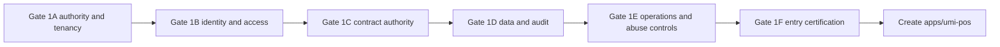

# Phase 0C — Executive Summary

## Verdict

Build-v3 has the correct UMI ownership. It does not yet provide a safe UmiPOS entry baseline.

The branch matches `build-v3` at `d5f399c8528fa3dda752aa37281d1b7a2c174348`. NEXO evidence is
fixed at `522bd46fa32b101f048b29e3a76f1cb417364150`.

## Decision

Do not create the production `apps/umi-pos` structure until these P0 conditions pass:

1. Establish one Supabase migration authority.
2. Prove request RLS and branch isolation on deployed roles.
3. Remove direct Supabase authority from untrusted clients.
4. Complete the neutral contract emitter and compatibility gate.
5. Record the final authority map and a clean build-v3 certification.

The app structure can start after P0. The first authenticated and commercial screens require more
P1 work.

## Current maturity

| Status                 | Count |
| ---------------------- | ----: |
| READY                  |     1 |
| PARTIAL                |    10 |
| MISSING                |     8 |
| CONTRADICTORY          |     2 |
| UNSAFE                 |     3 |
| BLOCKED                |     1 |
| NOT_REQUIRED_FOR_ENTRY |     2 |
| OUT_OF_SCOPE           |     1 |

## Main evidence

- `packages/contract` has one useful seam. It covers only auth, tenants, and part of loyalty Cash.
- Build-v3 SQL defines `umi`, `tenant`, and `runtime`. It is not an ordered root Supabase ledger.
- The API has an RLS app pool, a worker pool, a role boot guard, and focused RLS tests.
- Worker-pool request exceptions and direct client Supabase paths remain.
- Local auth exists. Durable refresh families, central revocation, POS PIN, and device proof do not.
- Catalog and order concepts exist. A POS quote, payment, receipt, refund, inventory, and cash
  transaction service does not.
- Queues, dead letters, logging, health, and conversational tools exist. POS audit and abuse limits
  remain incomplete.

## Entry sequence

## Non-negotiable boundaries

- UMI API owns every business and financial write.
- Supabase PostgreSQL is the only database authority.
- `packages/contract` is the only editable API contract authority.
- POS, dashboard, KDS, and Assistant do not receive service-role credentials.
- Clients do not calculate authoritative totals or write authoritative tables.
- NEXO remains evidence only.

## Owner decisions

- Approve the final Supabase migration cutover and role model.
- Approve the dashboard Auth cutover from direct Supabase use.
- Confirm the physical-cash name and boundary. `apps/umi-cash` currently means loyalty.
- Select the CDN, WAF, distributed rate-limit, backup, and staging providers before the pilot.
- Select payment and hardware providers after the initial cash/manual-terminal pilot.
