> **SUPERSEDIDO — no implementar.**
> Este documento propone una **plataforma federada** (UMI control plane + NEXO commerce
> execution plane, con dos bases de datos, APIs versionadas entre planos y propagación por
> outbox/eventos). Esa es la **Opción A**, evaluada y rechazada por escrito el 2026-07-14 en
> [`2026-07-14-umipos-analisis-integracion.md`](2026-07-14-umipos-analisis-integracion.md) §10.
>
> La arquitectura vigente es la **Opción B**: UmiPOS es un módulo de la plataforma Umi, cliente
> del API, sin segunda base de datos, sin bus de eventos entre planos, sin sincronización y sin
> reconciliación. Ver
> [`2026-07-22-umipos-resolucion-arquitectura.md`](2026-07-22-umipos-resolucion-arquitectura.md)
> y [`2026-07-23-umipos-fusion-implementation-plan.md`](2026-07-23-umipos-fusion-implementation-plan.md) §1.
>
> Se conserva como registro histórico y porque su **diagnóstico** (eliminar autoridades
> paralelas, un solo writer por bounded context, modelo de dominio de Inventory y de caja
> física, distinción Loyalty Wallet vs Physical Cash) sí se adoptó. Lo que no se adopta es el
> **remedio** federado. Ver
> [`2026-07-28-umipos-branch-reconciliation.md`](2026-07-28-umipos-branch-reconciliation.md).

# UMI × NEXO Platform Consolidation Strategy

**Fecha de decisión:** 2026-07-22  
**Fuente primaria:** `docs/UMI_NEXO_DISCOVERY_REPORT.md`  
**Baseline UMI:** `build-v3` @ `71f603e4d5c49b139ee6aefe0fac13b535d55e9c`  
**Baseline NEXO:** filesystem de `main`; sin `HEAD` resoluble  
**Naturaleza:** estrategia y decisiones arquitectónicas; no autoriza cambios de código, datos o infraestructura

# Executive Summary

UMI y NEXO deben convertirse en una plataforma federada, no en dos productos que vuelvan a implementar los mismos dominios ni en un monolito unido por una base compartida. La regla definitiva es **un solo writer y una sola fuente de verdad por bounded context**, con integración mediante APIs versionadas y eventos transaccionales; ningún servicio escribe tablas de otro dominio.

UMI será el **control plane y engagement plane**: Identity, Authentication, Authorization de plataforma, Organizations, Branches, Users, Employees, Roles, Permissions, Customers, entitlements, Loyalty/Gift Cards, Notifications de cliente, Knowledge, Copilot, RAG, embeddings, LLM orchestration, KDS y growth. NEXO será el **commerce execution plane**: Product, Categories, Variants, Media, Pricing, Inventory, Orders/Sales, Checkout, Payments, caja física, Receipts/Refunds y los contratos operativos del POS. Flutter POS, Customer Display e Inventory Scanner pertenecen al plano cliente de NEXO; KDS permanece en UMI. Payroll será un bounded context futuro independiente que consume el control plane UMI.

No se recomienda una base única ni compartir tablas. La evidencia demuestra runtimes, schemas, workers y modelos de concurrencia independientes; fusionarlos aumentaría el riesgo de regresión sin beneficio probado. El dashboard objetivo sí tendrá un único shell UMI, pero las superficies administrativas operativas de NEXO sobrevivirán como módulo federado/deep link hasta que la paridad permita una migración incremental. NEXO OpenAPI/SDK sigue siendo autoridad para Commerce; UMI deberá publicar su propio contrato de Control Plane. Un catálogo de contratos común no significa un “mega OpenAPI”.

La duplicidad crítica a eliminar es la de autoridad: Identity/Organization/Branch/Staff, Product/Catalog, Customer y Order. La transición se hará con IDs globales, tablas de mapeo temporales, adapters y proyecciones read-only. No habrá dual-write. `umi-cash` queda congelado: sobreviven sus capacidades de loyalty/wallet/Gift Cards, pero no se amplía su runtime aislado. Los sinks UMI locales de NEXO y la documentación de apps ausentes no se eliminan hasta que exista reemplazo verificado.

**Product Certification sí debe retomarse**, desde **Part 2A — Parte 3 (Refunds, Returns, Voids y Receipts)**, con un prompt modificado que limite la autoridad a NEXO Commerce e incorpore invariantes del seam UMI; no debe volver a certificar Identity, Organization, Branch, Customers, Loyalty, KDS o Copilot como dominios NEXO. Part 2B se divide, Final Certification se reescribe como certificación del ecosistema y las certificaciones de Knowledge/Copilot pasan exclusivamente a UMI.

# Estado Actual

| Hecho comprobado                                                                                    | Implicación estratégica                                                                   |
| --------------------------------------------------------------------------------------------------- | ----------------------------------------------------------------------------------------- |
| No hay imports, DB, Docker, pipelines, auth o despliegue compartido                                 | La consolidación parte de dos sistemas independientes; no existe “desacople” que ejecutar |
| UMI tiene 5 apps, 2 packages, 65 tablas build-v3 y 70 tests/spec                                    | Es un ecosistema real, no sólo frontend                                                   |
| NEXO tiene 4 apps, 15 packages, 62 modelos Prisma, 330 tests/spec y OpenAPI de 144 operaciones      | Es el runtime commerce más profundo y contractual                                         |
| UMI no contiene `umi-api/src/modules/pos`; el seam Dart es propuesta                                | UMI no puede reemplazar hoy el backend POS NEXO                                           |
| NEXO carece de KDS, loyalty/Gift Cards y RAG                                                        | No debe reconstruir capacidades UMI                                                       |
| UMI `umi-cash` está FROZEN, pero conserva runtime/DB/UI                                             | Debe congelarse y migrarse por capacidad, no borrarse                                     |
| Ambos modelan Identity, tenants, branches, staff, catalog, customers parciales, orders y dashboards | Existe riesgo de doble writer y divergencia semántica                                     |
| NEXO produce sinks/proyecciones UMI sin consumer UMI                                                | La integración documentada aún no es productiva                                           |
| NEXO no tiene un `HEAD` resoluble                                                                   | Antes de migrar se requiere provenance y baseline reproducible                            |

La arquitectura actual es dos plataformas verticales sin vínculo operativo. UMI es más amplio en customer engagement y AI; NEXO es más profundo en transacciones commerce. “Cash” no es duplicidad funcional: en UMI significa loyalty/stored value; en NEXO significa drawer/session/efectivo físico.

# Objetivos

1. Mantener una sola autoridad de escritura por dominio.
2. Preservar los activos maduros sin reescribirlos por preferencia tecnológica.
3. Evitar sincronización bidireccional, shared database y acoplamiento por tablas.
4. Producir contratos explícitos para APIs, eventos, IDs, errores e idempotencia.
5. Consolidar experiencia de operador sin convertir la UI en autoridad de datos.
6. Reorientar certificaciones hacia los límites definitivos.
7. Permitir incorporación posterior de Payroll, Copilot y nuevos clientes sin duplicar core.

# Arquitectura Actual

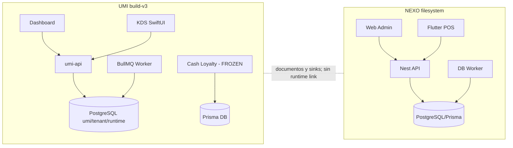

# Arquitectura Objetivo

## Principios

- **Bounded database ownership:** cada owner escribe sólo su DB.
- **API para comandos; eventos para propagación:** no se usan eventos para validar comandos sincrónicos ni APIs para replicar toda la historia.
- **Read projections no son autoridades:** pueden reconstruirse y llevan versión/source.
- **Identidad global, contexto local:** UMI emite subject, organization, branch, roles/claims; NEXO aplica autorización domain-specific y conserva referencias.
- **Outbox e idempotencia obligatorios:** productores publican después del commit; consumers deduplican por `eventId`.
- **Contratos separados:** Control Plane API y Commerce API versionados, registrados en un catálogo común.
- **Sin big-bang:** coexistencia temporal, shadow reads y cutovers reversibles.

## Platform Context

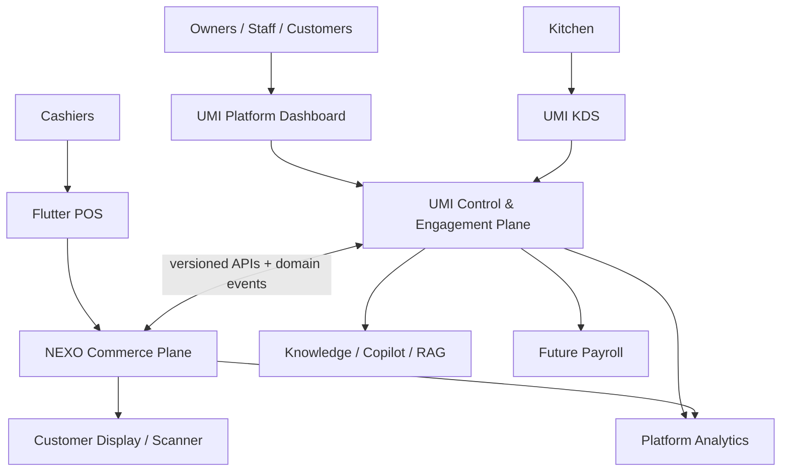

## Container Diagram

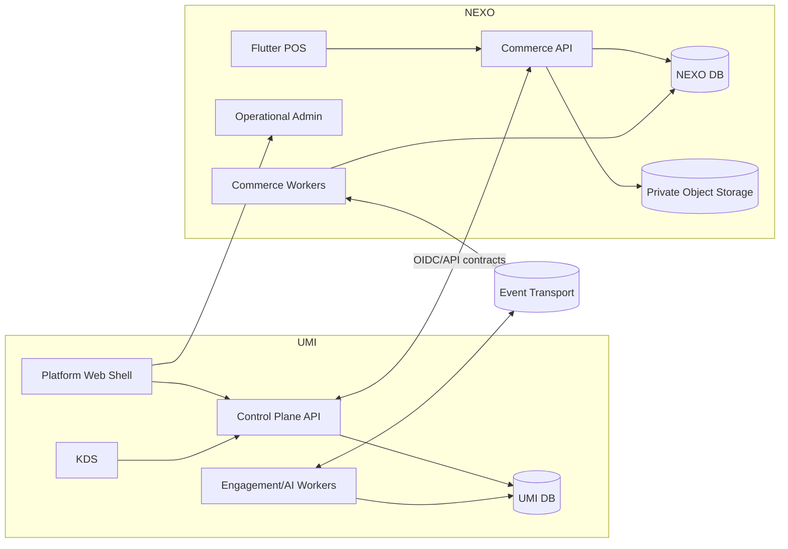

## Domain Diagram

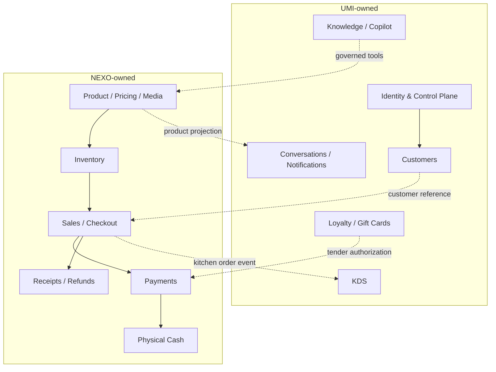

## Ownership Diagram

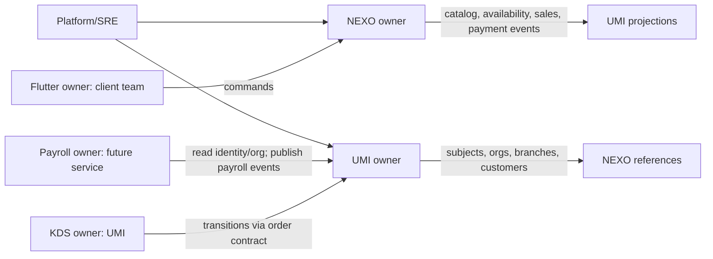

## API Diagram

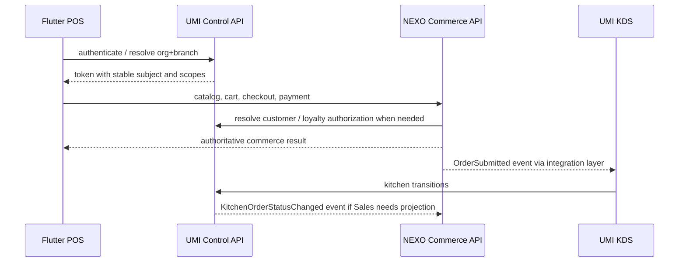

## Event Flow

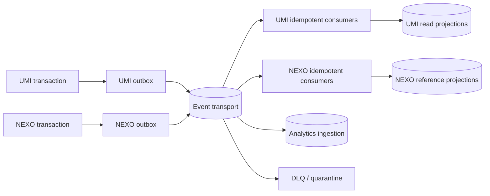

## Runtime Diagram

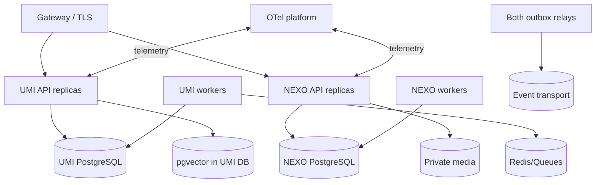

## Deployment Diagram

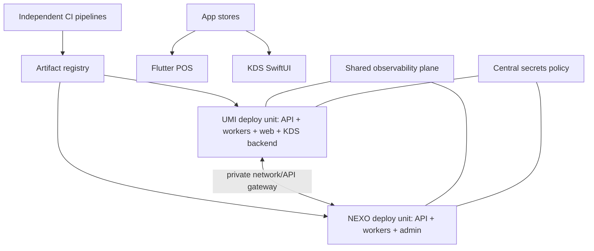

## Flutter Integration Diagram

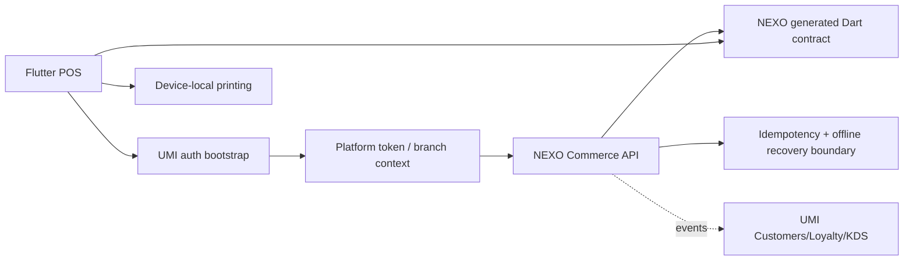

## Copilot Diagram

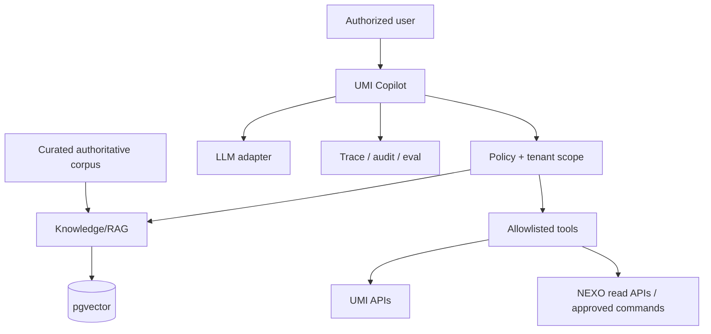

# Owner of Record Matrix

Leyenda: `M` mantener, `Mi` migrar, `E` eliminar tras cutover, `F` congelar, `—` no aplica. “Compartir” significa contrato o consumo, nunca escritura compartida.

| Dominio           | Owner / fuente de verdad              | Consumers               | API / DB / Worker                | UI / Runtime / Deploy | Docs / Tests / OpenAPI / SDK | Flutter / Web     | Event producer → consumer           | Compartir             | Mi / E / igual                      | Evidencia decisiva                                |
| ----------------- | ------------------------------------- | ----------------------- | -------------------------------- | --------------------- | ---------------------------- | ----------------- | ----------------------------------- | --------------------- | ----------------------------------- | ------------------------------------------------- |
| Identity          | UMI / UMI subjects                    | todos                   | UMI                              | UMI / UMI / UMI       | UMI                          | bootstrap / UMI   | UMI → NEXO, Payroll                 | protocolo             | NEXO identities Mi; duplicado E     | UMI control plane; integración exige sujeto único |
| Authentication    | UMI / UMI sessions                    | Web, clients            | UMI                              | UMI / UMI / UMI       | UMI                          | token / UMI       | security events → consumers         | OIDC/JWT              | NEXO auth Mi/E                      | dos cookies/sesiones actuales son riesgo          |
| Authorization     | UMI plataforma; NEXO policy commerce  | APIs/clients            | UMI claims; NEXO ABAC            | ambos runtimes        | cada owner                   | scopes / ambos    | policy/audit local                  | vocabulary            | roles core Mi; ABAC NEXO igual      | UMI entitlements + NEXO ABAC profundo             |
| Organizations     | UMI / business-org                    | todos                   | UMI                              | UMI                   | UMI                          | ref / UMI         | UMI → NEXO                          | IDs                   | NEXO org Mi/E                       | dos tenant graphs actuales                        |
| Branches          | UMI / branch                          | POS, KDS, NEXO          | UMI; projection NEXO             | UMI                   | UMI                          | context / UMI     | UMI → NEXO                          | IDs                   | NEXO master Mi; location NEXO igual | Branch global; warehouse Location es commerce     |
| Users             | UMI                                   | todos                   | UMI                              | UMI                   | UMI                          | subject / UMI     | UMI → domain audit                  | claims                | NEXO users Mi/E                     | doble alta/revocación inaceptable                 |
| Employees         | UMI / staff                           | Payroll, POS, KDS       | UMI                              | UMI                   | UMI                          | ref / UMI         | UMI → NEXO/Payroll                  | ref                   | NEXO membership Mi                  | UMI staff/hours más amplio                        |
| Roles             | UMI core roles                        | todos                   | UMI                              | UMI                   | UMI                          | claims / UMI      | UMI → consumers                     | vocabulary            | duplicado Mi/E                      | UMI control plane authority                       |
| Permissions       | UMI grants; NEXO domain permissions   | services                | ambos                            | ambos                 | cada owner                   | claims / admin    | local audit                         | namespace             | no eliminar ABAC                    | separación platform/domain                        |
| Dashboard         | UMI shell                             | operators               | APIs owners                      | UMI Web; NEXO module  | UMI shell/NEXO module        | — / UMI           | consume events/APIs                 | navegación            | NEXO shell Mi/E gradual             | coberturas complementarias                        |
| Products          | NEXO                                  | POS, UMI AI/KDS         | NEXO                             | NEXO                  | NEXO OpenAPI/SDK             | NEXO / module     | NEXO → UMI                          | projection            | UMI writer Mi/E                     | engine transaccional más profundo                 |
| Categories        | NEXO                                  | catálogo clients        | NEXO                             | NEXO                  | NEXO                         | NEXO / module     | NEXO → UMI                          | projection            | UMI writer Mi/E                     | ligada al aggregate Product                       |
| Variants          | NEXO                                  | POS/Inventory           | NEXO                             | NEXO                  | NEXO                         | NEXO / module     | NEXO → UMI                          | projection            | UMI model Mi/E                      | sólo NEXO presenta profundidad                    |
| Media             | NEXO                                  | Web/POS/UMI projection  | NEXO + object store              | NEXO                  | NEXO                         | NEXO / module     | Product events → UMI                | URLs firmadas         | M                                   | MinIO privado existente                           |
| Pricing           | NEXO                                  | Sales/POS/AI            | NEXO                             | NEXO                  | NEXO                         | NEXO / module     | Price events → UMI                  | projection            | UMI price Mi/E                      | history/determinism NEXO                          |
| Inventory         | NEXO                                  | Sales/POS/Scanner       | NEXO                             | NEXO                  | NEXO                         | NEXO / module     | NEXO → analytics                    | availability API      | M igual                             | único ledger/reservations/FIFO                    |
| Sales             | NEXO                                  | POS/KDS/reports         | NEXO                             | NEXO                  | NEXO                         | NEXO / module     | NEXO → UMI KDS/Customer             | events                | UMI order writer Mi/E               | único aggregate/checkout profundo                 |
| Checkout          | NEXO                                  | POS/ConversaFlow        | NEXO                             | NEXO                  | NEXO                         | NEXO / —          | NEXO → UMI                          | command API           | UMI tool adapta                     | UMI sólo tools parciales                          |
| Payments          | NEXO                                  | POS/Cash/reports        | NEXO                             | NEXO                  | NEXO                         | NEXO / module     | NEXO → UMI/analytics                | loyalty tender API    | UMI payment Mi/E                    | NEXO lifecycle e idempotencia                     |
| Cash físico       | NEXO                                  | POS/Admin               | NEXO                             | NEXO                  | NEXO                         | NEXO / module     | NEXO → analytics                    | no                    | M igual                             | único drawer/session/ledger                       |
| Customers         | UMI                                   | Sales/AI/Loyalty/KDS    | UMI                              | UMI                   | UMI contract futuro          | ref / UMI         | UMI → NEXO                          | minimal PII API       | NEXO customer Mi/E                  | UMI aggregate/timeline profundo                   |
| Loyalty           | UMI                                   | POS/ConversaFlow        | UMI                              | UMI                   | UMI                          | wallet hook / UMI | UMI ↔ NEXO tender events            | API                   | M; Cash runtime F                   | único ledger/rewards                              |
| Gift Cards        | UMI                                   | POS/Customer            | UMI                              | UMI                   | UMI                          | future / UMI      | UMI authorization ↔ NEXO redemption | API                   | M; `umi-cash` F                     | único implementation/passes                       |
| Orders            | NEXO commerce order                   | KDS/Customers           | NEXO; UMI projection             | NEXO                  | NEXO                         | POS / module      | NEXO → KDS                          | event                 | UMI `customer_order` Mi             | evita dos writers de venta                        |
| Receipts          | NEXO                                  | POS/Admin/Customers     | NEXO                             | NEXO                  | NEXO                         | NEXO / module     | NEXO → UMI notification             | link/event            | M                                   | ligado a Sale/Payment                             |
| Refunds           | NEXO                                  | POS/Admin/Cash          | NEXO                             | NEXO                  | NEXO                         | NEXO / module     | NEXO → UMI loyalty/customer         | event                 | UMI refund Mi/E                     | compensación financiera commerce                  |
| Reports           | Compartido por ámbito                 | operators               | NEXO ops; UMI platform           | ambos                 | cada owner                   | — / shell         | ambos → analytics                   | sí, datasets          | shells F                            | métricas distintas                                |
| Analytics         | UMI platform; NEXO operational        | product/business        | UMI warehouse futuro; NEXO views | UMI + NEXO            | contracts separados          | — / UMI           | ambos → ingestion                   | sí                    | construir sin dual truth            | no warehouse común encontrado                     |
| Notifications     | UMI outbound/customer                 | customers/operators     | UMI                              | UMI                   | UMI                          | — / UMI           | domains → UMI                       | event                 | NEXO customer send Mi               | UMI adapters más amplios                          |
| Files             | Owner por dominio                     | consumers               | NEXO media; UMI knowledge/pass   | ambos                 | cada owner                   | — / ambos         | metadata events                     | policy only           | no DB común                         | semánticas distintas                              |
| Payroll           | Servicio futuro / su DB               | employees/finance       | Payroll                          | Payroll               | Payroll                      | future / UMI link | UMI → Payroll; Payroll → analytics  | refs                  | no implementado                     | sólo seams actuales                               |
| Knowledge         | UMI                                   | Copilot/Support         | UMI                              | UMI                   | UMI                          | — / UMI           | corpus events → indexer             | governed read         | M                                   | docs/chunks existentes                            |
| Copilot           | UMI                                   | operators/customers     | UMI                              | UMI                   | UMI                          | future / UMI      | tool audit → owners                 | tools                 | M                                   | sustrato IA sólo UMI                              |
| RAG               | UMI                                   | Copilot                 | UMI                              | UMI                   | UMI                          | —                 | UMI internal                        | no DB share           | M                                   | pgvector/knowledge existentes                     |
| Embeddings        | UMI                                   | RAG                     | UMI                              | UMI                   | UMI                          | —                 | index jobs                          | model contract        | M                                   | Voyage + vector tables                            |
| LLMs              | UMI adapter                           | Copilot                 | UMI                              | UMI                   | UMI                          | —                 | traces                              | no                    | M                                   | Anthropic adapter existente                       |
| OpenAPI           | Cada API; catálogo compartido         | integrators             | owners                           | owners                | platform governance          | generated         | —                                   | registry              | UMI debe crear contrato             | NEXO 144 ops; UMI no spec                         |
| SDK               | Cada API; governance compartida       | Web/Flutter/integrators | owners                           | owners                | generated                    | Flutter uses NEXO | —                                   | conventions           | UMI SDK nuevo                       | NEXO pipeline existente                           |
| Flutter POS       | NEXO Client team                      | cashiers                | consume APIs                     | Flutter runtime/store | NEXO tests/contracts         | owner / —         | consumes                            | auth seam             | M igual                             | único POS actual                                  |
| KDS               | UMI                                   | kitchen                 | UMI API                          | SwiftUI/store         | UMI                          | — / —             | consumes NEXO order events          | order contract        | order source Mi                     | único KDS actual                                  |
| Customer Display  | NEXO client futuro                    | customers               | NEXO API                         | Flutter/client        | NEXO                         | owner / —         | consumes Sale                       | read only             | no implementado                     | adyacente a POS                                   |
| Inventory Scanner | NEXO client futuro                    | warehouse               | NEXO API                         | Flutter/client        | NEXO                         | owner / —         | Inventory commands                  | no                    | no implementado                     | adyacente a Inventory                             |
| Manager Companion | UMI client futuro                     | managers                | UMI aggregation                  | client runtime        | UMI                          | owner / UMI       | consumes platform events            | sí                    | no implementado                     | cross-domain manager experience                   |
| Workers           | Cada bounded context                  | domains                 | owner local                      | owner                 | owner                        | —                 | outbox                              | conventions           | no fusionar                         | DB/queues independientes                          |
| Feature Flags     | UMI entitlements; local rollout flags | all                     | UMI + local deploy               | UMI/local             | UMI governance               | claims / UMI      | UMI → clients                       | vocabulary            | NEXO org features Mi                | UMI planes/subscriptions explícitos               |
| Deployment        | Platform/SRE; unidades separadas      | all                     | —                                | SRE                   | SRE                          | stores/web        | telemetry                           | tooling               | mantener separados                  | runtimes heterogéneos                             |
| Infrastructure    | Platform/SRE                          | all                     | managed per service              | SRE                   | SRE                          | —                 | —                                   | observability/secrets | no DB compartida                    | stacks actuales independientes                    |

# Source of Truth Matrix

| Dominio                                                                                  | Autoridad definitiva                         | Justificación                                                                           |
| ---------------------------------------------------------------------------------------- | -------------------------------------------- | --------------------------------------------------------------------------------------- |
| Identity, Authentication, Organizations, Branches, Users, Employees, Roles, entitlements | UMI                                          | Control plane/tenant/staff/planes ya existen y sirven a ecosistema, KDS, customer y AI  |
| Authorization                                                                            | Compartido                                   | UMI emite identidad/scopes; cada dominio aplica policy local, especialmente ABAC NEXO   |
| Products, Categories, Variants, Media, Pricing                                           | NEXO                                         | Aggregate, price history, media privada y contratos transaccionales más completos       |
| Inventory                                                                                | NEXO                                         | Único ledger/reservations/transfers/FIFO/counts existente                               |
| Sales, Checkout, Orders, Payments, Cash físico, Receipts, Refunds                        | NEXO                                         | Único runtime POS/commerce profundo; UMI POS backend no existe                          |
| Customers, Loyalty, Gift Cards, Notifications customer-facing                            | UMI                                          | Aggregate/customer timeline, ledgers, passes y adapters existentes                      |
| Knowledge, Copilot, RAG, Embeddings, LLMs                                                | UMI                                          | Único sustrato implementado                                                             |
| KDS                                                                                      | UMI                                          | Único cliente/backend; consumirá orden NEXO                                             |
| Dashboard                                                                                | Compartido                                   | UMI shell definitivo; módulos operativos NEXO conservan ownership de UI hasta migración |
| Reports/Analytics                                                                        | Compartido                                   | NEXO mantiene reporting operacional; UMI consolida analytics cross-platform             |
| Files                                                                                    | Compartido por bounded context               | No existe un “archivo” genérico con semántica única                                     |
| OpenAPI/SDK                                                                              | Compartido por gobernanza, ownership por API | Evita mega-contrato y conserva pipeline NEXO                                            |
| Flutter POS, Customer Display, Scanner                                                   | NEXO                                         | Clientes de commerce/Inventory                                                          |
| Manager Companion                                                                        | UMI                                          | Experiencia cross-platform del control plane                                            |
| Payroll                                                                                  | No implementado                              | Será servicio independiente, no se adjudica código inexistente                          |
| Workers                                                                                  | Compartido sólo en estándares                | Cada worker debe permanecer con DB/domain owner                                         |
| Deployment/Infrastructure                                                                | Compartido                                   | Platform/SRE gobierna; deploy units permanecen aisladas                                 |

# API Ownership

- **UMI publica:** `/identity`, `/sessions`, `/organizations`, `/branches`, `/staff`, `/customers`, `/loyalty`, `/gift-cards`, `/notifications`, `/knowledge`, `/copilot`, `/kds` y entitlements.
- **NEXO publica:** `/products`, `/categories`, `/variants`, `/media`, `/prices`, `/inventory`, `/sales`, `/checkout`, `/payments`, `/cash-sessions`, `/receipts`, `/refunds` y device/POS operations.
- **Ambos consumen:** UMI identity/context; NEXO catalog/customer-safe projections; NEXO order/payment events; UMI loyalty authorization. Consumo cross-service siempre mediante contrato, nunca imports internos.
- **Deben desaparecer tras cutover:** escrituras NEXO de Organization/User/Branch master; escrituras UMI de Product/Price/commerce Order/Payment/Refund; endpoints proxy de `umi-cash` que sólo dupliquen la nueva autoridad.
- **Deben publicarse:** UMI Control Plane OpenAPI/JSON Schema, event catalog versionado, introspection/JWKS, customer minimal-reference API, loyalty authorization API y NEXO kitchen-order feed/transition contract.
- **No debe publicarse:** tablas, Prisma models, payloads provider sensibles, embeddings crudos, secretos, internal outbox o endpoints administrativos sin scope.

# Runtime Ownership

| Runtime                                                           | Owner            | Regla                                                         |
| ----------------------------------------------------------------- | ---------------- | ------------------------------------------------------------- |
| UMI API, engagement workers, AI/RAG, KDS backend, dashboard shell | UMI              | No ejecuta Inventory/Sales/Payments/Cash físico               |
| NEXO API, commerce workers, operational admin                     | NEXO             | No ejecuta customer engagement, loyalty engine, KDS o Copilot |
| Flutter POS/Display/Scanner                                       | NEXO Client team | No contiene autoridad financiera; backend valida todo         |
| KDS SwiftUI                                                       | UMI Client team  | Consume order projection y emite transitions autorizadas      |
| Payroll futuro                                                    | Payroll team     | DB/runtime propio; UMI sólo identidad/referencias             |
| Event transport, observability, secrets, registry                 | Platform/SRE     | Infra compartida, datos y ownership no compartidos            |

Nunca deberán compartirse procesos de worker, conexiones de escritura, migration runners, secretos de DB, tablas de outbox ni release trains. Sí pueden compartir convenciones, librerías neutrales y telemetría.

# Database Ownership

| Datos                                                          | Owner                | Referencias/sincronización/migración                                                   |
| -------------------------------------------------------------- | -------------------- | -------------------------------------------------------------------------------------- |
| subjects, sessions, orgs, branches, staff, roles, entitlements | UMI DB               | NEXO conserva IDs/proyección mínima; migrar masters NEXO y retirar writes              |
| customers/contact/consent                                      | UMI DB               | NEXO guarda `customerId` y snapshot mínimo de recibo, no PII duplicada                 |
| product/category/variant/media/price                           | NEXO DB/object store | UMI mantiene proyección de búsqueda versionada; migrar productos UMI con mapping       |
| ledger/reservations/stock/cost                                 | NEXO DB              | Jamás duplicar; UMI consulta availability API/projection                               |
| sales/payments/cash/receipts/refunds                           | NEXO DB              | UMI mantiene timeline/read projection; migrar `customer_order/payment/refund` commerce |
| loyalty/stored value/Gift Cards/passes                         | UMI DB               | NEXO solicita authorize/redeem; nunca copia balance como autoridad                     |
| knowledge/conversations/embeddings                             | UMI DB               | NEXO no consume embeddings directos; usa Copilot API                                   |
| analytics                                                      | warehouse futuro     | Ingesta append-only desde eventos; no es system of record                              |
| payroll                                                        | DB futura propia     | referencias UMI; no salario en identity tables                                         |

No se sincronizan estados mutables bidireccionalmente. Las entidades migradas usan una tabla temporal `legacySystem/legacyId/globalId`, validación de conteos/hashes y ventana de rollback. Snapshots históricos financieros permanecen en NEXO; no se reescriben para adoptar nombres UMI.

# UI Ownership

| Superficie                                     | Owner definitivo    | Decisión                                                      |
| ---------------------------------------------- | ------------------- | ------------------------------------------------------------- |
| Dashboard/landing/settings/platform admin      | UMI                 | Mantener como shell y navegación                              |
| Product/Inventory/Sales/Cash operational admin | NEXO                | Mantener módulo; federar en shell, migrar UI sólo con paridad |
| POS                                            | Flutter/NEXO        | Mantener exactamente como cliente commerce                    |
| KDS                                            | UMI SwiftUI         | Mantener; cambiar sólo el order seam                          |
| Customer Display                               | Flutter/NEXO futuro | No desarrollar hasta validar necesidad                        |
| Inventory Scanner                              | Flutter/NEXO futuro | No desarrollar hasta validar workflow                         |
| Manager Companion                              | UMI futuro          | No desarrollar hasta research de producto                     |
| Loyalty/Gift Card customer wallet              | UMI                 | Congelar `umi-cash`; extraer capacidad de forma incremental   |
| Analytics cross-platform                       | UMI shell           | Consumir datasets gobernados                                  |

# Event Ownership

| Productor      | Eventos canónicos propuestos                                                                 | Consumers permitidos                                 | Consumers prohibidos                                 |
| -------------- | -------------------------------------------------------------------------------------------- | ---------------------------------------------------- | ---------------------------------------------------- |
| UMI            | IdentitySubjectChanged, OrganizationChanged, BranchChanged, EmployeeChanged, CustomerChanged | NEXO refs, Payroll, Analytics                        | consumers que escriban masters UMI                   |
| UMI            | LoyaltyAuthorized/Redeemed/Reversed, GiftCardChanged                                         | NEXO Payments, Customer UI, Analytics                | Inventory/Cash que traten stored value como efectivo |
| UMI            | KitchenOrderStatusChanged                                                                    | NEXO Sales projection, Analytics                     | Payment authority                                    |
| NEXO           | ProductChanged, PriceChanged, InventoryAvailabilityChanged                                   | UMI Search/AI, clients, Analytics                    | UMI writers de catálogo/stock                        |
| NEXO           | SaleCreated/Completed/Cancelled, OrderSubmitted                                              | UMI KDS, Customer timeline, Notifications, Analytics | UMI que complete/recalcule la venta                  |
| NEXO           | PaymentCompleted/Failed, RefundCompleted, ReceiptIssued                                      | UMI Loyalty/Customer/Notifications, Analytics        | UMI que reescriba payment                            |
| Payroll futuro | PayrollRunCompleted/EmployeePayrollChanged                                                   | UMI employee view, Analytics                         | NEXO Commerce salvo reporting autorizado             |

Eventos a retirar: proyecciones NEXO→UMI locales sin consumer una vez reemplazadas por catálogo canónico; duplicados semánticos de `customer_order` tras cutover; eventos que incluyan PII/secretos. Todo evento incluye `eventId`, `schemaVersion`, owner, tenant/org, occurredAt, correlation/causation; consumidores deben ser idempotentes.

# Componentes Compartidos

- Catálogo/registry de contratos, convenciones de errores, IDs, scopes y eventos.
- Tokens visuales semánticos, no componentes runtime entre React/Swift/Flutter.
- Plataforma OTel, naming de traces, correlation IDs y SLOs.
- Policies de CI, supply-chain, secrets, SBOM y provenance.
- Analytics ingestion y taxonomy, sin sustituir fuentes operativas.
- SDK generation conventions; los SDKs concretos pertenecen a cada API.

# Componentes Exclusivos

- UMI: ConversaFlow, Knowledge/RAG, loyalty/wallet/Gift Cards, KDS, customer engagement, leads/growth.
- NEXO: Media/Pricing, Inventory ledger, Sales/Checkout/Payments, caja física, POS Flutter, receipts/refunds.
- Payroll: cálculos, wages, periods, filings y ledger de nómina futuros.
- Clientes: hardware/device behavior permanece en cada app; nunca en dashboard/backend genérico.

# Componentes a Migrar

| Componente                             | Desde → hacia                       | Costo | Riesgo                      | Beneficio                                    |
| -------------------------------------- | ----------------------------------- | ----- | --------------------------- | -------------------------------------------- |
| Identity/org/branch/staff master       | NEXO → UMI refs                     | Alto  | Alto: auth/RLS/branch scope | una sola alta/revocación/contexto            |
| Product/category writer                | UMI → NEXO                          | Alto  | Alto: tools/KDS/IDs         | precio/media/inventory coherentes            |
| Customer stub/reference                | NEXO → UMI                          | Medio | Medio: PII/receipts         | timeline único y menor duplicidad            |
| customer_order/payment/refund commerce | UMI → NEXO                          | Alto  | Alto: KDS/history           | una sola venta/folio/payment authority       |
| Loyalty UI/runtime de `umi-cash`       | runtime aislado → UMI API/dashboard | Alto  | Alto: balances/passes       | elimina freeze ambiguo y DB duplicada        |
| NEXO shell navigation                  | NEXO Web → UMI shell/federation     | Medio | Medio                       | experiencia unificada sin reescribir módulos |
| NEXO notifications customer-facing     | NEXO → UMI delivery API             | Medio | Medio                       | consent/audit/proveedores únicos             |
| UMI contract externo                   | Zod interno → spec pública UMI      | Medio | Medio                       | interoperabilidad Flutter/NEXO               |

# Componentes a Eliminar

La eliminación sólo ocurre después de migración, reconciliación, shadow period y rollback aprobado:

- writers duplicados NEXO de Organization/Branch/User core;
- writers UMI de Product/Category/Price y commerce Order/Payment/Refund;
- shells/pantallas duplicadas cuando el shell UMI tenga paridad y deep links estables;
- Prisma/proxies aislados de `umi-cash` una vez migrados ledger, passes y customer flows;
- sinks locales NEXO UMI sin consumer;
- mapas que atribuyen runtime a `umi-conversaflow`/`umi-logs` ausentes;
- duplicados de documentación obsoleta sólo después de preservar ADRs/historia útil.

No se eliminan: NEXO ledger/snapshots/history, UMI loyalty ledger, KDS, ConversaFlow, eventos históricos, audit/outbox ya procesado ni contratos versionados en uso.

# Componentes Congelados

- `umi-cash`: sin features nuevas; sólo seguridad, integridad y migración.
- Nuevos Identity/Organization/Branch/Catalog writers en cualquiera de los repos.
- NEXO features de Customers/Loyalty/KDS/AI y UMI features de Inventory/Sales/Payments/Cash físico.
- Sinks ad hoc y dual writes de integración.
- Nuevos dashboards duplicados.
- Customer Display, Scanner y Manager Companion hasta validar demanda y contrato.
- Adopción de una sola DB o mega-OpenAPI: no hay evidencia que justifique esa ruta.

# Consolidation Decisions

| Dominio/componente                 | Decisión                                          | Evidencia técnica/funcional                   | Mantenimiento/negocio             | Costo/riesgo/beneficio                      |
| ---------------------------------- | ------------------------------------------------- | --------------------------------------------- | --------------------------------- | ------------------------------------------- |
| Control Plane                      | Migrar a UMI authority                            | UMI tenant/staff/entitlements; ambos duplican | elimina doble alta y scope        | alto/alto/muy alto                          |
| NEXO ABAC/RLS                      | Mantener                                          | policy y FORCE RLS domain-specific            | defense-in-depth                  | bajo/bajo/alto                              |
| Product/Catalog                    | Migrar authority a NEXO                           | pricing/media/inventory/SDK y POS             | evita catálogo divergente         | alto/alto/muy alto                          |
| Inventory                          | Mantener exactamente como NEXO                    | único ledger maduro                           | activo crítico                    | bajo/alto si se toca/muy alto               |
| Sales/Payments/Cash                | Mantener NEXO; fusionar modelos UMI vía migración | POS runtime, idempotencia, folios             | evita doble venta/cobro           | alto/alto/muy alto                          |
| Customers                          | Mantener UMI; migrar refs NEXO                    | aggregate/timeline/integrations               | customer 360                      | medio/medio/alto                            |
| Loyalty/Gift Cards                 | Mantener UMI; congelar runtime Cash               | implementación única/FROZEN                   | ventaja comercial                 | alto/alto/alto                              |
| KDS                                | Mantener UMI; adaptar order feed                  | única app funcional                           | evita reconstrucción              | medio/medio/alto                            |
| Copilot/RAG                        | Mantener UMI                                      | único sustrato                                | ventaja estratégica               | medio/seguridad alta/alto                   |
| Dashboard                          | Compartir temporalmente; fusionar shell           | coberturas complementarias                    | reduce confusión                  | medio/medio/medio                           |
| OpenAPI/SDK                        | Compartir governance; mantener specs por owner    | NEXO pipeline; UMI Zod                        | interoperabilidad sin mega-schema | medio/medio/alto                            |
| Workers                            | Mantener separados                                | DB/outbox diferentes                          | reduce blast radius               | bajo/bajo/alto                              |
| DB única                           | No adoptar                                        | no existe runtime común                       | evitar coupling                   | migración extrema/alto/beneficio no probado |
| Payroll                            | Crear servicio futuro, no ahora                   | NOT IMPLEMENTED                               | evita contaminar staff            | alto/alto/futuro                            |
| Customer Display/Scanner/Companion | Congelar                                          | no implementados                              | evita roadmap especulativo        | —/—/ahorro                                  |

Ningún dominio requiere reescritura completa con la evidencia disponible. Para un event broker productivo, warehouse y Manager Companion la selección tecnológica concreta es **INSUFFICIENT EVIDENCE**.

# Duplicate Elimination Plan

| Duplicidad                | Sobrevive                              | Desaparece después                   | Docs/APIs/UI/Eventos a conservar           | Nunca tocar durante transición           |
| ------------------------- | -------------------------------------- | ------------------------------------ | ------------------------------------------ | ---------------------------------------- |
| Identity/Auth             | UMI control plane + NEXO ABAC local    | NEXO identity master/session issuer  | UMI auth docs/API; NEXO authorization docs | RLS y audit NEXO                         |
| Organization/Branch/Staff | UMI masters; NEXO Location/refs        | NEXO CRUD master                     | mapping/cutover docs; UMI events           | tenant historical IDs                    |
| Product/Category          | NEXO aggregate                         | UMI writer/tables tras archive       | NEXO OpenAPI/SDK; UMI tools como consumers | prices/media/history                     |
| Orders/Sales/Payments     | NEXO commerce                          | UMI commerce writer                  | NEXO events; UMI KDS projections           | ledgers, folios, receipts, audit         |
| Customers                 | UMI aggregate                          | NEXO customer master si aparece      | consent/timeline; minimal API              | historical receipt snapshot              |
| Dashboard                 | UMI shell + NEXO modules               | shell/navegación duplicada           | mejores UI primitives y accessibility      | operational workflows hasta paridad      |
| Contracts                 | specs owner + registry                 | duplicados manuales                  | NEXO generator; UMI Zod internal           | versioned public contracts               |
| Cash terminology          | ambos con nombres explícitos           | término ambiguo “Cash” sin qualifier | Loyalty Wallet / Physical Cash docs        | ambos ledgers                            |
| Observability             | shared OTel governance + domain traces | stacks redundantes sólo tras parity  | NEXO wiring, UMI conversational traces     | audit/security logs                      |
| Docs                      | ADRs y docs authority-curated          | mapas obsoletos                      | discovery y esta estrategia                | evidencia histórica hasta archive policy |

# Platform Score

Escala 1–10; puntúa evidencia de código, no producción no observada.

| Dimensión         | UMI | NEXO | Consolidada objetivo | Razón principal                                                   |
| ----------------- | --: | ---: | -------------------: | ----------------------------------------------------------------- |
| Arquitectura      |   7 |    8 |                    9 | UMI ecosystem; NEXO domains puros; target elimina doble authority |
| Backend           |   7 |    9 |                    9 | NEXO invariantes commerce; UMI amplitud AI/customer               |
| Frontend          |   7 |    8 |                    9 | UMI cobertura; NEXO DS/a11y; shell federado                       |
| Escalabilidad     |   7 |    8 |                    9 | ambos async; bounded deploys mejoran blast radius                 |
| DDD               |   7 |    9 |                    9 | packages NEXO más explícitos; ownership target claro              |
| Testing           |   7 |    9 |                    9 | 70 vs 330 tests/spec; falta runtime de esta auditoría             |
| Observabilidad    |   6 |    8 |                    9 | UMI OTel target; NEXO wired; target común                         |
| Deployment        |   7 |    7 |                    8 | UMI ruta VPS/Vercel; NEXO Compose; producción no verificada       |
| Mantenibilidad    |   6 |    7 |                    9 | docs drift/duplicidad y NEXO sin HEAD penalizan                   |
| Seguridad         |   8 |    9 |                    9 | ambos RLS; NEXO ABAC/FORCE RLS; identity único reduce superficie  |
| UX                |   7 |    8 |                    9 | experiencias complementarias; navegación hoy fragmentada          |
| Flutter readiness |   2 |    9 |                    9 | UMI seam propuesto; NEXO POS real                                 |
| Integración       |   3 |    3 |                    8 | hoy no existe runtime link; target contratos/eventos              |
| Producto          |   8 |    9 |                   10 | UMI engagement + NEXO commerce son complementarios                |

Puntuaciones específicas NEXO: POS 9, Inventory 9, Sales 9, Payments 8, Cash 8. UMI AI/Knowledge 9, KDS 8, Loyalty 8. La plataforma consolidada no recibe 10 técnico porque aún requiere migración, contratos y operación demostrada; su **valor comercial objetivo es 10**, calidad 9, tiempo de evolución 8.

# Riesgos

| Categoría / riesgo                                 | Prob. | Impacto | Mitigación                                                   | Prioridad |
| -------------------------------------------------- | ----- | ------- | ------------------------------------------------------------ | --------- |
| Técnico: dual writer durante cutover               | Alta  | Crítico | single-writer flag, shadow reads, no dual-write              | P0        |
| Integración: eventos incompatibles/duplicados      | Alta  | Alto    | registry, schema versions, outbox, consumer idempotency      | P0        |
| Seguridad: identidad/scope mal mapeado             | Media | Crítico | threat model, token exchange, negative tests, staged rollout | P0        |
| Operativo: NEXO sin Git HEAD                       | Alta  | Alto    | crear baseline/provenance antes de cambios                   | P0        |
| Producto: order semantics UMI vs Sale NEXO         | Alta  | Alto    | canonical lifecycle map y KDS acceptance tests               | P0        |
| Mantenimiento: `umi-cash` freeze ambiguo           | Alta  | Alto    | freeze enforcement, ledger migration plan, owner             | P1        |
| Datos: PII replicada a NEXO/AI                     | Media | Crítico | minimization, consent, retention, field allowlists           | P0        |
| Comercial: migración interrumpe POS/KDS            | Media | Crítico | parallel read, canary branches, rollback                     | P0        |
| Organizacional: owners cruzados sin accountability | Alta  | Alto    | domain teams/RACI y change approval                          | P0        |
| Escalabilidad: event storm/backpressure            | Media | Alto    | partitions, quotas, DLQ, replay tests                        | P1        |
| Performance: APIs cross-service en checkout        | Media | Alto    | local refs/cache, prefetch; no synchronous chain crítica     | P1        |
| Seguridad: Copilot ejecuta commands indebidos      | Media | Crítico | read-only default, allowlist, approvals, audit/evals         | P0        |
| Operativo: producción no verificada                | Alta  | Alto    | environment inventory and SLO baseline                       | P0        |
| Técnico: UMI SQL migrations no wired               | Alta  | Alto    | migration ownership/gate before cutover                      | P0        |
| Producto: apps nuevas especulativas                | Media | Medio   | discovery/business case gates                                | P2        |

# Architecture Decision Records

## ADR-001 — Control Plane definitivo

**Contexto:** ambos repositorios administran identity, tenant, branch y roles. UMI además gobierna entitlements, customers, KDS y engagement.  
**Problema:** doble alta/revocación y IDs divergentes comprometen todo el ecosistema.  
**Opciones:** NEXO authority; UMI authority; IdP externo nuevo; mantener dual.  
**Decisión:** UMI es control plane; un IdP externo puede ser adapter futuro, no un tercer domain writer. NEXO conserva ABAC/RLS local.  
**Consecuencias:** NEXO migra masters a referencias; tokens/scopes deben versionarse.  
**Riesgos:** auth cutover, branch scope y session revocation.  
**Justificación:** UMI ya cubre ecosystem/entitlements; mantener dual es el mayor riesgo hallado.

## ADR-002 — Owner definitivo de Product

**Contexto:** ambos escriben Product/Category; NEXO conecta variants, media, pricing, inventory, Sales y SDK.  
**Problema:** dos catálogos producen precios y stock incoherentes.  
**Opciones:** UMI; NEXO; shared write; nuevo servicio.  
**Decisión:** NEXO es owner. UMI consume proyección/read API para ConversaFlow, KDS y Copilot.  
**Consecuencias:** migración de IDs y tools UMI; no dual-write.  
**Riesgos:** productos históricos/semánticas no equivalentes.  
**Justificación:** la profundidad transaccional y el consumidor POS real están en NEXO.

## ADR-003 — Owner definitivo de Inventory

**Contexto:** sólo NEXO implementa ledger, reservations, transfers, FIFO y counts.  
**Problema:** inventario duplicado crearía unidades o overselling.  
**Opciones:** NEXO; reescribir UMI; servicio nuevo.  
**Decisión:** NEXO permanece sin migración de autoridad.  
**Consecuencias:** UMI usa availability API/events.  
**Riesgos:** latencia/stale projections; nunca usar proyección para commit.  
**Justificación:** activo único y ya certificado; reescritura carece de evidencia/beneficio.

## ADR-004 — Owner definitivo de Sales

**Contexto:** NEXO tiene Sale/Checkout/Payments/folios/reservations; UMI tiene customer orders para ConversaFlow/KDS, pero no módulo POS.  
**Problema:** dos order writers duplican ventas y pagos.  
**Opciones:** NEXO; UMI target documentado; coexistencia por canal.  
**Decisión:** NEXO es commerce Order/Sale authority para todos los canales. ConversaFlow envía comandos a NEXO; KDS consume `OrderSubmitted`.  
**Consecuencias:** migrar lifecycle y conservar snapshots históricos.  
**Riesgos:** KDS timing, conversational drafts y outages.  
**Justificación:** sólo NEXO demuestra aggregate/checkout/financial integrity.

## ADR-005 — Owner definitivo de Dashboard

**Contexto:** dos dashboards amplios con áreas complementarias y pantallas duplicadas.  
**Problema:** navegación, auth y administración fragmentadas.  
**Opciones:** UMI UI; NEXO UI; reescritura; federation.  
**Decisión:** UMI es shell; NEXO conserva módulos operativos federados hasta migración con paridad.  
**Consecuencias:** SSO, routing, design tokens y consistent navigation.  
**Riesgos:** UX híbrida y auth iframe/deep-link; evitar iframe si rompe seguridad.  
**Justificación:** UMI cubre ecosystem; NEXO workflows operativos no deben reescribirse.

## ADR-006 — Owner definitivo de Customers

**Contexto:** UMI tiene customer/contact/timeline/engagement; NEXO referencias parciales.  
**Problema:** PII y consent duplicados.  
**Opciones:** UMI; NEXO; CRM nuevo.  
**Decisión:** UMI owner; NEXO guarda ID y snapshots financieros mínimos.  
**Consecuencias:** minimal customer API/event y retention policy.  
**Riesgos:** disponibilidad en checkout y reconciliación de duplicados.  
**Justificación:** UMI tiene el aggregate e integraciones customer-facing más completos.

## ADR-007 — Owner definitivo de Copilot

**Contexto:** UMI posee Anthropic, Voyage, pgvector, knowledge, tools, memory y safety; NEXO no.  
**Problema:** un Copilot commerce necesita datos NEXO sin acceso directo a DB.  
**Opciones:** UMI; NEXO; proveedor externo aislado.  
**Decisión:** UMI owner; tools NEXO contract-first, read-only por defecto y approvals para comandos.  
**Consecuencias:** corpus curado, evals, permissions y audit.  
**Riesgos:** prompt injection, PII y acciones erróneas.  
**Justificación:** reutiliza el único sustrato AI y preserva autoridad NEXO.

## ADR-008 — Owner definitivo de Flutter

**Contexto:** NEXO tiene Flutter POS y design package; UMI sólo propone seam Dart.  
**Problema:** duplicar cliente retrasaría producto y fragmentaría contratos.  
**Opciones:** NEXO Flutter; nuevo shared app; UMI rewrite.  
**Decisión:** NEXO Client team mantiene Flutter POS; consume UMI auth/control context y NEXO Commerce API.  
**Consecuencias:** dos SDKs coordinados y bootstrap seguro.  
**Riesgos:** version skew/offline token expiry.  
**Justificación:** único cliente funcional encontrado.

## ADR-009 — Owner definitivo de Payroll

**Contexto:** Payroll no existe; sólo staff/branch/audit seams.  
**Problema:** incrustarlo en Identity o Cash mezclaría obligaciones y datos sensibles.  
**Opciones:** módulo UMI; módulo NEXO; bounded service separado; comprar SaaS.  
**Decisión:** bounded context futuro separado, patrocinado por plataforma UMI, con DB/API/workers propios. Build-vs-buy: **INSUFFICIENT EVIDENCE**.  
**Consecuencias:** consume UMI employee/org/branch; publica resultados mínimos.  
**Riesgos:** fiscalidad, PII, legislación y scope creep.  
**Justificación:** no hay implementación y su ciclo difiere de commerce/control plane.

## ADR-010 — Estrategia de Integración

**Contexto:** hoy no hay integración runtime; existen propuestas y sinks locales.  
**Problema:** shared DB o sync bidireccional crearían coupling y conflictos.  
**Opciones:** shared DB; REST-only; event-only; APIs+eventos.  
**Decisión:** comandos/queries sincrónicos por APIs versionadas; propagación/asíncrono por outbox+eventos; sin shared writes ni dual-write. Tecnología de broker: **INSUFFICIENT EVIDENCE**.  
**Consecuencias:** registry, idempotency, DLQ, observability y compatibility gates.  
**Riesgos:** eventual consistency y operación distribuida.  
**Justificación:** preserva los dos runtimes maduros y límites de datos.

# Migration Strategy

## Fase 0 — Freeze y provenance

- Aprobar owners/RACI; congelar writers duplicados.
- Establecer Git baseline NEXO y confirmar `build-v3` UMI.
- Inventariar entornos, SLOs, datos y migraciones aplicadas.
- Definir global IDs, event envelope y rollback criteria.

## Fase 1 — Contratos y seguridad

- Publicar Control Plane contract UMI, JWKS/token exchange y scopes.
- Crear registry de APIs/eventos y compatibility CI.
- Definir customer minimal API, Product projection y order/KDS lifecycle.
- Threat model, PII policy, audit/correlation conventions.

## Fase 2 — Control Plane

- Mapear NEXO org/branch/user/membership a UMI.
- Shadow authorization; comparar decisiones sin cambiar writer.
- Canary por branch; transferir alta/revocación a UMI.
- Mantener NEXO ABAC/RLS con referencias autoritativas.

## Fase 3 — Product y Customer

- Deduplicar/matchear Product UMI→NEXO con dry-run y reconciliation.
- Cambiar tools UMI a NEXO read API/projection; retirar writer UMI.
- Cambiar Sales NEXO a customer reference UMI y minimizar PII.

## Fase 4 — Orders, KDS y Loyalty

- Mapear conversational draft/order a NEXO commands.
- Publicar OrderSubmitted; shadow feed KDS; validar latency/transitions.
- Integrar loyalty/Gift Card authorization con Payment, idempotente.
- Migrar runtime `umi-cash` sin alterar balances históricos.

## Fase 5 — UI y Analytics

- UMI shell + SSO/deep links para módulos NEXO.
- Migrar pantallas sólo con behavioral parity y rollback.
- Ingerir eventos a analytics; reconciliar contra sources.

## Fase 6 — Copilot y clientes

- Curar corpus; agregar tools NEXO read-only, evals y approvals.
- Certificar Flutter con bootstrap UMI y Commerce NEXO.
- Sólo después de product discovery: Display/Scanner/Companion.

## Fase 7 — Payroll y cierre

- Decidir buy/build legal/comercial de Payroll.
- Ejecutar resilience, performance y ecosystem certification.
- Retirar duplicados tras ventanas de observación y archive policy.

Nunca migrar: Inventory ledger/history, Sale/Payment/Cash history a UMI; conversation/knowledge embeddings a NEXO; payroll data a core identity; databases completas. Pueden convivir indefinidamente los runtimes y workers. Requieren adaptación: auth, IDs, Product projection, customer refs, KDS orders y dashboard navigation.

# Roadmap Reconstruido

| Etapa                                 | Owner          | Resultado                                    | Cambio frente al roadmap implícito       |
| ------------------------------------- | -------------- | -------------------------------------------- | ---------------------------------------- |
| 0. Decision freeze/provenance         | CTO/Platform   | owners, baseline, RACI, no duplicate writers | nueva y P0                               |
| 1. Contract & Identity Seam           | UMI + Platform | auth/scopes/IDs/API/event registry           | reemplaza “UMI sync” genérico            |
| 2. NEXO Commerce Certification        | NEXO           | Refunds/Receipts, resilience, concurrency    | permanece, con scope recortado           |
| 3. Control Plane Cutover              | UMI            | org/branch/user master único                 | consolida certificaciones duplicadas     |
| 4. Product/Customer Authority Cutover | NEXO+UMI       | Product NEXO, Customer UMI                   | fusiona trabajo paralelo                 |
| 5. Omnichannel Order/KDS              | NEXO+UMI       | ConversaFlow→NEXO→KDS                        | nueva integración prioritaria            |
| 6. Loyalty/Gift Card Tender           | UMI+NEXO       | stored value seguro en checkout              | mueve Gift Cards fuera de NEXO Product   |
| 7. Unified Operator Experience        | UMI Web        | shell + operational NEXO modules             | reemplaza dashboards duplicados          |
| 8. Analytics/Notifications            | UMI platform   | datasets y delivery centralizados            | divide operational vs platform analytics |
| 9. Flutter Ecosystem                  | NEXO clients   | POS auth integrado; evaluar Display/Scanner  | POS permanece; nuevas apps gateadas      |
| 10. Copilot                           | UMI            | corpus gobernado, tools, evals               | sólo después de authorities              |
| 11. Payroll                           | Payroll team   | decisión buy/build y bounded service         | nueva, posterior a Identity              |
| 12. Ecosystem Certification           | Platform       | security/resilience/performance/E2E          | sustituye Final NEXO aislado             |

Desaparecen: construir KDS/Loyalty/Gift Cards/AI en NEXO; construir Inventory/Sales/Payments en UMI; certificaciones duplicadas de core; sync bidireccional como default. Cambian de orden: ownership/contract seam precede a integración, UI y AI. Se fusionan Identity/Org/Branch certification y dashboard governance. Se dividen Reports/Analytics y Final Certification.

## Implementation Priority

| Dominio/trabajo                     | Estado/prioridad                      | Razón                               |
| ----------------------------------- | ------------------------------------- | ----------------------------------- |
| Freeze/provenance/owners            | Alta P0                               | bloquea todo cambio seguro          |
| Contract, IDs, auth seam            | Alta P0                               | prerequisite de integración         |
| NEXO Refunds/Receipts certification | Alta                                  | siguiente frontera commerce         |
| Control Plane migration             | Migrar / Alta                         | elimina mayor duplicidad            |
| Product UMI→NEXO                    | Migrar / Alta                         | evita price/stock divergente        |
| Customer NEXO→UMI                   | Migrar / Alta                         | PII/timeline único                  |
| KDS order seam                      | Alta                                  | operación cross-product esencial    |
| Inventory/Sales/Payments/Cash NEXO  | Ya terminado parcialmente; certificar | no reescribir                       |
| Loyalty/Gift Cards UMI              | Congelar runtime; migrar capacidad    | preservar ledger                    |
| Dashboard shell                     | Fusionar / Media                      | después de auth y APIs              |
| Analytics                           | Media                                 | después de eventos canónicos        |
| Copilot tools NEXO                  | Media                                 | después de authority/security       |
| Flutter bootstrap                   | Media-Alta                            | después de auth seam                |
| Payroll                             | Baja hasta decisión legal             | no implementado                     |
| Customer Display/Scanner/Companion  | No desarrollar ahora                  | evidencia de necesidad insuficiente |
| Shared DB/mega API                  | No desarrollar                        | riesgo alto, beneficio no probado   |

# Product Certification Impact

## No continuar Certification hasta...

### ¿Qué Product Certifications deben detenerse?

- Cualquier certificación que expanda NEXO Customers, Loyalty, Gift Cards, KDS, Knowledge o Copilot.
- Cualquier certificación que expanda UMI Product/Pricing/Inventory/Sales/Payments/Cash físico.
- Identity/Organization/Branch/RBAC repetida por producto, hasta definir el seam UMI y las policies locales NEXO.
- Part 2B de Reports/Analytics en su forma monolítica y Final Product Certification exclusivamente NEXO.

### ¿Qué prompts ya no deben ejecutarse?

- Prompts antiguos de “UMI Integration” que presuponen dual systems y crean webhooks/sync bidireccional.
- Prompts para crear en NEXO KDS, loyalty, Gift Cards, customer engagement, RAG/LLM o dashboard ecosystem.
- Prompts para crear en UMI POS backend, Inventory ledger, Checkout, Payments o Cash Drawer.
- Prompts que declaren single database o shared models sin migration proof.

### ¿Qué prompts deben modificarse?

- Part 2A Parte 3: limitar a Refunds/Returns/Voids/Receipts NEXO y agregar event seams UMI.
- Part 2B: dividir operational reports NEXO y platform analytics UMI.
- Part 3A/3B: incluir fallos/latencia/replay del seam sin convertir UMI en authority commerce.
- Flutter: autenticar con UMI y operar Commerce con NEXO; conservar offline/idempotency NEXO.
- Final: reescribir como Ecosystem Certification con authorities y events.

### ¿Qué dominios ya no tiene sentido seguir certificando en el repo equivocado?

Customers/Loyalty/KDS/Knowledge/Copilot en NEXO; Product/Inventory/Sales/Payments/Cash físico en UMI; una segunda autoridad de Organization/Branch/Identity en cualquiera.

### ¿Cuáles continúan exactamente igual?

Las invariantes internas de NEXO Product/Pricing/Media, Inventory ledger, Sales/Checkout, Payments, Cash físico y Flutter POS; las invariantes internas UMI de Conversations, Knowledge/RAG, loyalty ledger y KDS. “Exactamente igual” aplica a la autoridad del dominio, no a su futuro seam.

## Matriz de certificaciones

| Certificación               | Decisión                          | Nuevo alcance                                            |
| --------------------------- | --------------------------------- | -------------------------------------------------------- |
| Part 2A                     | Continuar modificada              | Parte 3 desde Refunds/Receipts NEXO; no reabrir core UMI |
| Part 2B                     | Dividir/reescribir                | NEXO operational reporting + UMI platform analytics      |
| Part 3A                     | Continuar modificada              | resilience commerce y seam UMI/API/event                 |
| Part 3B                     | Continuar modificada              | concurrency/performance por owner y cross-boundary       |
| Final Product Certification | Cancelar forma actual; reescribir | Ecosystem certification, no NEXO aislado                 |
| Flutter Certification       | Continuar modificada              | UMI auth bootstrap + NEXO commerce contracts             |
| Knowledge Base              | Mover a UMI                       | corpus governance/RAG/evals; cancelar NEXO KB            |
| UMI Integration             | Reescribir completamente          | contract/seam/cutover, no sync genérico                  |
| Payroll                     | Nueva, posterior                  | bounded service y compliance; no core extension          |
| Copilot                     | UMI exclusiva                     | permissions, tools, RAG, evals, PII                      |
| Ecosystem Certification     | Nueva final                       | E2E, security, events, failure, SLO, data ownership      |

## Decisión sobre Product Certification

**SÍ, debe retomarse.**

**Punto exacto:** `NEXO Product Certification Part 2A — Parte 3 de 5: Refunds, Returns, Voids y Receipts`.

**Prompt exacto recomendado:**

> NEXO PRODUCT CERTIFICATION — PART 2A, PARTE 3 DE 5 — NEXO-OWNED REFUNDS, RETURNS, VOIDS & RECEIPTS WITH UMI PLATFORM SEAMS. Certificar exclusivamente los aggregates NEXO de Sale, Payment, Inventory, Physical Cash, Refund y Receipt. UMI es autoridad de Identity/Organization/Branch/Employee/Customer/Loyalty; NEXO sólo usa referencias autoritativas y conserva snapshots financieros mínimos. Probar idempotencia, concurrencia, compensaciones, ledger, tenant/branch policy local, outbox y eventos RefundCompleted/ReceiptIssued consumibles por UMI. No construir Customers, Loyalty, Gift Cards, KDS, Knowledge, Copilot ni sync bidireccional. No cambiar todavía ownership ni ejecutar migraciones de consolidación.

Antes de usarlo, el equipo debe aprobar ADR-001/002/004/010 y establecer baseline Git NEXO. La certificación puede validar el contrato seam como diseño/test-double; no debe declarar integración productiva hasta que UMI consumer exista.

# Decisiones Pendientes

| Responsable      | Decisión                                                  | Puede aplazarse     | Bloquea                |
| ---------------- | --------------------------------------------------------- | ------------------- | ---------------------- |
| CTO              | aprobar owners, no shared DB, RACI y release governance   | No                  | todo roadmap           |
| CTO/Security     | token issuer, scopes, session revocation y trust boundary | No                  | control plane/Flutter  |
| Equipo Platform  | event transport concreto y contract registry tooling      | Sí, tras requisitos | production integration |
| Producto         | canonical Order lifecycle entre ConversaFlow/POS/KDS      | No                  | Sales/KDS cutover      |
| Producto/Negocio | loyalty/Gift Card commercial rules                        | No para tender      | payment integration    |
| Negocio/Legal    | Payroll buy vs build y jurisdictions                      | Sí                  | sólo Payroll           |
| Equipo Data      | warehouse/vendor y retention                              | Sí                  | analytics consolidado  |
| UX/Product       | shell federation y destino de pantallas                   | Sí, después de auth | dashboard migration    |
| Mobile/Product   | business case Display/Scanner/Companion                   | Sí                  | sólo esas apps         |
| Operations       | environments/SLOs/app-store/VPS production truth          | No                  | certification final    |
| Data/Security    | PII/AI consent, deletion and corpus policy                | No                  | Copilot/customer sync  |

# Recomendaciones del CTO

1. No volver a desarrollar Inventory, Sales, Payments, Cash Drawer o POS fuera de NEXO.
2. No volver a desarrollar KDS, loyalty/Gift Cards, customer engagement o RAG/Copilot fuera de UMI.
3. Congelar `umi-cash`, duplicados de control plane/catalog y nuevos dashboards hasta cutover plans.
4. No reescribir NEXO commerce, UMI ConversaFlow/KDS o ambos ledgers: son los activos de mayor valor y riesgo.
5. Reescribir sólo contratos de integración y documentación de autoridad; no los dominios maduros.
6. Corregir primero la falta de provenance NEXO y la migration chain UMI antes de tocar datos.
7. Tratar Product NEXO + Inventory + Sales/Payments/Cash + Flutter como ventaja transaccional; tratar Customers + Loyalty + ConversaFlow + KDS + AI como ventaja de engagement.
8. Evitar una “plataforma compartida” que sea otro monolito. Compartir governance, no tablas ni release trains.
9. Hacer de Copilot un consumidor gobernado, nunca una ruta privilegiada alrededor de APIs/autorización.
10. Exigir proof de reconciliation, rollback y SLO antes de retirar cualquier writer.

## Validación contra el roadmap actual

- **Ya terminado:** fundamentos NEXO Product/Inventory/Sales/Payments/Cash/Flutter; UMI Customers/Conversations/KDS/Loyalty/Knowledge.
- **Desaparece:** reconstrucción cruzada de esos dominios, mega-sync, dashboards repetidos y Final NEXO aislado.
- **Era duplicado:** Identity/Org/Branch/Staff/Product/Category/Orders y shells.
- **Cambia completamente:** UMI Integration, Reports/Analytics, Final Certification y la definición de Orders/KDS.
- **Se conserva intacto:** certificación interna de invariantes financieras/stock NEXO y de ledgers/AI/KDS UMI.
- **Inmediato:** provenance, owner approval, contract seam y Part 2A Parte 3 modificada.
- **Posponer:** Copilot commerce write tools, Payroll, nuevos clientes, UI migration y warehouse vendor.

# Conclusión

La plataforma óptima no elige “UMI o NEXO”; asigna a cada uno el dominio donde el código demuestra autoridad real. UMI se convierte en el plano de control, cliente, engagement y conocimiento. NEXO permanece como motor transaccional de commerce y owner de los clientes operativos que dependen de él. Flutter opera NEXO con identidad UMI; KDS opera UMI consumiendo órdenes NEXO; Payroll será independiente; Copilot vivirá en UMI y accederá a NEXO sólo por herramientas gobernadas.

La consolidación crea valor al eliminar autoridades paralelas, no al fusionar repositorios. El siguiente movimiento correcto es formalizar los contratos y continuar Product Certification desde Refunds/Receipts con el límite NEXO claramente definido. Ningún módulo debe eliminarse ni migrarse hasta completar provenance, reconciliación, shadow validation, canary y rollback.

## Evidencia y límites

Esta estrategia deriva del reporte Discovery de 512 líneas generado sobre UMI `build-v3` y el filesystem NEXO. No se reejecutó discovery, no se inspeccionó producción y no se modificó código. Las decisiones de broker, warehouse, Payroll buy/build y tecnología de federation UI permanecen **INSUFFICIENT EVIDENCE**. La ausencia de `HEAD` NEXO y la falta de verificación live son blockers operativos para migración, no para esta decisión estratégica.
