# Umi Platform Architecture

> Developer presentation · Goal architecture · build-v3 is the database source of truth

Umi is one platform with several product surfaces. One backend owns all business writes.
Thin clients use versioned contracts and shared projections. Each business fact has one owner.

## 1. The architecture in one view

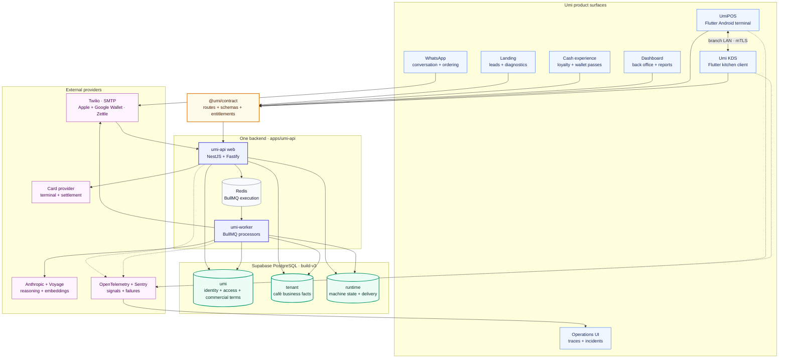

The key rule is simple. Product surfaces never become parallel platforms.
They consume one API and one data model. The POS and KDS also have a local resilience channel.

## 2. Product ownership

| Product or package | Owns | Does not own | Main communication |
| --- | --- | --- | --- |
| `apps/umi-api` | Business rules, writes, authorization, queues, adapters, and projections | Product UI and device hardware | HTTPS, PostgreSQL, BullMQ, provider APIs |
| `apps/umi-dashboard` | Owner and manager workflows | Business data or financial rules | Cookie-authenticated API calls |
| Umi Cash experience | Customer registration, QR, loyalty display, and wallet delivery | Loyalty balance truth or ledger rules | Public and authenticated API calls |
| `apps/umi-landing-page` | Marketing, lead capture, and diagnostics | Prospect storage and email workflow state | Public API calls |
| `apps/umi-pos` | Terminal UI, hardware ports, encrypted local state, and offline journal | Authoritative prices, money, orders, or loyalty | Versioned API and paired-KDS LAN |
| `apps/umi-kds` | Kitchen board, ticket actions, and local ticket journal | Order truth, payment truth, or customer messaging | Versioned API, event cursor, and POS LAN |
| Operations UI | Trace search, health, incidents, and reconciliation | Business facts | OpenTelemetry, Sentry, and read-only diagnostics |
| `packages/contract` | Routes, payload schemas, errors, versions, and product keys | Business logic | TypeScript package and neutral JSON artifact |
| `packages/tokens` | Shared brand primitives and generated app tokens | Product layout decisions | Generated CSS, JavaScript, and JSON |
| root `supabase/` | Ordered database migrations | Runtime business logic | Supabase CLI and PostgreSQL |

The Umi Cash capability can change its repository shape. Its business owner stays `umi-api`.
The public wallet URL must remain stable because printed QR codes depend on it.

### Business lifecycle

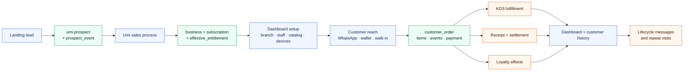

The flow starts before a café becomes a tenant. It ends with an auditable customer and business outcome.
Each step writes facts once and exposes them through the next product surface.

## 3. Target workspace shape

```text
Umi/
├── apps/
│   ├── umi-api/              # sole backend and financial writer
│   ├── umi-dashboard/        # owner and manager web console
│   ├── umi-landing-page/     # public marketing and lead capture
│   ├── umi-pos/              # Flutter Android point of sale
│   └── umi-kds/              # Flutter kitchen display client
├── packages/
│   ├── contract/             # sole API contract source
│   └── tokens/               # shared design values and generated outputs
├── supabase/
│   └── migrations/           # sole ordered migration authority
└── docs/
    ├── architecture/         # decisions and system maps
    └── migration/build-v3/   # authoritative relational model
```

The workspace uses a monorepo for coordination. A shared repository does not imply shared runtime ownership.

## 4. The four communication planes

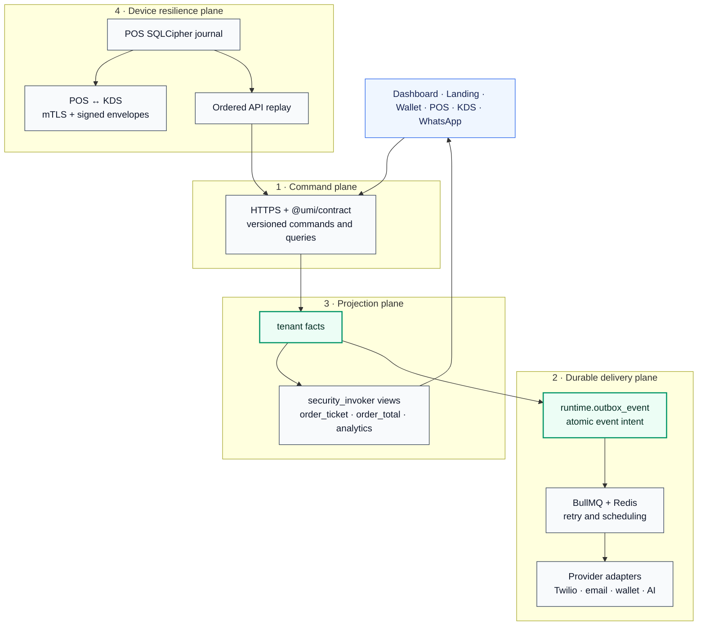

These planes solve different problems.

- The command plane validates intent and authorization.
- The outbox stores a unique event intent with the business change.
- BullMQ executes side effects with retries.
- Projections give all clients one derived view.
- The LAN plane keeps the kitchen active during an internet outage.

## 5. Backend structure

`apps/umi-api` runs one image as two processes. The web process serves requests.
The worker process performs slow and retryable work.

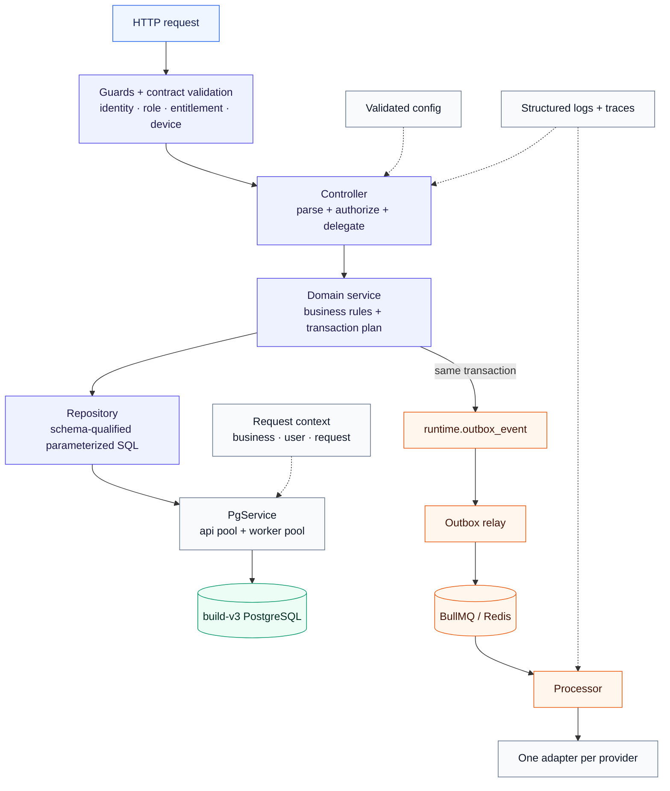

### Domain modules

| Module group | Modules | Purpose |
| --- | --- | --- |
| Platform access | `auth`, `identity`, `tenants`, `staff` | Login, role grants, business scope, and staff employment |
| Customer platform | `customers`, `cash`, `lifecycle` | Customer 360, loyalty, stored value, rewards, and lifecycle messages |
| Conversation | `conversations`, `voice`, `hours` | WhatsApp ingress, AI turns, tools, voice, and availability |
| Operations | `kds`, `pos`, `leads` | Kitchen, point of sale, prospects, and lead workflows |
| Async work | `turns`, `enrichment`, `outbound`, `integrations`, `lifecycle` | Queue consumers, schedules, retries, and provider delivery |
| Shared infrastructure | `database`, `adapters`, `auth`, `config`, `logging`, `ratelimit` | One implementation for each cross-cutting concern |

### Layer rule

```text
controller → service → repository → PgService → PostgreSQL
```

Controllers contain transport logic. Services contain business rules.
Repositories contain SQL. Adapters contain external provider logic.

## 6. build-v3 data authority

build-v3 uses schemas for authorship, not for product modules. Product domains live in backend code.

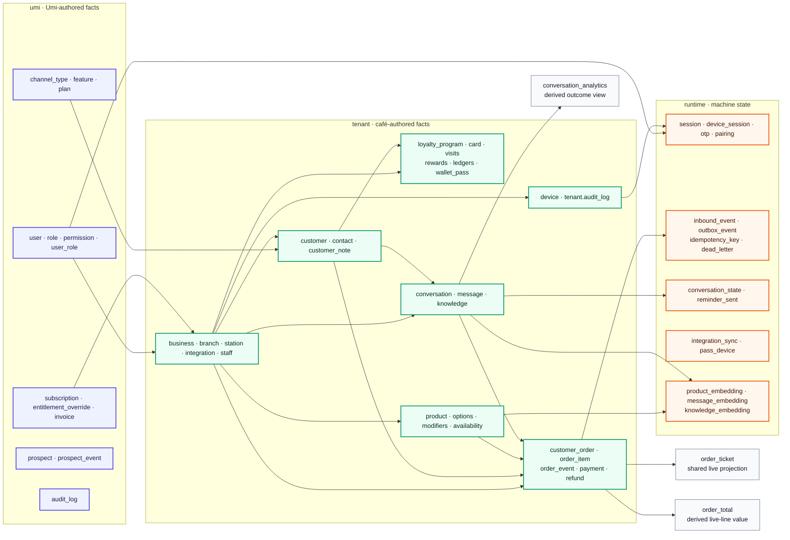

### Schema meaning

| Schema | Question it answers | Access rule |
| --- | --- | --- |
| `umi` | What does Umi know and grant? | Umi controls writes. Selected business rows use RLS. |
| `tenant` | What happened inside a café? | Every business fact uses business scope and RLS. |
| `runtime` | What must the machine read to continue? | The backend and worker control access. |
| `extensions` | Which PostgreSQL capabilities support the model? | Application roles receive usage only. |

Telemetry does not belong in these schemas. OpenTelemetry and Sentry receive operational signals.

### Database roles

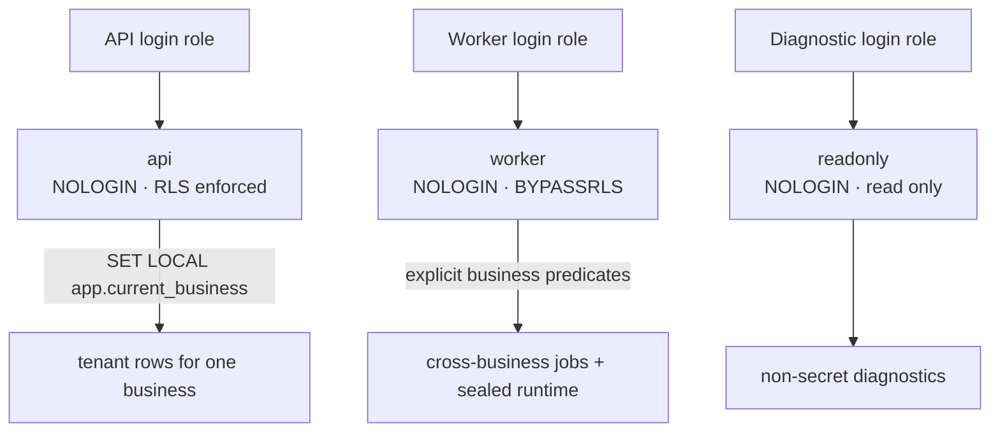

The request role sets `app.current_business` inside the same transaction. RLS applies to each request.
The worker can cross businesses only for trusted background work. Secret tables remain sealed.

## 7. Shared packages

### `packages/contract`

The contract is the only editable definition of HTTP routes and payload shapes.

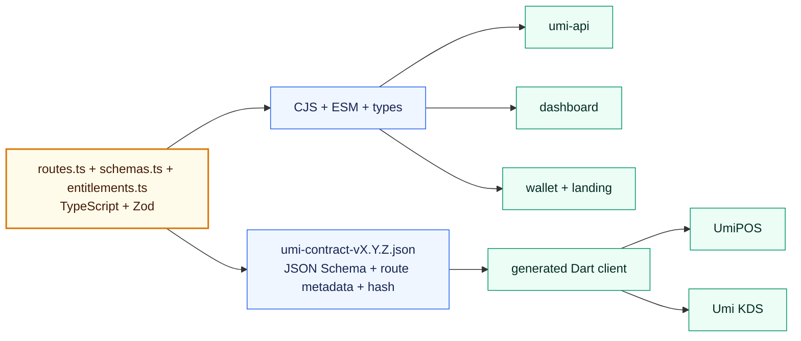

The neutral artifact includes these fields:

- Contract version and content hash.
- Method and `/api/v{major}/...` path.
- Request and response schemas.
- Authentication mode.
- Idempotency requirement.
- Stable machine error codes.
- Offline eligibility.
- Approval requirements.

No developer writes a parallel Dart model. Generated output stays immutable and versioned.

### `packages/tokens`

The token package centralizes stable brand values. It keeps product-specific typography and surfaces separate.

| Output | Consumer | Purpose |
| --- | --- | --- |
| `dashboard.css` | Dashboard | CSS custom properties |
| `landing.cjs` and `landing.mjs` | Landing | Tailwind theme input |
| `tokens.json` | Tooling and future clients | Resolved neutral values |

The package shares real brand facts only. It does not force all products to look identical.

## 8. Business channels

| Channel | User intent | Trust proof | Durable entry | Main result |
| --- | --- | --- | --- | --- |
| WhatsApp | Ask, order, or receive status | Twilio signature and sender resolution | `runtime.inbound_event` | Conversation, order, or outbound reply |
| Dashboard | Configure and inspect the business | User cookie, role, business scope, entitlement | API transaction | Config, audit fact, or report |
| Landing | Submit interest or a diagnostic | Public validation and abuse controls | `umi.prospect` and `prospect_event` | Sales follow-up |
| Wallet | Register, scan, top up, redeem, or receive a pass | Customer flow or staff authorization | Loyalty facts and ledgers | Updated loyalty state |
| POS | Sell, tender, refund, or manage a shift | Device proof, operator session, role, branch, entitlement | Idempotent POS command | Atomic sale and receipt |
| KDS | Read and advance kitchen work | Enrolled device and station scope | Ordered event command | Fulfillment change and notification |
| POS ↔ KDS LAN | Continue kitchen work offline | Branch certificate, mTLS, signature, sequence | Local durable journals | Ticket delivery and signed ACK |
| Email | Send lead, reset, or lifecycle messages | Server-held provider credentials | Outbox or scheduled job | Provider delivery result |
| Wallet provider | Create and update passes | Server-held signing material | Wallet pass and device state | Apple or Google pass update |
| Telemetry | Explain behavior and failures | Service identity and redaction | OTel/Sentry event | Trace, metric, log, or alert |

### Catalog and menu flow

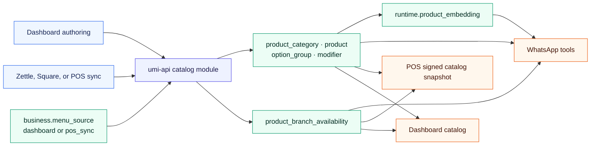

One selected authority writes the catalog. Every sales channel reads the same product and availability facts.
The POS snapshot pins a catalog version for offline use.

## 9. WhatsApp ordering flow

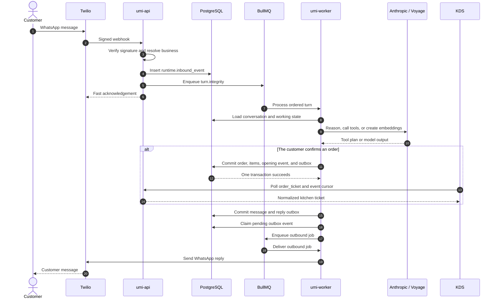

The webhook stays fast. Slow model work runs in the worker.
The database commits the business fact before the worker sends an external message.

## 10. The order model

Every order channel writes the same aggregate. The `source` field records the origin.

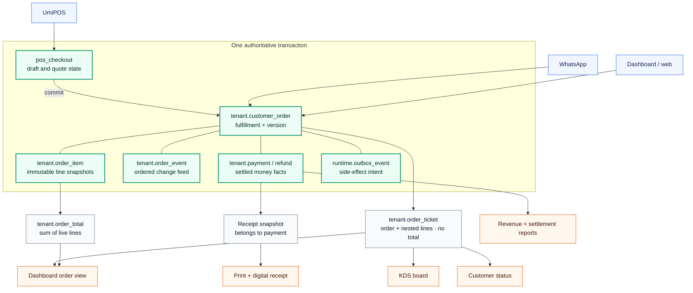

### Order lifecycle

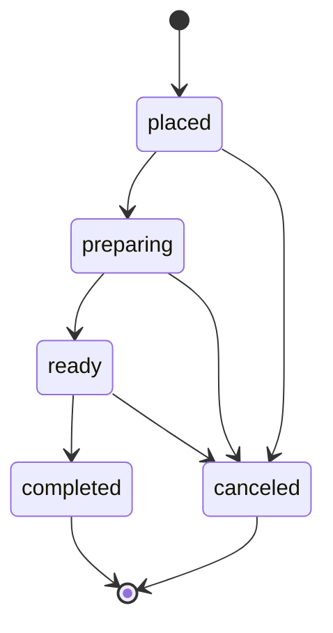

### Load-bearing order rules

- `customer_order.status` stores current fulfillment state.
- `customer_order.version` supports optimistic concurrency.
- `order_event.sequence` gives pull clients a stable cursor.
- `order_event` records status and line changes.
- `order_item` stores price and name snapshots.
- A line change voids the old row and adds a new row.
- A voided line remains visible to the kitchen.
- `order_total` derives the value of live lines.
- `payment` and `refund` store settled money.
- Revenue reports read payments, not mutable order lines.
- A draft checkout never appears in the KDS.
- A station belongs to the paired device scope.
- Future item routing belongs on each order line.

### Ticket and money are separate views

| Question | Source |
| --- | --- |
| What must the kitchen prepare? | `tenant.order_ticket` |
| What do the current live lines cost? | `tenant.order_total` |
| What did the customer pay? | `tenant.payment` |
| What money returned later? | `tenant.refund` |
| What appears on the receipt? | Immutable receipt snapshot linked to payment |

This split prevents a later line void from rewriting historical revenue.

## 11. UmiPOS online sale

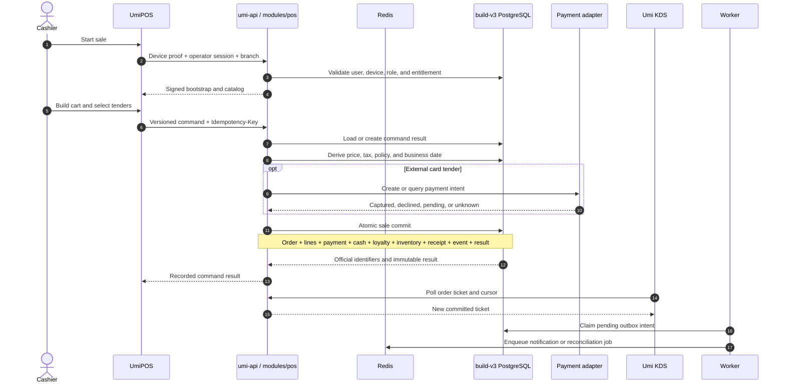

External provider calls stay outside database locks. The final database transaction records every authoritative sale effect.
The same command and fingerprint return the recorded result. A changed fingerprint returns `idempotency_conflict`.

## 12. UmiPOS offline and LAN flow

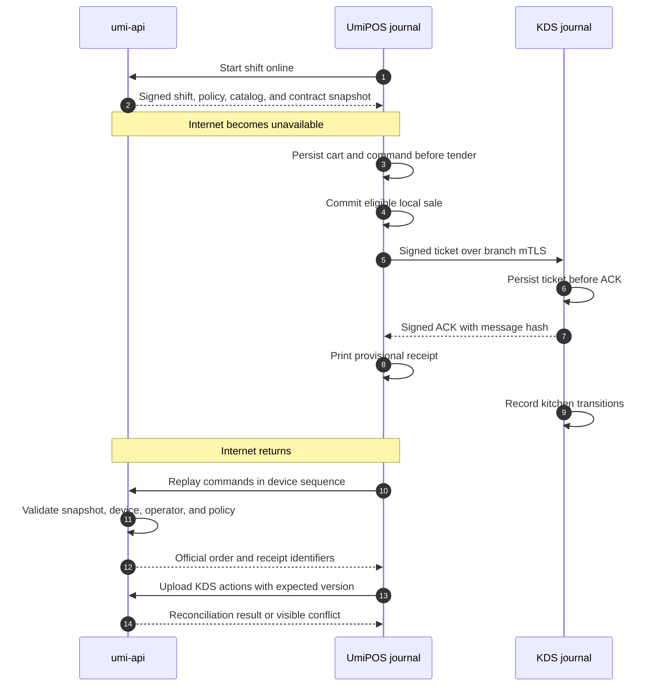

Offline support is an explicit capability set. It does not copy the server into the device.

### Offline trust rules

- Start the shift online.
- Encrypt local data with SQLCipher.
- Store the key in the platform keystore.
- Persist a command before network or tender work.
- Use one stable `clientCommandId`.
- Preserve original price and policy snapshots.
- Block refunds and loyalty redemption offline.
- Block official shift close until sync completes.
- Show every replay conflict.
- Never drop or silently reprice a command.

## 13. Loyalty and wallet flow

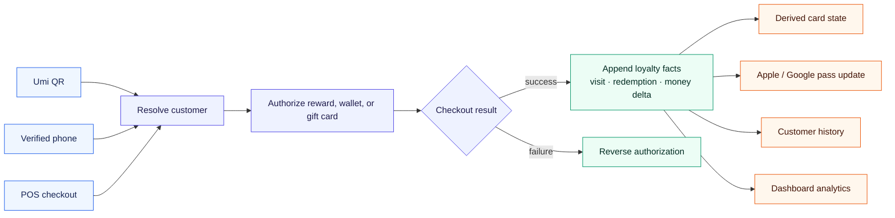

The loyalty card stores identity only. Stored value equals the sum of ledger deltas.
Visit count equals the count of visits. Money ledgers never update or delete prior facts.

## 14. Device and user trust

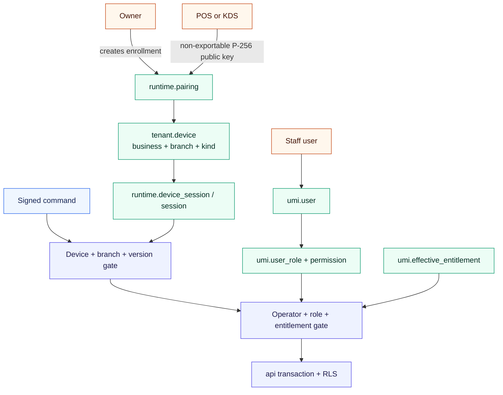

### Trust by surface

| Surface | Proof | Scope |
| --- | --- | --- |
| Dashboard | Rotating httpOnly session cookies and CSRF protection | User roles and business |
| POS | Device signature plus short operator session | One device, business, branch, and shift |
| KDS | Enrolled device proof and paired station | One device, business, branch, and station |
| WhatsApp | Twilio signature and sender account | Resolved business and customer channel |
| Worker | Trusted worker role | Explicit cross-business job scope |
| Read-only tools | Restricted diagnostic role | Non-secret reporting data |

No client receives database credentials. A device revocation fails the next online command.

## 15. Important libraries and dependencies

### Backend and data

| Library or service | Job | Why Umi uses it |
| --- | --- | --- |
| Node.js | Backend runtime | It supports the TypeScript service, workers, and shared package tools. |
| NestJS | Module, dependency, guard, and lifecycle structure | It gives each business domain an explicit module boundary. |
| Fastify | HTTP transport | It provides a small, fast server and exact webhook body control. |
| `@fastify/cookie` | Cookie parsing and response helpers | Dashboard sessions use signed httpOnly cookies. |
| BullMQ | Queue workers, retries, priorities, and schedules | Slow work cannot block inbound HTTP requests. |
| Redis | BullMQ execution state | It provides fast queue coordination and worker locks. |
| `pg` | PostgreSQL pools and parameterized SQL | Repositories keep SQL explicit and preserve PostgreSQL features. |
| PostgreSQL | Transactions, constraints, views, RLS, and ledgers | The database enforces core platform invariants. |
| Supabase | Managed PostgreSQL host, migration tooling, backup, and recovery | It keeps PostgreSQL canonical while Umi owns the API. |
| pgvector | Vector search | It stores product, message, and knowledge embeddings in `runtime`. |
| Zod | Contract schemas and type inference | One definition validates data and generates client types. |
| `class-validator` and `class-transformer` | Nest request DTO validation | They protect the HTTP boundary while contract adapters remain explicit. |
| `jose` | JWT and JOSE primitives | It supports secure web sessions and signed token work. |

### Product clients

| Library or service | Job | Why Umi uses it |
| --- | --- | --- |
| React | Dashboard, landing, and wallet UI | It provides component-based web product surfaces. |
| Vite | Dashboard build and development server | It gives the SPA a fast and direct build path. |
| React Router | Dashboard navigation | It maps product modules to clear routes. |
| Next.js | Landing and public wallet routes | It combines public pages with server routes where required. |
| Flutter | POS and KDS clients | It supports Android terminals and the iPad KDS from one client stack. |
| SQLCipher | Encrypted device database | POS recovery data stays encrypted at rest. |
| Android Keystore and Apple Keychain | Non-exportable keys | A copied file cannot copy the device identity. |
| PassKit and Google Wallet APIs | Loyalty passes | Umi can issue and update platform-native wallet passes. |
| QR libraries | Customer and loyalty lookup | A scan resolves a Umi customer or card without manual search. |

### Channels and operations

| Library or service | Job | Why Umi uses it |
| --- | --- | --- |
| Twilio | WhatsApp ingress and delivery | It connects the customer conversation channel to the API. |
| Anthropic SDK | Model calls and tool selection | It powers the conversational order assistant. |
| Voyage AI | Embeddings | It supports semantic product, memory, and knowledge retrieval. |
| Nodemailer | SMTP email | One adapter sends reset, lead, and lifecycle email. |
| Zettle adapter | Catalog integration | It imports an external menu source when a business selects it. |
| OpenTelemetry | Traces, metrics, and logs | It keeps telemetry outside the business database. |
| Sentry | Client and service failures | It adds crash context and release correlation. |
| Docker Compose | Runtime packaging | One image runs the web and worker commands. |
| Caddy | TLS and reverse proxy | It terminates public HTTPS for the API. |

### Workspace and quality

| Tool | Job | Why Umi uses it |
| --- | --- | --- |
| pnpm | Workspace dependency management | It links shared packages with one lockfile. |
| Turborepo | Task graph and cache | It orders package builds and runs checks across apps. |
| tsup | Contract package build | It emits ESM, CommonJS, and type declarations. |
| Vitest and Jest | Unit and integration tests | They verify services, contracts, and web behavior. |
| Swift test fixtures | KDS behavior reference | They preserve the kitchen contract during the Flutter implementation. |

The dependency principle is narrow. One library has one main job.
Umi avoids a second framework for a problem that the existing stack already solves.

## 16. Deployment topology

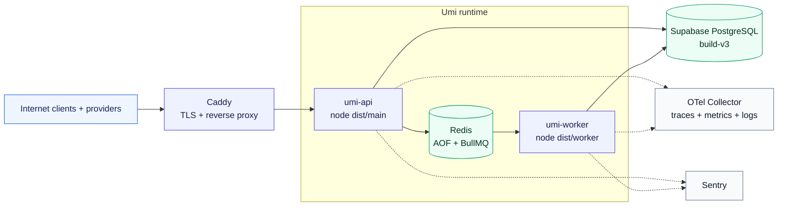

The web and worker share code, modules, adapters, and configuration. They scale independently.
PostgreSQL remains the business source of truth. Redis never becomes business storage.

## 17. Core invariants

### Data

- Keep all authoritative writes in `umi-api`.
- Use build-v3 names and schema boundaries.
- Store money as signed 64-bit centavos plus currency.
- Derive balances, counts, and working totals.
- Keep financial ledgers append-only.
- Use compensating facts for corrections.
- Keep receipts immutable after commit.
- Keep telemetry outside business schemas.

### Orders

- Write an order and its opening event in one transaction.
- Record line changes in the ordered event feed.
- Use order versions for optimistic concurrency.
- Show only committed orders to the KDS.
- Keep payment state separate from fulfillment state.
- Keep provider calls outside database locks.

### Communication

- Write the outbox row with the business change.
- Use deterministic idempotency keys.
- Assume at-least-once delivery.
- Make every consumer idempotent.
- Keep a dead-letter trail for terminal failures.
- Use one adapter for each provider.

### Security

- Keep database credentials out of every client.
- Enforce business scope through RLS.
- Bind a POS or KDS device to one branch.
- Keep device private keys non-exportable.
- Revoke access on the next online command.
- Redact customer, device, token, and card data from telemetry.

### Contracts

- Edit routes and schemas only in `packages/contract`.
- Put the API major in the path.
- Generate Dart models and clients.
- Keep older majors stable during their support window.
- Reject unsupported versions explicitly.

## 18. How a feature crosses the platform

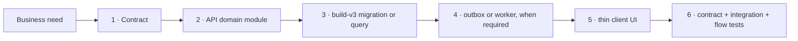

1. Define the business fact and its owner.
2. Extend `packages/contract`.
3. Add the narrowest `umi-api` module change.
4. Add a build-v3 migration when the fact needs storage.
5. Add an outbox route for an external side effect.
6. Generate or consume the client contract.
7. Verify the complete business flow.

## 19. Decision basis and references

### Documented facts

- [build-v3 foundation](../migration/build-v3/00_foundation.sql)
- [build-v3 Umi schema](../migration/build-v3/10_umi.sql)
- [build-v3 tenant schema](../migration/build-v3/20_tenant.sql)
- [build-v3 runtime schema](../migration/build-v3/30_runtime.sql)
- [build-v3 RLS and grants](../migration/build-v3/90_rls.sql)
- [build-v3 order model](../migration/build-v3/ORDER_MODEL.md)
- UmiPOS fusion plan: `UMIPOS_FUSION_IMPLEMENTATION_PLAN.md`
- [UmiPOS contract seam](2026-07-20-umipos-contract-seam.md)
- [Umi API centralization](2026-06-23-umi-api-centralization-spec.md)
- [`@umi/contract` guide](../../packages/contract/README.md)
- [`@umi/tokens` guide](../../packages/tokens/README.md)
- [Umi API root modules](../../apps/umi-api/src/app.module.ts)
- [Umi worker root modules](../../apps/umi-api/src/worker.module.ts)

### Source-backed tradeoffs

- [NestJS Fastify adapter](https://docs.nestjs.com/techniques/performance)
- [BullMQ idempotent jobs](https://docs.bullmq.io/patterns/idempotent-jobs)
- [BullMQ custom job IDs](https://docs.bullmq.io/guide/jobs/job-ids)
- [node-postgres parameterized queries](https://node-postgres.com/features/queries)
- [node-postgres pools and transactions](https://node-postgres.com/apis/pool)
- [Supabase Row Level Security](https://supabase.com/docs/guides/database/postgres/row-level-security)
- [Supabase database migrations](https://supabase.com/docs/guides/deployment/database-migrations)
- [Zod schemas and type inference](https://zod.dev/)
- [Flutter offline-first architecture](https://docs.flutter.dev/app-architecture/design-patterns/offline-first)

### Umi-specific decisions

- UmiPOS is an Umi client, not a peer platform.
- `umi-api` is the sole backend and financial writer.
- build-v3 schemas represent authorship.
- KDS consumes an order projection and never owns an order.
- The database outbox provides the durable side-effect boundary.
- The POS and KDS use a direct LAN channel only for resilience.
- Umi Cash capabilities use the shared loyalty domain.
- OpenTelemetry and Sentry own operational telemetry.
