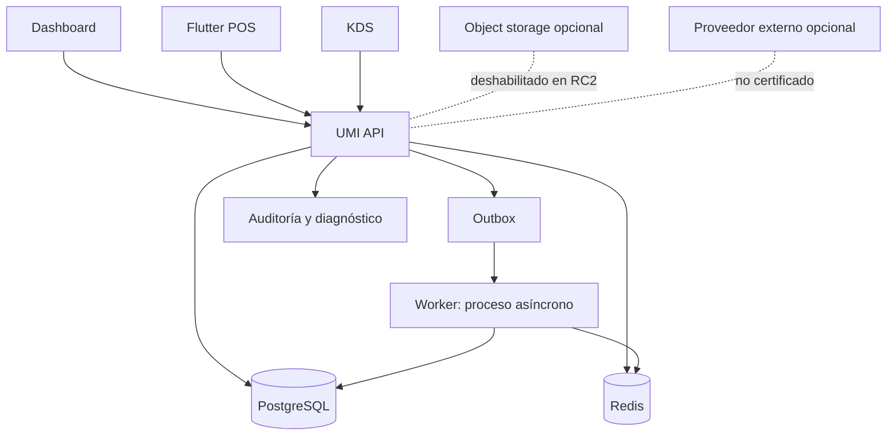
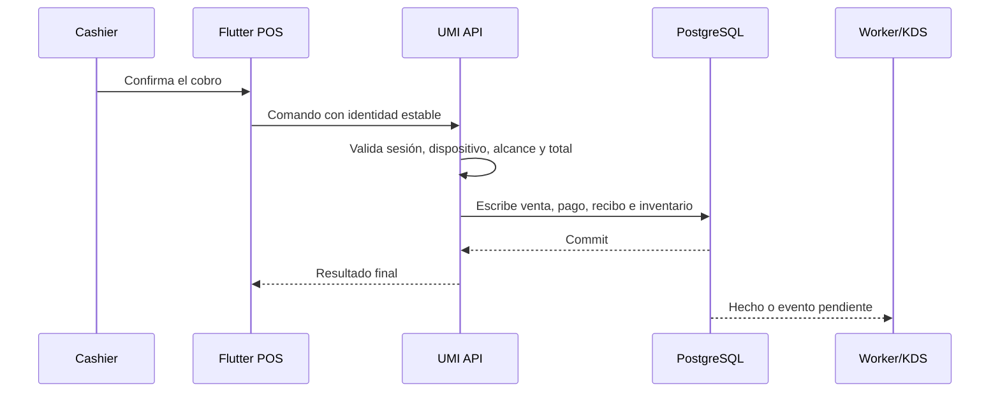

# Arquitectura

[Índice](README.md) | [Datos y API](DESARROLLO_CODIGO_DATOS_Y_API.md) | [Observabilidad](TRABAJADORES_Y_OBSERVABILIDAD.md)

## Topología

## Autoridad

PostgreSQL conserva los hechos del negocio. UMI API valida identidad, permiso, alcance, versión e idempotencia antes de escribir.

Redis conserva estado temporal. Una pérdida de Redis no cambia la verdad financiera que ya existe en PostgreSQL.

El proceso worker ejecuta las tareas asíncronas. No puede inventar una venta, reembolso ni saldo.

Dashboard, POS y KDS son clientes. Ninguno sustituye la autorización del servidor.

## Flujos de solicitud

### Venta

### Reembolso

El cliente solicita una vista previa. El servidor valida contenido, monto, permiso y aprobación.

La confirmación añade un hecho de reembolso. La venta original y su recibo permanecen intactos.

### Inventario

La venta añade hechos al ledger. Las proyecciones resumen esos hechos para consulta.

### KDS

KDS obtiene una instantánea y recibe cambios. Cada comando usa el estado permitido del pedido.

## Modelo de fallas

| Falla                    | Efecto esperado                                        | Acción segura                                                |
| ------------------------ | ------------------------------------------------------ | ------------------------------------------------------------ |
| API no disponible        | Los comandos online no continúan                       | Espera disponibilidad o usa una función offline autorizada   |
| Redis no disponible      | Sesiones, límites o colas pueden degradarse            | Restaura Redis y consulta PostgreSQL para verdad financiera  |
| Worker detenido          | El trabajo asíncrono se retrasa                        | Reinicia el worker. Revisa el trabajo pendiente y los fallos |
| KDS desconectado         | Conserva la vista conocida y bloquea cambios inseguros | Reconecta. Concilia con una nueva instantánea                |
| Estado frontend obsoleto | El servidor rechaza la versión o aprobación            | Recarga. Revisa antes de crear otro comando                  |
| Respuesta perdida        | La confirmación puede existir                          | Consulta el comando original. No repitas a ciegas            |

## Fuentes

- API: `apps/umi-api/src/modules/`
- Worker: `apps/umi-api/src/worker.module.ts` y `apps/umi-api/src/jobs/`
- POS: `apps/umi-pos/lib/features/`
- KDS: `apps/umi-kds/Sources/`
- Contratos: `packages/contract/`
- Migraciones: `docs/migration/`
