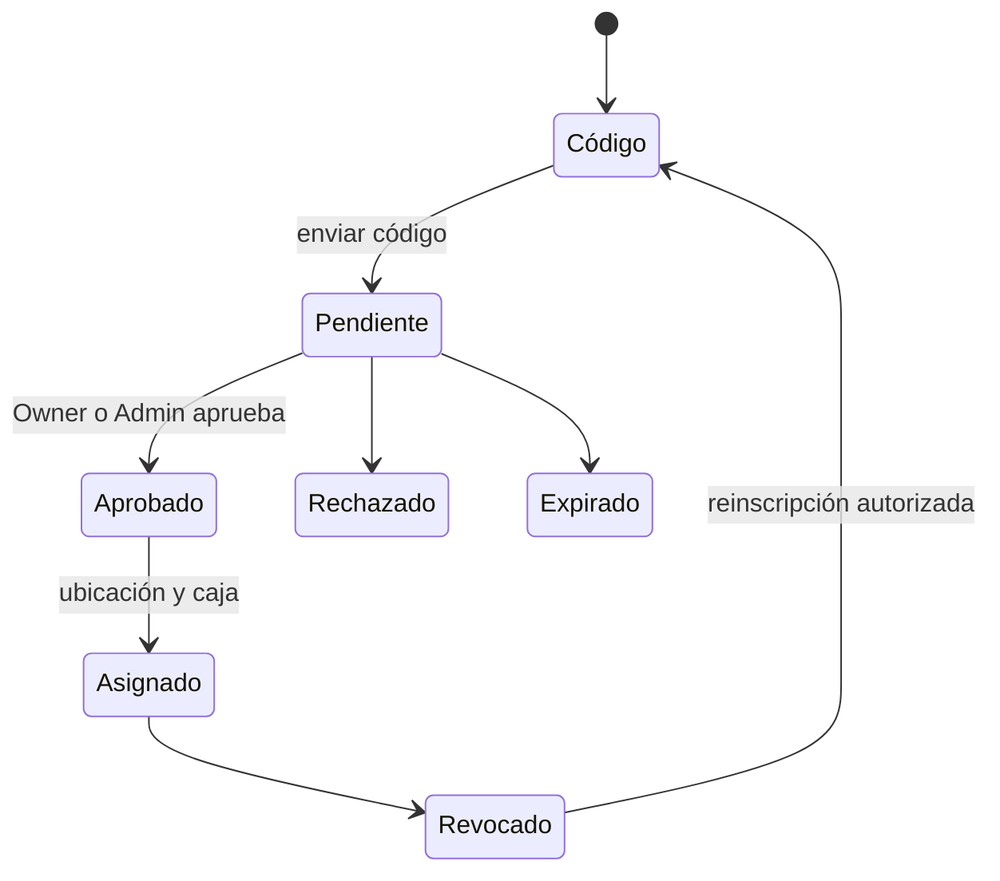

# Comercios, usuarios, dispositivos y cajas

[Índice](README.md) | [Seguridad](SEGURIDAD_IDENTIDAD_Y_PERMISOS.md) | [POS](POS_FLUTTER.md)

## Comercio y ubicación

El bootstrap crea el contexto inicial y el primer Owner. Después, el Owner configura ubicaciones, región y políticas operativas.

Una ubicación no es una etiqueta visual. Afecta permisos, catálogo, inventario, cajas, dispositivos, ventas y KDS.

Antes de operar:

1. Verifica el comercio.
2. Verifica la ubicación.
3. Verifica la zona horaria y la moneda.
4. Verifica las políticas de recibo y funciones.
5. Verifica que el estado no sea archivado.

## Usuarios y membresías

Una persona puede tener una membresía con rol, estado y ubicaciones. Un cambio de rol no modifica hechos históricos.

### Ciclo

1. Crea o invita al usuario.
2. Asigna un rol permitido.
3. Asigna ubicaciones.
4. Confirma el estado activo.
5. Revoca la membresía cuando termine la relación.

No reutilices una cuenta para varias personas. No compartas PIN ni contraseña.

El último Owner no se puede revocar sin otro Owner válido. Esta regla evita un comercio sin autoridad administrativa.

## Dispositivo, caja y turno

| Concepto           | Significado                                        |
| ------------------ | -------------------------------------------------- |
| Dispositivo físico | Equipo que ejecuta una aplicación                  |
| Identidad inscrita | Credencial confiable emitida para ese cliente      |
| Caja               | Configuración operativa asociada con una ubicación |
| Turno              | Periodo de custodia y conciliación de efectivo     |

Una caja puede existir sin un turno abierto. Un turno no sustituye la configuración de la caja.

## Inscripción del dispositivo

La confianza protege el acceso operativo. También permite revocar un equipo sin cambiar hechos anteriores.

## Soporte

### Dispositivo no reconocido

1. Verifica ambiente y versión.
2. Verifica el estado de inscripción.
3. Verifica la ubicación y la caja asignadas.
4. Reinscribe solo después de una revocación confirmada.

### Ubicación incorrecta

Detén la venta. Corrige la asignación antes de crear hechos en otro contexto.

### Caja no disponible

Verifica estado, ubicación, dispositivo y turno. No crees una caja duplicada para ocultar el problema.

La prueba física del equipo pertenece a Gate 13.
