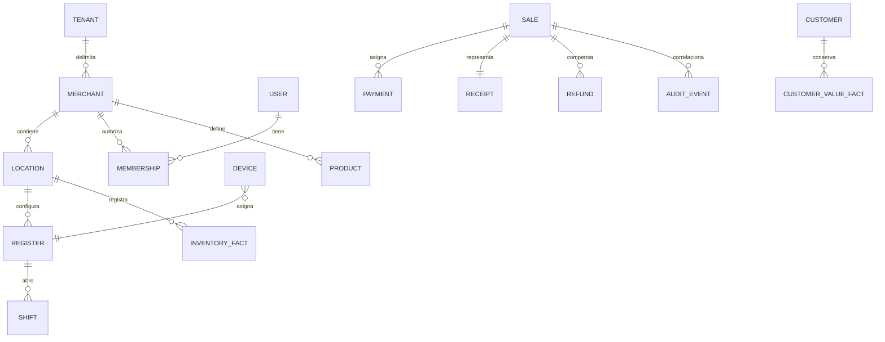

# Desarrollo, mapa de código, datos y API

[Índice](README.md) | [Arquitectura](ARQUITECTURA.md) | [Versiones](GESTION_DE_VERSIONES.md)

## Reglas de arquitectura

- UMI API conserva la autoridad del backend.
- PostgreSQL conserva los hechos del negocio.
- Aplica tenancy y permisos en el servidor.
- Conserva ventas, pagos, recibos, reembolsos y auditoría como hechos inmutables.
- Usa idempotencia para evitar efectos duplicados.
- No crees un backend NEXO independiente.
- No uses hardware pendiente como excusa para una función de software faltante.

## Preparación

Usa Node.js, pnpm, PostgreSQL, Redis, Flutter y el toolchain Apple solo cuando corresponda.

```sh
pnpm install --frozen-lockfile
pnpm run build
pnpm run lint
pnpm run test
```

Consulta `WORKSPACE.md`, cada `REPO_CONTEXT.md` y los archivos `AGENTS.md` antes de cambiar un owner.

## Mapa práctico

| Tema               | Ruta principal                                    |
| ------------------ | ------------------------------------------------- |
| Auth y sesiones    | `apps/umi-api/src/modules/auth/`                  |
| Identidad          | `apps/umi-api/src/modules/identity/`              |
| Personal           | `apps/umi-api/src/modules/staff/`                 |
| Comercios          | `apps/umi-api/src/modules/merchants/`             |
| Dispositivos       | `apps/umi-api/src/modules/devices/`               |
| Catálogo POS       | `apps/umi-api/src/modules/pos-catalog/`           |
| Ventas             | `apps/umi-api/src/modules/pos-sale/`              |
| Checkout           | `apps/umi-api/src/modules/pos-checkout/`          |
| Inventario         | `apps/umi-api/src/modules/pos-inventory/`         |
| Caja               | `apps/umi-api/src/modules/pos-cash/` y `cash/`    |
| Refunds y recovery | `apps/umi-api/src/modules/pos-exception/`         |
| Customer value     | `apps/umi-api/src/modules/pos-customer-value/`    |
| KDS                | `apps/umi-api/src/modules/kds/` y `apps/umi-kds/` |
| Worker             | `apps/umi-api/src/jobs/` y `worker.module.ts`     |
| Dashboard          | `apps/umi-dashboard/src/`                         |
| Flutter POS        | `apps/umi-pos/lib/features/`                      |
| Contratos          | `packages/contract/`                              |
| Migraciones        | `docs/migration/`                                 |
| Release            | `scripts/` y `docs/deployment/`                   |

## Modelo de datos



La configuración mutable incluye nombres, políticas vigentes y asignaciones. Los hechos terminales no se editan.

## API

La API usa controladores NestJS, validación de contratos, servicios de dominio y repositorios PostgreSQL.

Los grupos de rutas siguen los módulos de `apps/umi-api/src/modules/`. El contrato generado vive en `packages/contract/`.

No dupliques aquí cada operación. Usa `packages/contract/src/route-table.ts` y los controladores como referencia exacta.

Cada comando protegido puede validar:

- Sesión y CSRF.
- Comercio y ubicación.
- Rol y permiso.
- Dispositivo y caja.
- Versión de estado.
- Command ID, idempotencia y huella.
- Aprobación vinculada.

## Pruebas y certificación

```sh
pnpm --filter @umi/api test
pnpm --filter @umi/api typecheck
pnpm --filter @umi/dashboard test
pnpm --filter @umi/dashboard lint
cd apps/umi-pos && flutter analyze && flutter test
PR_BASE_REF=origin/build-v3 pnpm check:pr
```

Ejecuta solo las suites relacionadas con el cambio. Un cambio de artefacto exige una nueva identidad de versión.
