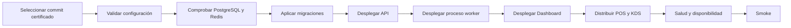

# Despliegue, respaldo y recuperación

[Índice](README.md) | [Gestión de versiones](GESTION_DE_VERSIONES.md) | [Problemas](SOLUCION_DE_PROBLEMAS.md)

## Versión actual

`UMI POS Pilot RC2`, versión `6.0.0-pilot.rc2`.

El artifact source es `1e885022b654dcecf943377ea2e1e3b739a9027a`.

`RC1 SUPERSEDED — DO NOT DEPLOY`.

## Secuencia de despliegue

Usa `docs/deployment/UMIPOS_PILOT_RC_DEPLOYMENT.md` para los comandos exactos.

El despliegue verifica versión, commit, contrato, esquema y ambiente. No uses un artefacto sin identidad verificable.

## Configuración

Los secretos viven en el entorno del servicio correspondiente. Nunca los pongas en `VITE_`, Flutter defines públicos o documentación.

Las configuraciones de pilot y production fallan si falta un valor requerido. No actives bypass de desarrollo.

## Migraciones

Aplica las migraciones en orden. No edites tablas manualmente para completar un despliegue.

El esquema actual termina en `build-v3-48`. Un fallo detiene la versión antes de abrir tráfico.

## Smoke

1. Verifica API live y ready.
2. Verifica la disponibilidad del proceso worker.
3. Abre Dashboard y autentica un Owner.
4. Verifica comercio, ubicación, dispositivos y cajas.
5. Carga catálogo e inventario.
6. Verifica KDS cuando corresponda.
7. Ejecuta una transacción segura autorizada.
8. Confirma historia, recibo y ausencia de duplicado.

## Respaldo

PostgreSQL es la fuente autoritativa de hechos del negocio. Conserva respaldos con identidad, hora, tamaño y checksum.

Object storage está deshabilitado en RC2. Si se habilita después, requiere su propia política de durabilidad.

## Recuperación

| Acción         | Uso                                              |
| -------------- | ------------------------------------------------ |
| Restart        | Reinicia un proceso sin cambiar versión ni datos |
| Rollback       | Vuelve a una aplicación compatible               |
| Restore        | Recupera datos desde un respaldo autorizado      |
| Reconciliation | Compara proyecciones y totales con hechos        |

No reviertas una migración irreversible a ciegas. Prefiere una aplicación anterior compatible con el esquema futuro.

No reconstruyas ventas, pagos o inventario desde una pantalla. Usa PostgreSQL, auditoría, backups y procedimientos certificados.

## STOP

Detén el despliegue por identidad incorrecta, migración inesperada o exposición de secretos.

Detén también por una diferencia no explicada o una prueba financiera fallida.
