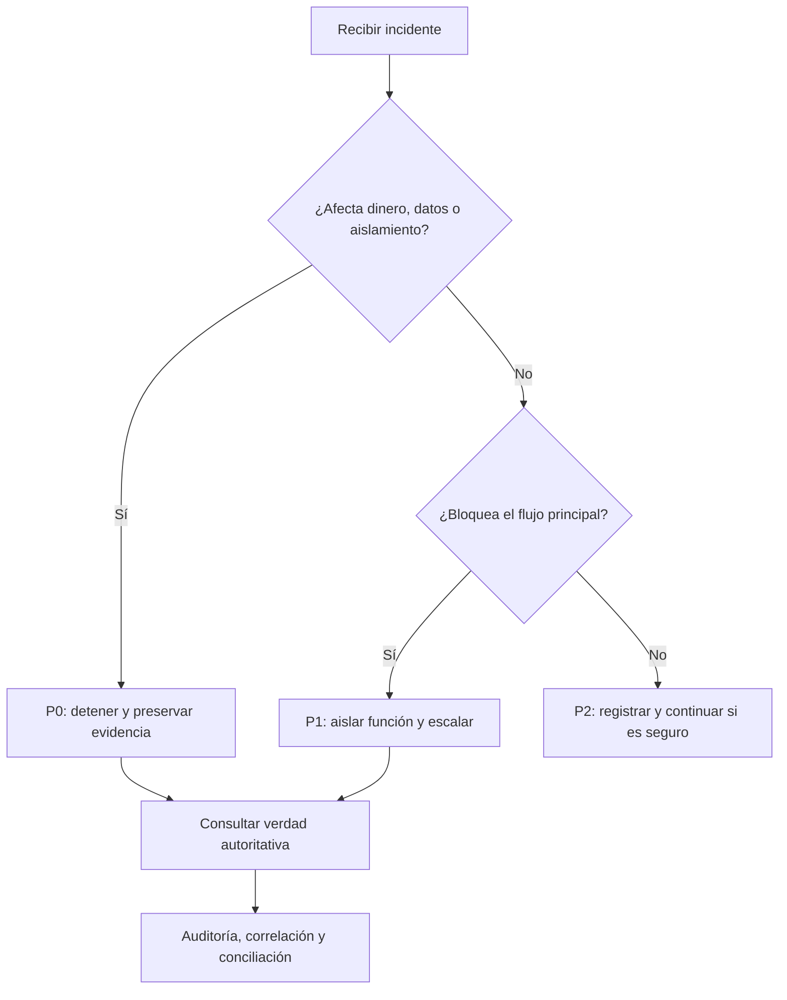

# Incidentes, soporte y diagnóstico

[Índice](README.md) | [Problemas](SOLUCION_DE_PROBLEMAS.md) | [Plantilla](../pilot/UMIPOS_PILOT_ISSUE_LOG_TEMPLATE.md)

## Severidad

### P0

Detén la operación afectada. Conserva evidencia. Determina el estado autoritativo. No repitas una mutación incierta.

Ejemplos: dinero incorrecto, duplicado irreversible, cruce de comercio, pérdida de datos o exposición de secretos.

### P1

Detén el flujo afectado. Aísla comercio, ubicación, dispositivo y función. Usa solo una alternativa certificada.

Ejemplos: venta bloqueada, KDS incoherente, recuperación insegura, caja inutilizable o despliegue incorrecto.

### P2

Registra el problema. Continúa si el estado y la seguridad son claros.

## Datos para triage

- Comercio y ubicación.
- Rol del usuario.
- Dispositivo y caja.
- Versión y confirmación de Git.
- Identificador de la transacción o referencia.
- Correlation ID.
- Hora y zona horaria.
- Mensaje visible.
- Impacto operativo.
- Acción de recuperación ya realizada.

No recopiles contraseñas, PIN, cookies, tokens, secretos de proveedor ni PII innecesaria.

## Árbol de decisión

## Clasificación por área

1. Autenticación: sesión, cookie, token o revocación.
2. Autoridad: rol, permiso, ubicación o dispositivo.
3. Configuración: ambiente, origen, versión o función.
4. Transacción: venta, pago, recibo o reembolso.
5. Inventario: ledger, proyección o diferencia no explicada.
6. KDS: estación, instantánea, ciclo de vida o conexión.
7. Proceso de tareas: trabajo pendiente, reintento o fallo terminal.
8. Despliegue: migración, salud, disponibilidad o artefacto.
9. Proveedor: límite externo no certificado.

## Handoff de soporte

El operador puede detener, consultar estado visible y usar recuperación indicada.

El Owner o Manager puede revisar contexto, permisos, historia, auditoría y diagnóstico.

Soporte puede correlacionar servicios y ejecutar un runbook. Ingeniería modifica datos o software solo mediante un procedimiento aprobado.

## Escalamiento

Escala cuando no puedas demostrar un estado terminal, una acción segura o un límite claro. No uses conocimiento informal como sustituto del registro.
