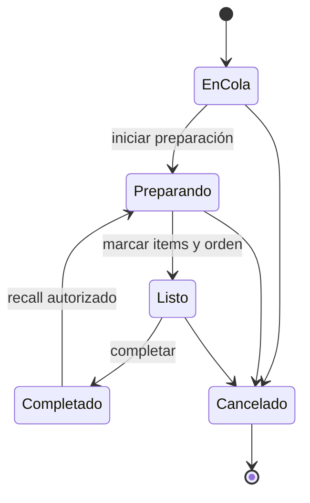

# Manual de KDS

[Índice](README.md) | [Arquitectura](ARQUITECTURA.md) | [Problemas](SOLUCION_DE_PROBLEMAS.md)

KDS significa Kitchen Display System. Presenta el trabajo de cocina para una estación y ubicación.

## Estados y acciones

Las tarjetas muestran número, edad, prioridad, cantidades, items, modificadores y notas seguras.

Una acción pendiente bloquea el doble toque. El backend valida la transición y la versión actual.

## Conexión

KDS inicia con una instantánea. Después recibe cambios en tiempo real y envía heartbeat.

Durante una desconexión, la tarjeta conocida puede permanecer visible. Las mutaciones inseguras se bloquean.

Al reconectar, KDS obtiene o concilia la instantánea. La deduplicación evita tarjetas repetidas.

## Recall y cancelación

Recall devuelve trabajo completado al estado activo según la política. No crea una venta nueva.

Cancelación es terminal. La interfaz conserva una explicación para trabajo ya preparado.

## Autoridad

KDS puede cambiar estados de preparación permitidos. No puede cobrar, reembolsar, cambiar pagos ni editar inventario financiero.

## Recuperación

1. Verifica estación, ubicación, versión y conexión.
2. Conserva la tarjeta visible.
3. No repitas una acción pendiente.
4. Reconecta y solicita una instantánea.
5. Compara el estado terminal del servidor.
6. Escala una pérdida o duplicado de trabajo como P1.

La prueba física del iPad y la red pertenece a Gate 13.

## Fuentes

- Aplicación: `apps/umi-kds/Sources/`
- Repositorio: `apps/umi-kds/Sources/Data/OrderRepository.swift`
- API: `apps/umi-api/src/modules/kds/`
- Modelo operativo: `docs/product/UMIPOS_KDS_OPERATIONAL_MODEL.md`
