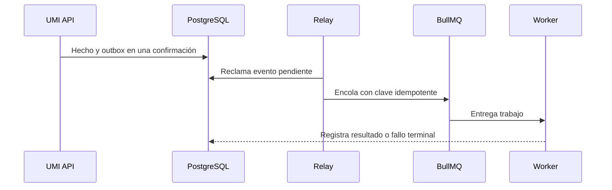

# Trabajadores y observabilidad

[Índice](README.md) | [Arquitectura](ARQUITECTURA.md) | [Incidentes](INCIDENTES_SOPORTE_Y_DIAGNOSTICO.md)

## Worker y trabajo asíncrono

El worker es el proceso de tareas asíncronas. Ejecuta trabajo que no debe bloquear una respuesta normal.

El outbox es una tabla de eventos pendientes. La confirmación final, o commit, guarda el hecho y su evento.

Una dead letter es un registro de fallo terminal. Conserva trabajo que agotó sus intentos.

Las responsabilidades incluyen:

- Relay, o retransmisor, del outbox transaccional.
- Procesadores de turnos, enriquecimiento, integración y salida.
- Tareas de ciclo de vida y leads habilitadas por configuración.
- Caducidad de autorizaciones de valor del cliente.
- Reintentos limitados y registro terminal.

## Inventario de tareas

| Tarea                          | Inicio                                              | Reintento e idempotencia                          | Fallo y señal                     | Reinicio seguro                                      |
| ------------------------------ | --------------------------------------------------- | ------------------------------------------------- | --------------------------------- | ---------------------------------------------------- |
| `OutboxRelayService`           | Intervalo cuando `OUTBOX_RELAY_ENABLED` está activo | Reclama con arrendamiento y usa clave idempotente | Deja pendiente o registra error   | Reinicia. El arrendamiento permite reclamar otra vez |
| `SystemProcessor`              | Trabajo de infraestructura                          | Un intento                                        | Falla terminal visible            | Corrige la dependencia antes de reiniciar            |
| `TurnsProcessor`               | Turno de conversación en cola                       | Tres intentos y bloqueo de cinco minutos          | Fallo terminal después del límite | Conserva la clave del turno                          |
| `EnrichmentProcessor`          | Enriquecimiento solicitado                          | Tres intentos                                     | Fallo terminal y log              | Reinicia después de restaurar la dependencia         |
| `OutboundProcessor`            | Evento de salida del outbox                         | Cinco intentos y clave estable                    | Dead letter                       | Verifica entrega antes de una acción manual          |
| `IntegrationsProcessor`        | Trabajo de integración habilitado                   | Tres intentos                                     | Fallo terminal                    | Confirma el proveedor y después reinicia             |
| `LifecycleProcessor`           | Tarea periódica habilitada                          | Tres intentos                                     | Fallo terminal                    | Conserva deduplicación del periodo                   |
| `LifecycleScheduler`           | Inicio del worker y calendario                      | Programador estable                               | Falta la tarea programada         | Reinicia. Confirma un solo programador               |
| `LeadsScheduler`               | Inicio cuando la función está activa                | Programador estable                               | Tarea ausente o fallida           | Revisa configuración y calendario                    |
| `CustomerValueExpiryScheduler` | Inicio cuando la caducidad está activa              | Tarea periódica con identidad estable             | La autorización tarda en expirar  | Reinicia y revisa trabajo pendiente                  |

## Outbox

El outbox evita perder el evento después de guardar el hecho. La clave idempotente evita un efecto duplicado.

## Si el worker se detiene

Los hechos ya comprometidos permanecen seguros. Las entregas, caducidades o proyecciones asíncronas pueden retrasarse.

1. Revisa disponibilidad funcional, Redis y conexión a PostgreSQL.
2. Revisa trabajo pendiente, intentos y fallos terminales.
3. Corrige la dependencia.
4. Reinicia el worker una vez.
5. Confirma que el trabajo pendiente disminuye.
6. Verifica que no exista efecto duplicado.

No elimines una cola para ocultar trabajo fallido.

## Señales

| Señal                       | Responde                                           |
| --------------------------- | -------------------------------------------------- |
| `/health/live`              | ¿El proceso está vivo?                             |
| `/health/ready`             | ¿Puede cumplir su función?                         |
| Identidad de versión        | ¿Qué versión está activa?                          |
| Referencia de transacción   | ¿Qué hecho del negocio se consulta?                |
| Correlation ID              | ¿Qué solicitudes pertenecen al mismo flujo?        |
| Auditoría                   | ¿Quién hizo qué, dónde y cuándo?                   |
| Recovery Center             | ¿Qué resultado es conocido y qué acción es segura? |
| Fallo terminal              | ¿Qué trabajo agotó sus intentos?                   |
| Estado de dispositivo o KDS | ¿Qué cliente está degradado?                       |

## Preguntas operativas

### ¿Ocurrió la venta?

Consulta el resultado del comando, la venta, el pago y el recibo. Después revisa auditoría y conciliación.

### ¿Por qué se negó?

Relaciona código, usuario, rol, ubicación, dispositivo y evento de auditoría.

### ¿Se repitió?

Compara identidad del comando, huella, referencias de negocio y conteo de hechos.

## Datos prohibidos

No registres contraseñas, PIN, cookies, tokens, secretos de proveedor, secretos de Gift Card ni PII innecesaria.

Los detalles técnicos pertenecen a soporte o ingeniería. El operador recibe un mensaje de negocio y una acción segura.

## Fuentes

- Worker: `apps/umi-api/src/worker.module.ts`
- Jobs: `apps/umi-api/src/jobs/`
- Health: `apps/umi-api/src/modules/health/`
- Redacción: `scripts/lib/support-redaction.mjs`
