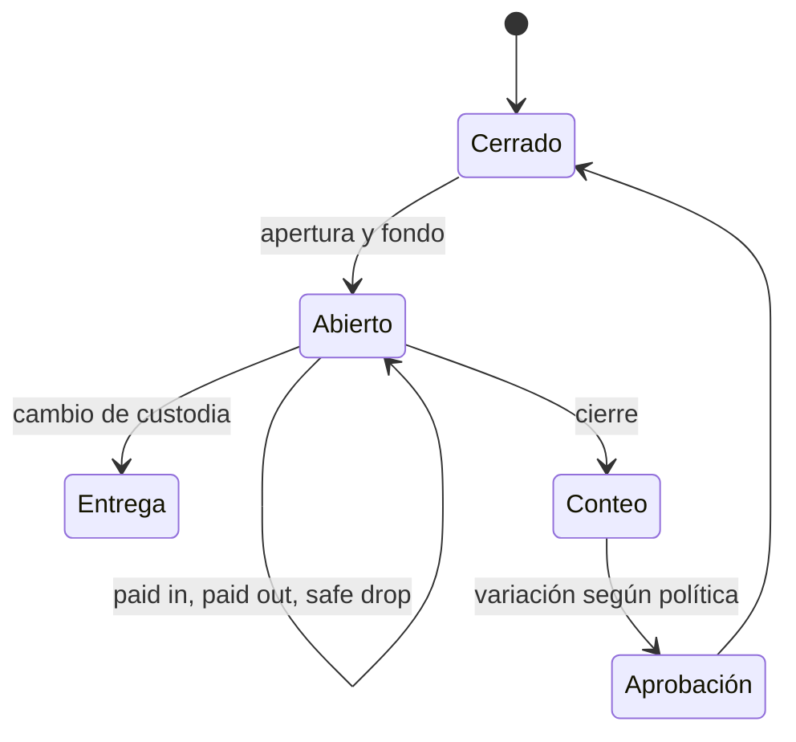

# Turnos, clientes y valor

[Índice](README.md) | [Ventas](VENTAS_RECIBOS_Y_REEMBOLSOS.md) | [Seguridad](SEGURIDAD_IDENTIDAD_Y_PERMISOS.md)

## Turnos y efectivo

Una caja es configuración. Un turno es un periodo de custodia de efectivo asociado con una caja.

El efectivo esperado proviene de hechos. El conteo real proviene del operador.

La variación es la diferencia. El conteo ciego no debe mostrar el valor esperado antes del registro.

Un cierre conserva apertura, movimientos, conteo, variación, actor y aprobación. No edites su historia.

### Diferencia de turno

1. Verifica caja, ubicación y turno.
2. Revisa fondo, ventas Cash y movimientos.
3. Revisa safe drops y cambios de custodia.
4. Repite el conteo físico autorizado.
5. Registra la variación. No cambies ventas para hacerla desaparecer.

## Clientes

Un cliente puede asociarse con una venta. La venta anónima permanece disponible.

El perfil conserva solo información necesaria. Los roles inferiores reciben una proyección limitada.

Consentimiento de marketing y enrolamiento de lealtad son decisiones separadas. No los actives de forma implícita.

## Lealtad

La política define cómo se gana o usa valor. Los hechos conservan lo que ocurrió bajo una versión de política.

Un earn pendiente no es igual a un saldo disponible. Una recompensa requiere elegibilidad, costo y autorización.

Un reembolso crea una reversión según los hechos originales. No aplica una política nueva a la historia.

## Wallet

Wallet conserva cuenta, balance disponible, autorizaciones, débitos, liberaciones, reembolsos e historia.

El saldo no es un campo editable. Cambia mediante hechos autorizados y conciliables.

POS confirma el importe exacto. Una autorización expirada se libera según la política.

## Gift cards

La tarjeta usa una identidad pública enmascarada y un secreto protegido. El secreto solo se revela en el límite autorizado.

No muestres ni registres el secreto completo. No lo copies en diagnósticos ni tickets.

Emisión, activación, autorización, débito, suspensión y reembolso producen hechos separados.

La conciliación de cliente, lealtad, Wallet y Gift Card debe tener diferencia `0`.

## Privacidad

- Recopila solo el dato necesario.
- Enmascara contacto y gift cards según el rol.
- Evita PII en logs, capturas y tickets.
- Usa referencias y correlation IDs para soporte.
