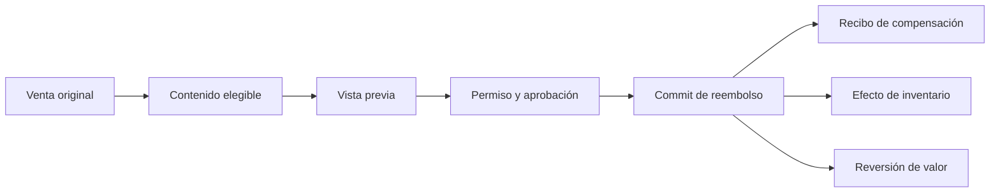

# Ventas, recibos y reembolsos

[Índice](README.md) | [POS](POS_FLUTTER.md) | [Inventario](CATALOGO_E_INVENTARIO.md)

## Venta

Una venta empieza como estado editable. La confirmación final, o commit, crea los hechos terminales en PostgreSQL.

Los importes usan unidades menores enteras. Por ejemplo, `4499` representa 44.99 en una moneda con dos decimales.

El checkout puede incluir Cash, manual terminal, Wallet, Gift Card o Mixed Tender. Cada asignación debe cuadrar con el total.

Una venta suspendida permanece editable. Reanudarla no crea otra venta.

La cancelación termina un borrador permitido. No reescribe una venta comprometida.

## Idempotencia y concurrencia

Cada comando usa una identidad estable y una huella del contenido. La repetición exacta devuelve el resultado original.

La misma identidad con contenido distinto produce un conflicto. Dos comandos concurrentes no pueden gastar el mismo valor dos veces.

Los estados terminales no vuelven a un estado editable.

## Recibo y impresión

| Elemento       | Significado                           |
| -------------- | ------------------------------------- |
| Venta          | Hecho comercial comprometido          |
| Recibo         | Hecho oficial que representa la venta |
| Print job      | Solicitud de efecto físico            |
| COPY           | Nueva impresión marcada como copia    |
| UnknownOutcome | El sistema no sabe si el papel salió  |

Una falla de impresión no borra la venta. Reimprimir no crea una venta ni un recibo oficial nuevo.

## Reembolso

El reembolso es un hecho separado. Conserva la venta original, el actor, la hora y el motivo.

El servidor limita cantidades e importes según reembolsos anteriores. La aprobación se vincula con el comando exacto.

Inventario y valor del cliente usan compensaciones explícitas. No borran hechos históricos.

## Incertidumbre de transacción

1. Detén nuevos intentos.
2. Obtén la referencia del comando.
3. Consulta la venta y el resultado del comando.
4. Revisa pago, recibo, inventario y auditoría.
5. Repite solo una consulta segura.
6. Escala si no existe un estado autoritativo.

Una incertidumbre financiera sin recuperación es P0.

## Conciliación

La conciliación compara ventas brutas, reembolsos y neto con los hechos de pago. La diferencia no explicada debe ser `0`.
