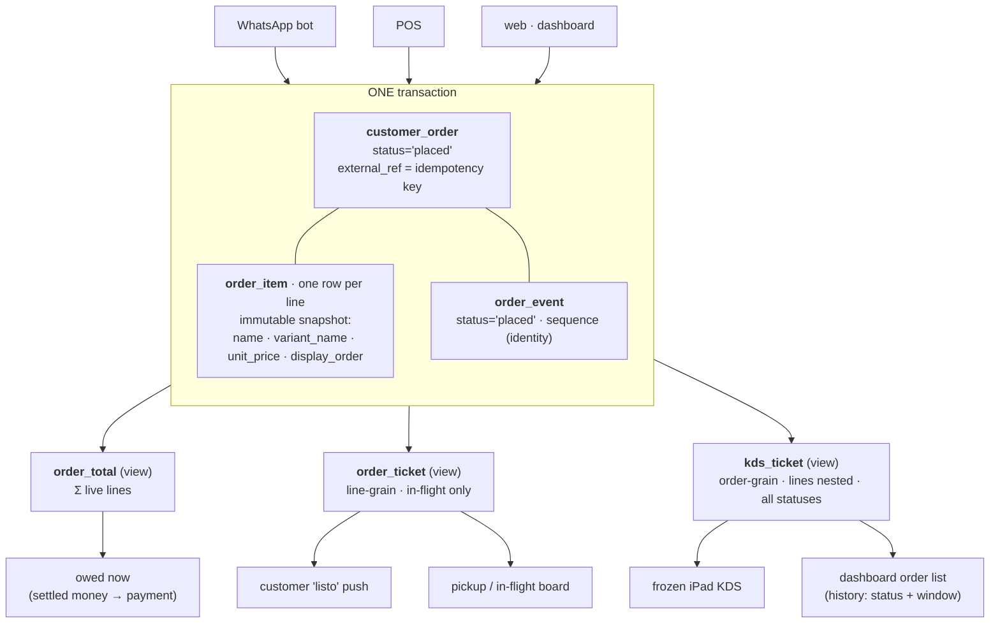
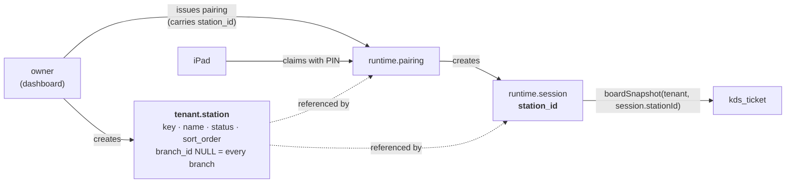
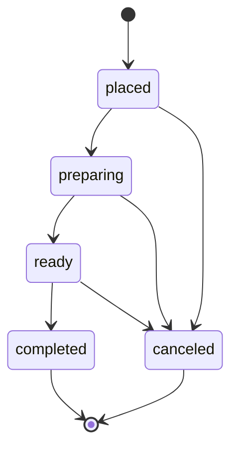

# The order model — decision record

_build-v3 · `tenant` schema · order cluster · 2026-07-15_

How build-v3 represents an order, why it is shaped that way, and the small delta the
current DDL still needs. Grounded in two things: the real production data (the prod
snapshot, 51 orders) and how mature commerce/POS systems model the same problem
(Square, Toast, Vendure, Medusa, Deliverect). Companion to
[`BACKFILL_METHODOLOGY.md`](./BACKFILL_METHODOLOGY.md); the DDL lives in
[`20_tenant.sql:397`](./20_tenant.sql).

---

## 1. The principle

An order is the most universal commerce primitive there is — a cinema, a gym, a
barber, a café all have one. So the order is modelled as a **business-neutral spine**
with the café-specific parts quarantined to one seam. Genericity lives in the
**decomposition**, never in the vocabulary: the nouns stay readable (`order`, `item`,
`station`), and a non-café tenant costs a `CHECK` value, not a migration.

Three separable facts, each at the grain where it is actually true:

| fact                        | entity                  | grain     | why this grain                                                                                                 |
| --------------------------- | ----------------------- | --------- | -------------------------------------------------------------------------------------------------------------- |
| the commercial agreement    | `tenant.customer_order` | order     | one agreement to buy                                                                                           |
| what was bought             | `tenant.order_item`     | line      | a line is one product at one price                                                                             |
| where each item is prepared | `order_item.station_id` | **line**  | a station is a _preparation locus_; a latte is made at the bar, a panini at the grill — two loci for one order |
| how far along the ticket is | `tenant.order_event`    | **order** | the ticket advances as a unit (see §3)                                                                         |

The KDS is a **projection** over this — it groups lines by order, tags each line's
station, and advances through `order_event`. It is **not the owner** of the order.
The dashboard reads `customer_order` directly; a future POS _writes_ it with
`source='pos'`. One row, many views — never a KDS-only artifact.

### The ticket is a shared projection, and `order_event` is its status spine

The KDS "ticket" — the live, per-order, actionable view (live lines + status + who +
timing) — is **one of two fundamental projections** of an order, not a KDS artifact:

- **Live projection (the ticket):** mutable, status-driven. Consumed by a _family_ —
  the KDS (act: fire/bump), **customer status notifications** ("preparing / listo", the
  outbound slice), a pickup/handoff board, a dashboard "orders in flight" monitor, an
  expediter/all-day aggregation, and outbound aggregator/delivery status sync
  (Deliverect-style). Same shape, each a filter or regrouping of it.
- **Settled projection (the record / receipt):** frozen, money-truth. Consumed by the
  historical order list/detail, receipts, and revenue analytics.

That seam is the **same one as §4's money split** — live projection ↔ working/owed total
(mutable), settled projection ↔ charged/`payment` (frozen). One seam runs through the
whole model.

Two consequences: **(DRY)** define the ticket **once** as a shared read-model/view over
`order` + `order_event` + live lines — never a KDS-private query — or WhatsApp status, the
pickup board and outbound sync will each re-derive it and drift. **(KISS)** wire only the
consumers that exist today (**KDS + customer status**); the rest are define-once,
build-when-earned.

This is why **`order_event` is load-bearing now, not deferred**: it is the status stream
every live consumer subscribes to. The deciding test was never "is the KDS in scope" but
"**do we notify the customer on status change?**" — and we do. Two status consumers (KDS +
customer) earn the transition spine independently of the KDS roadmap. It stays thin —
_real status transitions only, not a catch-all event log_ (per its DDL comment).

Two roles, one status, no contradiction: the _current_ status is the denormalized
`customer_order.status` — that is what the `order_ticket` view reads, one cheap column, no
per-order aggregation. `order_event` is the append-only _transition_ stream: a writer
advances `customer_order.status` **and** appends an `order_event` row, and notification
consumers subscribe to that stream (a new row → a "listo" push). The ticket reads the
snapshot; the spine drives the change. They must be written together, never one without
the other.

### The flow, end to end — and where the station actually lives

Three things this makes concrete, because all three get asked: an order is written
**once** and read as **projections**; the **station belongs to the device, not to the
order**; and the two status vocabularies meet in **one** place.

**1 · Write once, project many.** A checkout writes three tables in one transaction. No
consumer reads them directly — each reads a projection, so there is one definition of
"total" and one of "ticket" and neither can drift.



**2 · The station is a property of the device, not the order.** This is the part that
surprises people. Nothing on `customer_order` names a station. The owner creates
stations, pairs a device to one, and the board is scoped by **the session the device
logged in with**.



So a ticket's station is **derived at query time** from who is asking. Two consequences
worth stating plainly:

- **Today every ticket broadcasts to every station.** The board predicate is
  `ticket.station_id IS NULL OR = :session_station`, and an order carries no station, so
  it always matches. That is correct for one café with one station — and it is why the
  event cursor no longer pretends to filter by station (a predicate that cannot exclude
  anything should not read like a security boundary).
- **When routing is earned, it goes on the LINE, not the order** (§2). A salad and a
  grill item on one order belong to different stations; the order does not. That is why
  `order_item.station_id` is the deferred column and `customer_order.station_id` is not
  a thing. Measured: `station_groups` and `station_assignments` are both **0 rows**.

**3 · One spine, two vocabularies, one translator.** Every status change advances
`customer_order.status` _and_ appends an `order_event`. The iPad polls the spine
incrementally by `sequence`; the customer notification subscribes to the same rows.



The iPad's frozen enum spells two of these differently (`new`, `cancelled`) and adds two
build-v3 does not model (`accepted`, `partial_cancelled` → both collapse onto
`preparing`). That translation lives **only** in `kds-contract.ts` and is guarded by
`kds-status-map.spec.ts`, because a Postgres `CHECK` and a Swift enum share no type
system and no gate reads both. Getting it wrong does not degrade the board — it blanks
it, since `try rows.map { try $0.asKitchenOrder() }` propagates the first failure.

Amendments never edit a line: void the old (`order_item.voided_at`), add a new one. The
voided line stays on the ticket so the barista sees it struck through and stops pouring,
and falls out of `order_total` automatically.

---

## 2. Grain evidence (why station is per-line, lifecycle is per-order)

Not reasoned from taste — measured, then cross-checked against the industry.

**Station → the line.** In the source, `ops.orders.station_id` is **null on all 51
orders**, there is **one** station ("cafe"), and **zero** routing rules
(`kitchen.station_assignments` = 0). So the current _data_ does not force per-line;
it is a **capacity choice**. But the _industry_ removes all doubt: Toast routes **by
menu item** to per-item prep stations and **one order splits across stations**
(salad / grill / fry), with independent per-station bump as an option; Square splits
"complex tickets across multiple stations, appetizers → fry, entrees → grill." Per-line
routing is the **universal standard**, so _when_ a routing FK exists it belongs on the
line — that grain ruling is settled.

But the ruling is about _where_, not _whether to build now_. `order_item.station_id` is
null on **every** source line (the source `order_items` has no station column at all), so
deferring it deletes no data and adding it later is a plain nullable `ALTER` — nothing to
retrofit, because the "can't re-grain populated history" cost only bites when there _is_
history. **This is only about the per-line FK.** The `tenant.station` _table_ itself is a
different thing: the KDS device pairs to it and tickets are tagged with it
(`kds.repository.ts` reads it today), and the iPad KDS contract is frozen — so the table
**stays, as config** (§5). Do not conflate the two.

**Lifecycle → the order.** Across all 51 orders, **zero** ever had lines at different
statuses. The source carried a per-line `kitchen_status` and **never once used the
granularity**. Toast's **default is bump-together**; per-station independent bump is an
opt-in config. So `order_event` stays at the order grain, and the DDL is written so a
line/station split is a _future config_, not a schema change.

---

## 3. Changing an order (the amendment model)

**You never edit a line in place. A change is: void the old line (mark, do not
delete) + add the new line.** The current order the customer/KDS sees is a
**derivation** — lines where `voided_at IS NULL`. The full set of lines is the
history. This is enforced, not just documented: a `BEFORE UPDATE OR DELETE` trigger
(`tenant.tg_order_item_void_only`) rejects any edit to a priced line, freezes it once
voided, and **rejects DELETE outright** — the only permitted mutation is setting
`voided_at` (+ `void_reason`) once. An app bug cannot silently rewrite or erase a fired
line and corrupt the waste or money truth (the same append-only stance build-v3 already
applies to the money ledgers, which also block delete despite an on-delete-cascade
parent — order history is permanent; you void, never delete).

Why mark-don't-delete, and why it is not optional:

- It is what production **already did** — `ops.order_items.is_cancelled` (3 real
  voided lines across 2 orders), the row kept. build-v3 currently has **no column to
  hold that fact** (see §5) — so the backfill would either drop those 3 lines or carry
  them as if live. Both lie.
- After the item is **fired**, a void has a **cost** the owner must see. Toast treats
  "waste tracking across all fired items" as first-class. If you `UPDATE` the line to
  the new milk, that waste vanishes from the books.
- It lets the KDS show a voided line as **VOID** (so the barista stops pouring) instead
  of it silently disappearing — impossible under delete-in-place.

**When does an order lock?** At **fired / sent-to-kitchen**, not at served. This is the
industry rule: Toast freezes a fired order (_Strict Mode_), Vendure freezes at
`ArrangingPayment`, Square at _invoiced_ — all the same idea: **lock once production or
money is committed.** Before fire, amend freely; after fire, a change is a
_void-with-cost_, not an edit.

**Right-weight, not a saga.** The industry spectrum runs Square (versioned in-place
mutate + optimistic concurrency) → Vendure (freeze + explicit `OrderModification`) →
Medusa (full append-only `OrderChangeAction` engine + a confirm step). **None silently
overwrite** — a change is always a recorded event. But Medusa's full change-action
subsystem is over-built for **2 amended orders in 51**. build-v3 lands at Square's
weight: `voided_at` on the line + a new line = a poor-man's version history that
still answers "what was ordered vs. what was made." Medusa's action-type enum is the
reference to grow _toward_ (exchange/return analytics), not to build now.

### Cancel vs void vs comp vs refund — four operations, two axes

"Cancel / void / refund" get conflated, but the industry (Toast, Square) decides between
them with **two independent questions**, not one:

1. **Has the money settled?** — separates _void_ from _refund_. Not settled (same day,
   before the nightly batch) → **void**, reverse as if it never happened, no fee. Already
   settled (batch closed / prior day) → **refund**, a new reversing transaction. It is
   **timing, not reason** ([Toast: void vs. refund](https://support.toasttab.com/en/article/Understand-when-to-void-vs-refund)).
2. **Was the product made?** — separates _void_ from _comp_. Not made (wrong item, a
   duplicate) → **void**, inventory returns, no cost. Made and served but not charged →
   **comp**, you ate the ingredients so it **hits food cost** — Toast implements it as a
   100 %-off discount: _"if inventory has already been impacted, the item should be comped
   instead of voided."_

Mapped onto build-v3, three of the four have a home and one is deferred:

| operation  | trigger                                                             | home                                                 | cost                       |
| ---------- | ------------------------------------------------------------------- | ---------------------------------------------------- | -------------------------- |
| **Cancel** | the whole **order** is called off                                   | `customer_order.status='canceled'` + `cancel_reason` | none (if unmade)           |
| **Void**   | a **line** killed, not-yet-made / not-settled                       | `order_item.voided_at` (+ `void_reason`)             | none — inventory returns   |
| **Comp**   | a line **made**, not charged (service recovery — "fly in the food") | **deferred** (a discount entity)                     | food cost absorbed         |
| **Refund** | **money** already settled, returned                                 | `refund` → `payment` (append-only)                   | money out (+ cost if made) |

Two rules keep them straight. **(a) The axes are orthogonal — money never collapses into
status.** There is deliberately **no `'refunded'` order status**: a refunded order is
`completed`/`canceled` on the fulfillment axis **and** carries a `refund` row on the money
axis — adding a status value would re-fuse money into fulfillment, the §4 mistake. **(b)
"Why" is a reason code, never more statuses** — abandoned, expired, staff-void,
kitchen-rejected, customer-changed, test all live in `cancel_reason` / `void_reason`, so the
status enums stay tiny.

**Comp is the one gap, and it is a deferral, not an oversight.** A comp is really a 100 %-off
discount, and build-v3 has **no discount mechanism at all** yet (only `product_modifier.price_delta`)
— discounts/comps/promos are a whole cluster, clearly Phase-3+. Until it lands, a service
recovery is a `voided_at` line with `void_reason='comp'`, and its cost is still recoverable
because "was it fired" is derivable from `order_event`. Add a first-class `discount`/`comp`
line-type when food-cost analytics earns it — the same build-when-earned discipline as
`order_item_modifier`.

---

## 4. Money — three numbers, not one

The word "total" hides three different facts, and conflating them is a real bug. They
have different homes and different mutability:

| number                   | answers                                   | home                                    | mutable                                   |
| ------------------------ | ----------------------------------------- | --------------------------------------- | ----------------------------------------- |
| **working / owed total** | "what does this order cost _right now_"   | `Σ live lines` (derived)                | **yes** — moves as lines are added/voided |
| **charged**              | "what we actually took from the customer" | `payment.amount` (captured at pay time) | **no** — frozen fact                      |
| **revenue**              | "what did we make last week"              | aggregate over `payment`                | **no** — reads frozen facts               |

**Working total → derived, operational for the _open_ order.** Drop the stored
`customer_order.total`; compute `SUM(unit_price * quantity) WHERE voided_at IS NULL`
at read time — a **view now**, a trigger-cached column _only_ if the dashboard ever sorts
thousands of orders by amount (a speed optimization, not a truth change; generated
columns can't do it — they can't sum child rows). While an order is open the total must
be live (the customer switched to oat milk, the number has to move), and for a 2–5 line
order the SUM is sub-millisecond with an index on `order_item(order_id)`. This kills the
"duplicate derived state" the 2026-07-02 audit flagged: it cannot drift, and it
**self-heals on every amendment** because a voided line falls out of the SUM.

**At the money boundary → capture, do not keep deriving.** When the customer pays, write
`payment.amount`. From that instant "what we charged" is the payment row, _not_ a re-SUM
of the lines. If a line is later voided, the working total drops below `SUM(payments)` and
the gap **is** the refund owed (`paid − owed`), settled by a **compensating ledger entry**
— append-only, never an edit to a past row (same rule `loyalty_stored_value_ledger`
already lives by). Money truth is immutable precisely so the mutable derivation can't
corrupt it.

**Analytics → read the captured facts, never re-sum live lines.** Revenue / AOV aggregate
over `payment`. If a report summed live lines, voiding one line today would
**retroactively rewrite last week's revenue**. Reports must be reproducible, so they read
the frozen values, not the mutable order.

So the derived total is **operational for open orders**; money-truth and analytics live on
`payment`. Do not wire a revenue chart to the live-lines SUM.

**Snapshot columns are correct, not redundant.** `order_item.name` and `unit_price` are
frozen at order time (already commented so in the DDL). Square does the same — snapshots
catalog state onto the line — because the menu price will change next week and the order
must remember what was actually charged. Keep them.

---

## 5. The sorted spec — structure / config / data

The big commerce systems keep the order schema small by pushing variation into the
right place: **structure** holds what you filter, sum, join or constrain; **config**
holds what the owner edits at business cadence (never a migration); **data** holds the
per-instance tail nobody queries across. Square proves the pattern — one `CatalogObject`
with a `type` discriminator + `*_data` payload models item, variation, modifier, tax and
discount as rows in _one_ table, and `CUSTOM_ATTRIBUTE_DEFINITION` extends without schema
change. Sorting the whole cluster this way keeps the order **structure** to four small
tables — `customer_order`, `order_item`, `order_event` (the status spine), `payment` — of
which only **two are touched** (columns added / total derived). `station` and the whole
catalog are **config that already exists** in `20_tenant.sql` and is already correct.

**The reusable test:** if a café changing it would force a migration and cafés change it,
it's in the wrong bucket; if you'll ever filter/sum/join on it, it's structure — no
matter how tempting the blob.

### Structure — schema (two tables touched)

```
customer_order   id · business_id · branch_id · customer_id · conversation_id
                 source⟨check⟩ · fulfillment_type⟨check⟩ · status⟨check⟩
                 cancel_reason · notes · pickup_person · external_ref
                 placed_at · created_at · updated_at
                 total  →  DERIVED (Σ live lines), not a stored column
                 UNIQUE (business_id, external_ref) WHERE NOT NULL — injection idempotency
                 (notes/pickup_person are the NAMED columns this section sanctions —
                  frozen KDS ticket fields with a live writer and reader. The untyped
                  details/metadata blobs stay dead. personal_message is deferred.)

order_item       id · order_id · product_id
                 name · unit_price   (snapshot — final, incl. chosen modifiers)
                 quantity · voided_at · void_reason · notes · created_at
                 (immutable except the one-time void — enforced by trigger)

order_event      id · sequence · order_id · status⟨check⟩ · staff_id · occurred_at
                 the STATUS SPINE — every live consumer subscribes (KDS,
                 customer "listo", pickup board, outbound sync). Thin:
                 real transitions only, not a catch-all log.
                 `sequence` (bigint identity) is the PULL cursor: the frozen iPad
                 polls `after_sequence`. occurred_at cannot serve — 63 source
                 timestamps are TIED, so a `> timestamp` cursor skips or replays.

payment          already right — money in, method⟨check⟩, reconciled
```

Money, FKs, status and dates only. `total` is a projection so it can't drift;
`voided_at` is the void tombstone (3 real lines + waste truth); snapshot `name` /
`unit_price` are correct, not redundant (Square snapshots catalog too — the order must
remember what was charged). The **ticket** is a _view_ over `customer_order` +
`order_event` + live lines (§1) — defined once, read by the KDS and customer status
notifications today.

### Config — already exists, owner edits, business cadence

`product` (price/active) · `product_category` · `product_option_group` (e.g. "Milk",
min/max) · `product_modifier` (e.g. "Oat milk" +$0.50) · `product_branch_availability`
(86'd) · `branch` · `business_hours`. **`tenant.station` lives here too** — it is the KDS
station a device pairs to and a ticket is tagged with (`kds.repository.ts`
`loadStation` / `listStations`; the iPad KDS contract is frozen), and the owner sets up
stations at business cadence. One row today, but it has a real consumer — it is **kept**,
as config, not dropped. What is _not_ config is a station table baked into the _order's_
structure: the order **references** the catalog and the KDS derives a ticket's station
from the device login, so the order itself carries no station.

### Data — per-instance tail

Chosen customizations ("oat milk, no foam") fold into the line's `unit_price` + `name` /
`notes`; free-text notes. Infinite, per-order, never queried across — money already lives
in `unit_price`, so a customization rides as a value, **not** a column-per-variant and
**not** a resurrected `metadata jsonb` junk drawer.

### The collapse — what the 28 source columns become

| source                                              | ruling   | build-v3                                                                                                                                                                                                                                                                                                                                                                                                                                                                                                                                                                                                                                            |
| --------------------------------------------------- | -------- | --------------------------------------------------------------------------------------------------------------------------------------------------------------------------------------------------------------------------------------------------------------------------------------------------------------------------------------------------------------------------------------------------------------------------------------------------------------------------------------------------------------------------------------------------------------------------------------------------------------------------------------------------- |
| `cancellation_reason/_code/_note` + `partial_*` (6) | 6 → 2    | `customer_order.cancel_reason` (order) + `order_item.voided_at` (line; partial split used **0×**). Line-level `void_reason` is added as new structure, carried **NULL** — the source reasons are contaminated                                                                                                                                                                                                                                                                                                                                                                                                                                       |
| `kitchen_status` (order + line)                     | collapse | `status` field (0/51 ever diverged)                                                                                                                                                                                                                                                                                                                                                                                                                                                                                                                                                                                                                 |
| `ops.orders.station_id` · `station_name`            | drop     | the _order_ carries no station; the KDS ticket derives it from the device login. Both were null on all 51 orders anyway. (`tenant.station` the table is kept — see Config.)                                                                                                                                                                                                                                                                                                                                                                                                                                                                         |
| `metadata` · `details` (order blobs)                | 2 → 0    | dropped — untyped junk drawers. `details.items` is a denormalized cache of `order_items`; `details.customer_note` is a duplicate of the `notes` column                                                                                                                                                                                                                                                                                                                                                                                                                                                                                              |
| `notes` · `pickup_person`                           | 2 → 2    | **kept as NAMED columns** (2026-07-21). This row previously read "dropped, order-level free text is unmodeled" and called the notes contaminated. Both were wrong: the frozen iPad ticket **renders both** (`kds.service.ts:730-731`) and the checkout **writes both**, so a real consumer had already earned them under this section's own rule; and the 7 populated notes are clean (5 drink specs, 1 size, 1 preference), not contaminated. Carried as-is rather than re-routed to `order_item.notes` / `customer_note`, because these 51 orders are **test data** — inventing a line attribution for a test string is fabrication, not fidelity |
| `order_item.metadata jsonb` · `variant_name`        | fold     | into `name` / `notes`                                                                                                                                                                                                                                                                                                                                                                                                                                                                                                                                                                                                                               |
| `slack_message_ts` · `source_transaction_id`        | →        | `external_ref`; rest dropped (machinery, not order truth)                                                                                                                                                                                                                                                                                                                                                                                                                                                                                                                                                                                           |

### Deferred — earned later, decision recorded, table not built

- **`order_item.station_id`** (per-line routing FK, _not_ the `station` table) — a build-v3
  invention (the source lines have no station column), null on 100% of lines, backed by 0
  routing rules, and read by nothing (the KDS ticket's station comes from the device login,
  not the line). Add when a second station + real routing exist; the §2 grain ruling (it
  goes on the line) stands. ⚠️ **`tenant.station` the table is NOT deferred** — it is a live
  KDS consumer, kept as config.
- **`order_item_modifier`** — structured per-modifier money breakdown; add when a receipt
  needs "$4 latte + $0.50 oat" split out. Until then the delta is folded into `unit_price`.
- **`replaces_id`** (line supersession) — no consumer (`partial_cancellation_reason` 0×);
  add only for substitution analytics. A per-line amendment saga is **refused** at 2/51.
- **`customer_order.personal_message`** (the gift message that accompanies `pickup_person`)
  — it never had a column (it lived in the `details` blob), it appears on **0 of 51** source
  orders, and the only thing that ever displayed it was a **Slack controller that no longer
  exists** — whose remaining trace, `slack_message_ts`, this same section already drops as
  machinery. `confirm_order` still collected it, so the tool contract is trimmed to stop
  accepting input nothing can show. **The KDS will earn it back** (owner, 2026-07-21); re-add
  as a plain nullable text column then. Nothing to retrofit, precisely because there is no
  history. ⚠️ Contrast `pickup_person` + `notes`, which are **not** deferred: both are frozen
  KDS ticket fields with a live reader, and `notes` carries 7 real rows.
- **discount / comp cluster** (an order-/line-level discount entity, of which a _comp_ is the
  100 %-off case) — build-v3 has **no** discount mechanism yet (only `product_modifier.price_delta`).
  Discounts, comps and promos are a whole feature, Phase-3+. Interim: a service recovery is a
  `voided_at` line with `void_reason='comp'` (cost still derivable from `order_event`). Add the
  first-class type when food-cost / promo analytics earns it. See §3.

> The status enum (`placed · preparing · ready · completed · canceled`) conflates the
> commercial axis (placed/completed/canceled) with the operational axis (preparing/ready).
> Acceptable for one café type; if a non-café vertical lands, the operational values move
> to a per-`fulfillment_type` `CHECK` and the commercial axis stays. Not worth splitting today.

**Net vs. the pre-existing DDL:** **add** `cancel_reason` (order) + `voided_at` /
`void_reason` (line) + a `CHECK (quantity>0, unit_price>=0)` + the
`tg_order_item_void_only` immutability trigger; **derive** `total` (view); **keep**
`order_event` (status spine — customer status notifications consume it, earned independent
of the KDS roadmap), `tenant.station` (KDS config), `payment`; **defer** the per-line
`order_item.station_id` FK, `order_item_modifier`, `replaces_id`, `personal_message`, and
the **discount/comp cluster**; **add** the `order_total` + `order_ticket` views over order +
live lines. The delta is small and drops **no** live consumer.

**Amendment (2026-07-21) — three deltas this document missed.** They were found by reading
the KDS/checkout code against the DDL before rewriting it, and none was visible to any gate:
`sql-preflight` proves a statement _resolves_, and all three resolve while behaving wrongly.

1. **`order_event.sequence`.** §1 specified the spine as a **push** stream ("a new row → a
   listo push"), which needs no cursor. The frozen iPad **pulls** — `after_sequence` in, `WHERE
sequence > $n` out. `occurred_at` cannot substitute: **63 source timestamps are tied**, so a
   `> timestamp` cursor silently skips or replays events.
2. **`UNIQUE (business_id, external_ref)`.** §6 deferred an idempotency key to "when the
   injection path is built" — the WhatsApp checkout **is** one, and it is live. Its
   `ON CONFLICT` had no constraint to land on, so a retried turn would create a duplicate order.
3. **`notes` + `pickup_person` kept, `personal_message` deferred** — see the collapse table
   and the Deferred list above.

### Implementation status (2026-07-19)

Applied to the build-v3 migration sources on branch `feat/order-cluster-ddl` and **verified
locally** against the prod snapshot (port 5233) — **not** on prod:

- `20_tenant.sql` — `customer_order` drops stored `total`, adds `cancel_reason`;
  `order_item` drops `station_id`, adds `voided_at` + `void_reason` + a `CHECK
(quantity>0, unit_price>=0)` + an `(order_id)` index + the `tg_order_item_void_only`
  immutability trigger; two new `security_invoker` views `tenant.order_total` (Σ live
  lines, with its meaning-by-status contract) and `tenant.order_ticket` (live line-grain
  projection that **includes** voided lines so the KDS renders VOID).
- `backfill/backfill_commerce.sql` — stops carrying `total_cents` (derived instead),
  carries `is_cancelled → voided_at` (source has only the boolean → `updated_at` stands
  in), leaves `cancel_reason` / `void_reason` NULL (contaminated free-text not imported).
- `backfill/reconcile_v3.sql` — order counts + two money invariants, hardened to
  **per-order** (derived vs source total) and **per-item** (`is_cancelled ⟺ voided_at`, by
  id, NULL-safe) checks; `90_rls.sql` revokes api DML on the two new views;
  `security_gate.sql` — view check is count-agnostic ("every umi/tenant view is
  `security_invoker`") + asserts the two contract views exist + counts the new trigger fn.

**Proof of lossless:** the derived total reproduces the stored source total to the centavo
across all 51 orders — `Σ(ops.orders.total_cents)` = `Σ(tenant.order_total.total)` =
**590 300**, the stored total having already excluded the 3 voided lines (all-lines sum =
612 600); per-order and per-item mismatch counts are both **0**. The immutability trigger was
exercised: voiding a live line once succeeds, editing a priced field or an already-voided
line is rejected. Gate result: reconcile all `src=dst`, `security_gate.sql` **PASSED** (25
structural + 3 behavioral), pristine `build-v3 verify: OK`. Every remaining decision on the
order cluster is settled.

---

## 6. Ecosystem fit (where Umi sits)

Middleware like Deliverect exists to normalize many channels → **one canonical order**
→ inject into POS+KDS → sync status back (a ~99.6% "injection rate" is their headline
KPI). Today **Umi is one of those channels** (WhatsApp), and its orders must land as one
order the dashboard/KDS can see — the exact visibility gap this model closes. If Umi
grows into the POS, it becomes the **injection target**, so its order must be able to
(a) _receive_ orders tagged by origin (`source ∈ whatsapp · pos · web · dashboard`, and
later `aggregator`) and (b) _emit_ status outward. `source` + `external_ref` are the
origin-tagging fields that make an order injection-ready, and are **already present**; a
tenant-scoped `idempotency_key` (with a uniqueness constraint) is the **planned** third —
it makes re-injection duplicate-safe and lands when the injection path is built, not now.
The model is ecosystem-compatible by construction; the one rule is to never let
"order" collapse back into a KDS-only artifact.

---

## Sources

Industry cross-check (2026-07-15):

- Square Orders API — [How It Works](https://developer.squareup.com/docs/orders-api/how-it-works) · [Update Orders](https://developer.squareup.com/docs/orders-api/manage-orders/update-orders)
- [Vendure — Order Lifecycle & State Machine](https://docs.vendure.io/current/core/core-concepts/orders)
- [Medusa — Order Change](https://docs.medusajs.com/resources/commerce-modules/order/order-change)
- Toast — [firing / void after fired / Strict Mode](https://doc.toasttab.com/doc/platformguide/adminFireByPrepTime.html) · [per-item prep-station routing](https://doc.toasttab.com/doc/platformguide/adminAssigningPrepStationsMenuBuilder.html)
- [Deliverect — order injection into POS/KDS](https://www.deliverect.com/en-us/blog/pos-systems/the-importance-of-injection-rate-for-digital-order-management)
