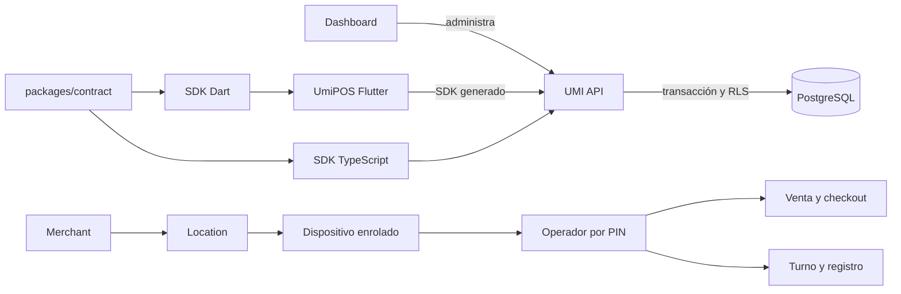
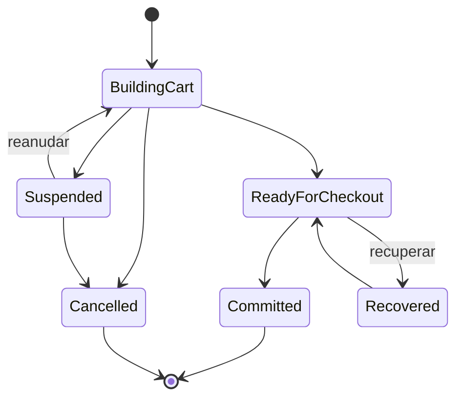
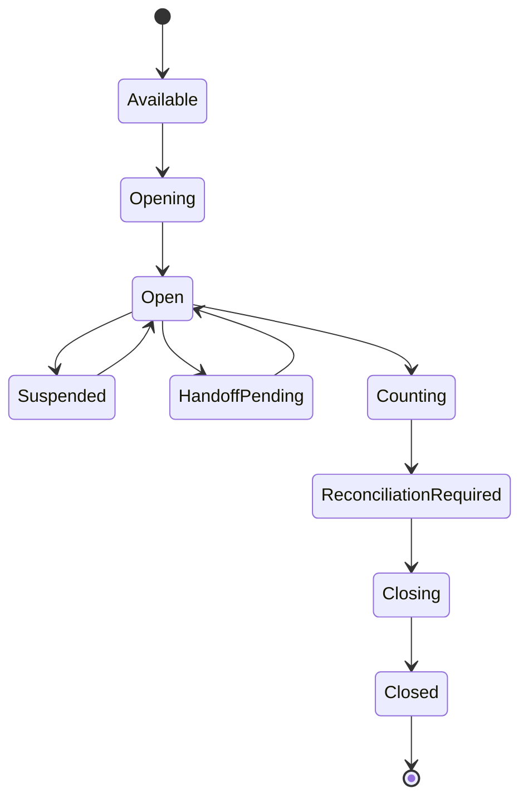
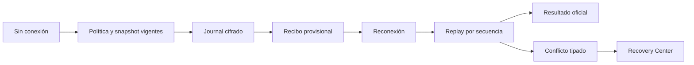

# UmiPOS — Casos de uso, funcionalidades y roles

## Tabla de contenido

1. [Propósito del documento](#1-propósito-del-documento)
2. [Visión general del ecosistema](#2-visión-general-del-ecosistema)
3. [Glosario operativo](#3-glosario-operativo)
4. [Roles y alcance](#4-roles-y-alcance)
5. [Ciclo de vida del dispositivo](#5-ciclo-de-vida-del-dispositivo)
6. [Acceso del operador](#6-acceso-del-operador)
7. [Catálogo](#7-catálogo)
8. [Carrito](#8-carrito)
9. [Ciclo de vida de la venta](#9-ciclo-de-vida-de-la-venta)
10. [Checkout y pagos](#10-checkout-y-pagos)
11. [Operación de caja y turnos](#11-operación-de-caja-y-turnos)
12. [Refunds, voids y excepciones postventa](#12-refunds-voids-y-excepciones-postventa)
13. [Offline, replay y recuperación](#13-offline-replay-y-recuperación)
14. [Historial y recibos](#14-historial-y-recibos)
15. [Casos de error y recuperación](#15-casos-de-error-y-recuperación)
16. [Jornadas operativas completas por rol](#16-jornadas-operativas-completas-por-rol)
17. [Matriz de casos de uso por rol](#17-matriz-de-casos-de-uso-por-rol)
18. [Funcionalidades no implementadas todavía](#18-funcionalidades-no-implementadas-todavía)
19. [Checklist manual para probar UmiPOS](#19-checklist-manual-para-probar-umipos)
20. [Mapa de cobertura](#20-mapa-de-cobertura)
21. [Hardware Runtime](#21-hardware-runtime)
22. [Operación KDS](#22-operación-kds)

## 1. Propósito del documento

Este documento explica el comportamiento operativo que existe en UmiPOS hasta Gate 4A. Sirve para operación, soporte, desarrollo, QA y capacitación.

La referencia es Gate 4A, del 9 de agosto de 2026. El contrato canónico es la versión `2.9.0`. Su hash es `ac23d09d92f252f8e770e84fef90ab4c42c30afb85d8e08a0c0a15df2376ff6f`.

El producto conserva Gates 3A a 3E. Gate 3F añade clientes, lealtad y valor almacenado. La certificación final de UX sigue pendiente.

Cada caso usa uno de estos estados:

- **IMPLEMENTADO:** el flujo existe en Flutter, API, persistencia y pruebas enfocadas.
- **IMPLEMENTADO CON LIMITACIONES:** el flujo existe, pero tiene un límite explícito de canal, política o integración.
- **FOUNDATION:** existe un contrato o una intención persistida, pero no existe el efecto externo final.
- **NO IMPLEMENTADO:** el roadmap lo reconoce, pero el flujo operativo no existe.
- **FUERA DE ALCANCE ACTUAL:** el producto no lo incluye en los Gates completos.

Este documento no certifica UX, hardware, pagos de proveedor ni custodia física. Consulte también el [estado canónico](../architecture-transition/PROJECT_CANONICAL_STATE.md) y el [roadmap](UMIPOS_PRODUCT_ROADMAP.md).

## 2. Visión general del ecosistema

UmiPOS Flutter es la interfaz del operador. Usa el SDK Dart generado. No accede a Supabase de forma directa.

UMI API valida la identidad, los permisos, la política y los importes. PostgreSQL conserva los hechos autoritativos y aplica RLS por `merchant` y `location`.

El Dashboard administra datos que no pertenecen al flujo diario del cajero. Esto incluye enrolamiento y supervisión cuando la función está disponible.

`packages/contract` es la única autoridad editable del contrato. El generador produce JSON, TypeScript y Dart con el mismo contenido.

La relación operativa es estricta. Un `merchant` contiene una `location`. El dispositivo pertenece a ese alcance. Una sesión de operador pertenece al dispositivo y a la ubicación. La venta, el checkout y el turno usan el mismo contexto.

## 3. Glosario operativo

| Término                | Definición operativa                                                                              |
| ---------------------- | ------------------------------------------------------------------------------------------------- |
| Merchant               | Negocio que posee los datos y la operación.                                                       |
| Location               | Sucursal del merchant. Limita catálogo, ventas, caja y permisos.                                  |
| Dispositivo            | Terminal enrolada con una credencial propia.                                                      |
| Enrolamiento           | Proceso de asociación de un dispositivo con el merchant y la location.                            |
| Operador               | Persona que usa el POS con una sesión activa.                                                     |
| PIN                    | Secreto personal para abrir una sesión o aprobar una operación. Nunca se persiste en texto claro. |
| Cajero                 | Operador que realiza ventas y operaciones permitidas de caja.                                     |
| Manager                | Operador con permisos de supervisión y aprobación.                                                |
| Supervisor             | Operador con permisos de recuperación y aprobación según la asignación real.                      |
| Venta                  | Agregado que conserva el carrito y su ciclo de vida.                                              |
| Carrito                | Conjunto editable de líneas, cantidades, variantes, modificadores y notas.                        |
| Checkout               | Flujo autoritativo que calcula y confirma el pago de una venta.                                   |
| Tender                 | Línea de pago. Gate 3B admite efectivo y terminal manual.                                         |
| Terminal manual        | Pago o refund que el operador procesa fuera de UmiPOS. No prueba una respuesta del proveedor.     |
| Pago mixto             | Pago con efectivo y terminal manual en líneas separadas.                                          |
| Registro físico        | Ubicación física del efectivo. No es igual al dispositivo.                                        |
| Turno de caja          | Periodo de responsabilidad de un operador sobre un registro.                                      |
| Fondo inicial          | Efectivo declarado al abrir el turno. No es ingreso por venta.                                    |
| Paid In                | Entrada de efectivo posterior a la apertura.                                                      |
| Paid Out               | Salida aprobada de efectivo por una razón operativa.                                              |
| Safe Drop              | Retiro del cajón hacia una caja segura.                                                           |
| Efectivo esperado      | Proyección del ledger: fondo más entradas, menos salidas.                                         |
| Conteo ciego           | Conteo que oculta el efectivo esperado hasta el envío autoritativo.                               |
| Efectivo contado       | Observación manual e inmutable del dinero físico.                                                 |
| Varianza               | Efectivo contado menos efectivo esperado.                                                         |
| Reconciliación         | Resultado autoritativo que combina ledger, conteo, varianza y aprobación.                         |
| Refund                 | Excepción que crea hechos compensatorios después de una venta comprometida.                       |
| Void                   | Excepción estrecha para una venta todavía elegible. No elimina la venta.                          |
| Recibo original        | Snapshot inmutable creado con la venta comprometida.                                              |
| Recibo compensatorio   | Snapshot inmutable creado por un refund o void.                                                   |
| Restock intent         | Decisión inmutable del refund. Gate 3E crea su consecuencia de inventario.                        |
| Venta provisional      | Resultado local de una venta en efectivo offline. No tiene identidad oficial.                     |
| Replay                 | Envío ordenado de comandos del journal cuando vuelve la conexión.                                 |
| Reconciliación offline | Resolución autoritativa de aceptación, duplicado o conflicto durante replay.                      |

## 4. Roles y alcance

La autoridad depende del permiso efectivo. El nombre del rol no basta. La API también valida merchant, location, dispositivo, credencial y sesión.

Gate 3D.1 crea perfiles deterministas para `owner`, `admin`, `manager`, `supervisor`, `cashier`, `staff` y `viewer`. El archivo `config/umipos-pilot-role-grants.json` es la matriz canónica del piloto.

`staff` conserva compatibilidad con `cashier`. Los dos perfiles reciben los mismos permisos operativos. Esta equivalencia evita una elevación durante la migración de usuarios existentes.

No existe un rol de negocio `auditor`. El perfil técnico `developer` conserva lectura limitada. `super_admin` es un rol de plataforma. El seed lo suspende y lo excluye del flujo normal del café.

La API decide la autoridad efectiva. La decisión combina el permiso, el merchant, la location, el entitlement POS, el dispositivo y la sesión.

| Funcionalidad                           | Owner | Admin | Manager | Supervisor | Cashier | Staff | Viewer |
| --------------------------------------- | ----- | ----- | ------- | ---------- | ------- | ----- | ------ |
| Catálogo                                | ✅    | ✅    | ✅      | ✅         | ✅      | ✅    | 👁️     |
| Carrito y venta                         | ✅    | ✅    | ✅      | ✅         | ✅      | ✅    | ❌     |
| Efectivo y terminal manual              | ✅    | ✅    | ✅      | ✅         | ✅      | ✅    | ❌     |
| Aprobar descuento o terminal            | ✅    | ✅    | ✅      | ✅         | ❌      | ❌    | ❌     |
| Recuperar venta o checkout ajeno        | ✅    | ✅    | ✅      | ✅         | ❌      | ❌    | ❌     |
| Abrir y operar turno propio             | ✅    | ✅    | ✅      | ✅         | ✅      | ✅    | ❌     |
| Handoff, recuento y varianza            | ✅    | ✅    | ✅      | ✅         | ⚠️      | ⚠️    | ❌     |
| Refund parcial permitido                | ✅    | ✅    | ✅      | ✅         | ⚠️      | ⚠️    | ❌     |
| Refund total, void y refund en efectivo | ✅    | ✅    | ✅      | ✅         | ❌      | ❌    | ❌     |
| Enrolar o revocar dispositivo           | ✅    | ✅    | ❌      | ❌         | ❌      | ❌    | ❌     |
| Auditoría segura                        | ✅    | ✅    | ❌      | ❌         | ❌      | ❌    | ❌     |

El seed del piloto aplica la matriz en una base limpia o existente. La ejecución repetida conserva una sola membresía y una sola asignación.

Leyenda: ✅ permiso predeterminado; ⚠️ requiere permiso, política o aprobación; 👁️ solo lectura; ❌ sin permiso predeterminado; N/A no aplica.

### Owner

- **Objetivo:** Administrar el negocio y controlar su operación.
- **Operaciones habituales:** Revisar dispositivos, permisos, ventas, caja y auditoría.
- **Permitido:** Administra el merchant y puede ejecutar las operaciones Gate 3A–3D con los controles normales.
- **Con aprobación:** Toda acción que una política marque como sensible conserva un grant explícito.
- **Prohibido:** No puede cruzar a otro merchant ni omitir device trust, RLS o idempotencia.
- **Alcance:** Un merchant y las locations autorizadas por su membresía.
- **Dependencias:** Dispositivo enrolado y sesión de operador para usar el POS.
- **Riesgos frecuentes:** Usar un permiso amplio como sustituto de una aprobación o de la location correcta.
- **Ejemplo:** Revoca una terminal perdida y aprueba una varianza dentro de su política.

### Administrator / Admin

- **Objetivo:** Administrar dispositivos, personal y operación local.
- **Operaciones habituales:** Enrolar terminales, revisar permisos y apoyar cierres o recovery.
- **Permitido:** Administra el negocio y opera Gate 3A–3D. No recibe acceso a otra location sin asignación.
- **Con aprobación:** Debe crear evidencia explícita para una operación sensible.
- **Prohibido:** No obtiene acceso a otro merchant por el nombre del rol.
- **Alcance:** Merchant membership y locations autorizadas.
- **Dependencias:** Sesión administrativa para dispositivos; sesión de operador para el POS.
- **Riesgos frecuentes:** Aprobar un dispositivo en la location incorrecta.
- **Ejemplo:** Rota una credencial y revisa un conflicto de replay.

### Manager

- **Objetivo:** Supervisar la operación y resolver excepciones autorizadas.
- **Operaciones habituales:** Aprobar descuentos, recuperar ventas, reconciliar caja y revisar excepciones.
- **Permitido:** Opera Gate 3A–3D dentro de sus locations asignadas.
- **Con aprobación:** Puede aprobar descuentos, caja y refunds dentro de la política.
- **Prohibido:** No administra dispositivos, roles ni la plataforma.
- **Alcance:** Merchant y location de su sesión. `sale.refund.other_location` no tiene grant predeterminado.
- **Dependencias:** Dispositivo confiable, sesión de operador y PIN para approvals.
- **Riesgos frecuentes:** Intentar usar una aprobación fuera de su location o después de su expiración.
- **Ejemplo:** Aprueba un refund y reconcilia un turno excepcional de su location.

### Supervisor

- **Objetivo:** Supervisar una location y aprobar operaciones limitadas por política.
- **Operaciones habituales:** Recuperar ventas ajenas, aprobar descuentos y revisar variancias.
- **Permitido:** Opera Gate 3A–3D dentro de su location asignada.
- **Con aprobación:** Aprueba descuentos y terminales. Solicita a Manager las demás aprobaciones.
- **Prohibido:** No administra roles, dispositivos ni otra location.
- **Alcance:** Una location explícita del merchant.
- **Dependencias:** PIN, entitlement, dispositivo y sesión activos.
- **Riesgos frecuentes:** Superar el umbral de Supervisor. La API exige un Manager.
- **Ejemplo:** Aprueba un descuento permitido y solicita un recuento.

### Cashier

- **Objetivo:** Vender, cobrar y mantener su responsabilidad de caja.
- **Operaciones habituales:** Catálogo, carrito, checkout, turno propio y refund parcial de bajo riesgo.
- **Permitido:** Opera su venta, checkout, caja y recovery propios.
- **Con aprobación:** Descuento alto, movimiento sensible o refund restringido requieren otro actor.
- **Prohibido:** No aprueba, no recupera otro operador y no administra el negocio.
- **Alcance:** Su location, dispositivo, sesión, venta y turno autorizado.
- **Dependencias:** Dispositivo confiable, PIN y turno para cash cuando la política lo exige.
- **Riesgos frecuentes:** Confundir un permiso de checkout cash con autoridad para abrir un turno.
- **Ejemplo:** Abre su turno, cobra en efectivo y termina un conteo ciego.

### Staff / Employee

- **Objetivo:** Ejecutar tareas de atención según la asignación local.
- **Operaciones habituales:** Las mismas funciones base del Cashier.
- **Permitido:** Usa el mismo perfil operativo que Cashier durante el piloto.
- **Con aprobación:** Usa los mismos umbrales de política que Cashier.
- **Prohibido:** No recibe grants de supervisión por defecto.
- **Alcance:** Merchant y location de su staff membership.
- **Dependencias:** Dispositivo, sesión, permisos y overrides vigentes.
- **Riesgos frecuentes:** Suponer que `staff` tiene el mismo override en todas las locations.
- **Ejemplo:** Registra Paid In si la política y su turno lo permiten.

### Viewer

- **Objetivo:** Consultar información expresamente permitida.
- **Operaciones habituales:** Leer el catálogo y los insights permitidos.
- **Permitido:** Solo `catalog.read` e `insights.read`.
- **Con aprobación:** N/A. Una approval no convierte Viewer en operador financiero.
- **Prohibido:** Carrito, venta, pago, turno, refund y toda mutación financiera.
- **Alcance:** Merchant y location de su membresía.
- **Dependencias:** Contexto de lectura autorizado.
- **Riesgos frecuentes:** Mostrar un control de mutación por una decisión visual del cliente.
- **Ejemplo:** Revisa precios sin crear un carrito.

### Auditoría y soporte técnico

No existe un rol de negocio `Auditor`. Owner y Admin reciben `audit.read`. El rol técnico `developer` conserva lectura limitada.

- **Objetivo:** Revisar evidencia segura sin cambiar hechos.
- **Operaciones habituales:** Consultar auditoría redactada y diagnósticos acotados.
- **Permitido:** Solo los permisos explícitos de lectura.
- **Con aprobación:** N/A para una lectura normal.
- **Prohibido:** Toda mutación de ventas, pagos, caja o excepciones.
- **Alcance:** `developer` puede tener alcance de plataforma, pero mantiene autoridad de solo lectura.
- **Dependencias:** Sesión técnica autorizada y filtros seguros.
- **Riesgos frecuentes:** Tratar un diagnóstico como un payload financiero completo.
- **Ejemplo:** Confirma que un command ID produjo un solo resultado sin abrir datos sensibles.

## 5. Ciclo de vida del dispositivo

### UC-DEV-001 — Generar un código de enrolamiento

**Estado:** IMPLEMENTADO

**Objetivo:** Asociar una terminal nueva con un merchant y una location.

**Actor principal:** Owner o Admin.

**Actores secundarios:** UMI API y Dashboard.

**Permisos requeridos:** `device.enroll`; el controlador admite `owner`, `admin` y `super_admin`.

**Precondiciones:**

- merchant y location válidos;
- sesión administrativa activa;
- operador con alcance sobre el merchant;
- conexión online.

**Disparador:** El administrador solicita enrolar un dispositivo.

**Flujo principal:**

1. El administrador selecciona el merchant y la location.
2. UMI API crea un código de ocho caracteres y uso único.
3. El operador captura el código en UmiPOS.

**Resultado esperado:** Existe una sesión de enrolamiento limitada y auditable.

**Flujos alternos:** El administrador cancela el código antes del uso.

**Errores y recuperación:** Un código vencido o usado se rechaza. El administrador crea otro código.

**Reglas de seguridad:** El código vence, tiene límite de intentos y no reemplaza una credencial de dispositivo.

**Persistencia y efectos:** La sesión de enrolamiento se conserva. No crea una venta ni una sesión de operador.

**Disponibilidad:** Online-only.

**Evidencia de implementación:** `packages/contract/src/route-table.ts`, `apps/umi-api/src/modules/devices`, `apps/umi-pos/lib/features/entry` y `apps/umi-api/src/modules/devices/devices.service.spec.ts`.

### UC-DEV-002 — Completar y activar el dispositivo

**Estado:** IMPLEMENTADO

**Objetivo:** Entregar una credencial válida a la terminal aprobada.

**Actor principal:** Operador de instalación.

**Actores secundarios:** Owner o Admin, UMI API y almacenamiento seguro.

**Permisos requeridos:** `device.enroll` para la aprobación administrativa.

**Precondiciones:**

- código vigente;
- merchant y location coincidentes;
- dispositivo no revocado;
- conexión online.

**Disparador:** UmiPOS reclama el código.

**Flujo principal:**

1. UmiPOS inicia el pairing.
2. Un administrador aprueba la solicitud.
3. UmiPOS consulta el estado y confirma la recepción.
4. El dispositivo guarda la credencial en almacenamiento seguro.

**Resultado esperado:** El dispositivo queda activo y ligado a una location.

**Flujos alternos:** El administrador rechaza la solicitud. UmiPOS permanece sin enrolamiento.

**Errores y recuperación:** La pérdida de respuesta se resuelve con polling y acknowledge idempotente.

**Reglas de seguridad:** La credencial no se muestra, no se registra y no se comparte entre dispositivos.

**Persistencia y efectos:** Se crea la identidad del dispositivo y su versión de credencial.

**Disponibilidad:** Native; Web con limitaciones de almacenamiento seguro.

**Evidencia de implementación:** `packages/contract/src/device.ts`, `packages/contract/src/route-table.ts`, `apps/umi-pos/lib/features/entry` y `scripts/umi-pos-device-pairing-db-check.sh`.

### UC-DEV-003 — Rotar, revocar o sustituir un dispositivo

**Estado:** IMPLEMENTADO

**Objetivo:** Invalidar una credencial comprometida o sustituir una terminal.

**Actor principal:** Owner o Admin.

**Actores secundarios:** UMI API, dispositivo anterior y dispositivo nuevo.

**Permisos requeridos:** Guard administrativo de dispositivos y alcance del merchant.

**Precondiciones:**

- dispositivo existente;
- sesión administrativa;
- merchant coincidente;
- conexión online.

**Disparador:** El administrador rota, revoca o reemplaza la terminal.

**Flujo principal:**

1. El administrador selecciona el dispositivo.
2. UMI API incrementa la versión o cambia el estado.
3. Las solicitudes con la credencial anterior se rechazan.
4. La sustitución usa un enrolamiento nuevo.

**Resultado esperado:** Solo la credencial vigente puede abrir sesiones y enviar comandos.

**Flujos alternos:** Un dispositivo recuperado recibe una credencial nueva mediante un flujo administrativo.

**Errores y recuperación:** UmiPOS muestra `DEVICE_REVOKED` o credencial rotada y conserva datos seguros para soporte.

**Reglas de seguridad:** RLS, versión de credencial, alcance de location y auditoría.

**Persistencia y efectos:** La identidad histórica permanece. La revocación no elimina ventas ni journals.

**Disponibilidad:** Online-only para administración.

**Evidencia de implementación:** `apps/umi-api/src/modules/devices/devices.controller.ts`, `apps/umi-api/src/modules/devices/devices.service.ts` y `docs/migration/build-v3/24_device_pairing.sql`.

### UC-DEV-004 — Recuperar el acceso después de una revocación

**Estado:** IMPLEMENTADO CON LIMITACIONES

**Objetivo:** Restaurar el POS sin aceptar una credencial obsoleta.

**Actor principal:** Owner, Admin o soporte autorizado.

**Actores secundarios:** Operador, UMI API y Recovery Center.

**Permisos requeridos:** `device.enroll` y, cuando aplica, `offline.recovery.review`.

**Precondiciones:**

- identidad del dispositivo conocida;
- autoridad administrativa;
- conexión online;
- journal pendiente preservado.

**Disparador:** UmiPOS detecta revocación o rotación.

**Flujo principal:**

1. UmiPOS bloquea las mutaciones.
2. El administrador valida el contexto.
3. El dispositivo se vuelve a enrolar o recibe una credencial vigente.
4. Recovery Center consulta los comandos pendientes antes de replay.

**Resultado esperado:** La recuperación no duplica hechos financieros.

**Flujos alternos:** Soporte conserva el journal cifrado para una revisión manual.

**Errores y recuperación:** Web no promete paridad de almacenamiento seguro. La recuperación sensible usa un cliente nativo.

**Reglas de seguridad:** Prohibido reutilizar la credencial anterior o adivinar el merchant.

**Persistencia y efectos:** Los comandos pendientes conservan su identidad y fingerprint.

**Disponibilidad:** Native; Web con limitaciones.

**Evidencia de implementación:** `apps/umi-pos/lib/features/offline/recovery_center.dart`, `apps/umi-pos/lib/features/entry` y `apps/umi-api/src/modules/pos-offline`.

## 6. Acceso del operador

### UC-AUTH-001 — Abrir una sesión con PIN

**Estado:** IMPLEMENTADO

**Objetivo:** Permitir que un operador autorizado inicie la jornada del POS.

**Actor principal:** Cashier, Staff, Supervisor, Manager, Admin u Owner.

**Actores secundarios:** Dispositivo y UMI API.

**Permisos requeridos:** Los permisos efectivos del rol y sus overrides.

**Precondiciones:**

- dispositivo confiable;
- merchant y location vigentes;
- operador activo;
- PIN personal;
- conexión online.

**Disparador:** El operador captura su PIN.

**Flujo principal:**

1. UmiPOS envía el PIN por el límite generado.
2. UMI API verifica el hash y el contexto.
3. UMI API crea una sesión de operador con permisos efectivos.
4. UmiPOS carga el contexto de entrada.

**Resultado esperado:** La sesión queda vinculada al dispositivo, merchant y location.

**Flujos alternos:** Un operador autorizado recupera su turno abierto exacto.

**Errores y recuperación:** Un PIN incorrecto produce texto seguro. No revela si otra persona existe.

**Reglas de seguridad:** Rate limit, hash de PIN, sesión con vencimiento y device trust.

**Persistencia y efectos:** Se crea `runtime.operator_session`. El PIN no se persiste ni se registra.

**Disponibilidad:** Online-only para iniciar la sesión.

**Evidencia de implementación:** `apps/umi-api/src/modules/pos-entry`, `apps/umi-pos/lib/features/entry` y `packages/contract/src/pos-entry.ts`.

### UC-AUTH-002 — Manejar PIN incorrecto y bloqueo temporal

**Estado:** IMPLEMENTADO

**Objetivo:** Limitar intentos de acceso sin exponer datos sensibles.

**Actor principal:** Operador.

**Actores secundarios:** UMI API y servicio de rate limit.

**Permisos requeridos:** Ninguno antes de la autenticación.

**Precondiciones:**

- dispositivo enrolado;
- location válida;
- pantalla de PIN;
- conexión online.

**Disparador:** El operador envía un PIN incorrecto.

**Flujo principal:**

1. UMI API rechaza el intento.
2. El sistema incrementa el límite acotado.
3. UmiPOS anuncia el error sin mostrar el PIN.
4. Los intentos excesivos reciben `RATE_LIMITED`.

**Resultado esperado:** No se crea una sesión.

**Flujos alternos:** El operador espera el periodo seguro o solicita apoyo.

**Errores y recuperación:** Soporte verifica dispositivo y operador. No desactiva el límite.

**Reglas de seguridad:** Nunca se registra el PIN. Los mensajes no confirman identidades.

**Persistencia y efectos:** Solo se conserva telemetría acotada del intento.

**Disponibilidad:** Online-only.

**Evidencia de implementación:** `apps/umi-api/src/modules/pos-entry/pos-entry.service.ts`, `packages/contract/src/route-table.ts` y pruebas de `pos-entry`.

### UC-AUTH-003 — Cambiar operador, bloquear o cerrar sesión

**Estado:** IMPLEMENTADO

**Objetivo:** Terminar una responsabilidad sin perder una venta o turno válido.

**Actor principal:** Operador actual.

**Actores secundarios:** UMI API, ciclo de venta y ciclo de caja.

**Permisos requeridos:** Sesión activa y permisos sobre el estado actual.

**Precondiciones:**

- dispositivo confiable;
- sesión activa;
- venta y turno en estado recuperable;
- conexión online para finalizar.

**Disparador:** El operador bloquea, cambia de usuario o sale.

**Flujo principal:**

1. UmiPOS verifica la venta editable.
2. La venta se suspende o cancela según el flujo confirmado.
3. El turno se conserva, suspende o usa handoff.
4. UMI API bloquea o termina la sesión.

**Resultado esperado:** El siguiente operador debe autenticarse por PIN.

**Flujos alternos:** Un reinicio recupera la sesión autorizada y el estado exacto.

**Errores y recuperación:** Un pago ambiguo impide descartar el checkout.

**Reglas de seguridad:** No existe reemplazo silencioso del operador.

**Persistencia y efectos:** La venta, el turno y sus hechos permanecen separados de la sesión.

**Disponibilidad:** Online; recuperación nativa limitada.

**Evidencia de implementación:** `packages/contract/src/route-table.ts`, `apps/umi-pos/lib/features/sale/sale_lifecycle_controller.dart` y `apps/umi-pos/lib/features/entry`.

### UC-AUTH-004 — Autorizar una operación sensible con manager

**Estado:** IMPLEMENTADO

**Objetivo:** Aprobar un comando exacto sin crear un bypass general.

**Actor principal:** Manager, Supervisor, Admin u Owner autorizado.

**Actores secundarios:** Cajero, UMI API y auditoría.

**Permisos requeridos:** Permiso exacto de aprobación, como `checkout.discount.approve`, `cash.variance.approve` o `sale.refund.approve`.

**Precondiciones:**

- operador actuante autenticado;
- comando y fingerprint vigentes;
- aprobador activo en el mismo alcance;
- conexión online.

**Disparador:** Una política exige aprobación.

**Flujo principal:**

1. UmiPOS solicita el PIN del aprobador.
2. UMI API valida identidad y permiso.
3. UMI API vincula la aprobación al comando exacto.
4. El commit consume la aprobación una vez.

**Resultado esperado:** El comando puede continuar mientras la aprobación sea válida.

**Flujos alternos:** Una política exige que el aprobador sea diferente del cajero.

**Errores y recuperación:** Expiración, reutilización o cambio de fingerprint fallan cerrados.

**Reglas de seguridad:** PIN no persistido, rate limit, uso único, alcance y auditoría.

**Persistencia y efectos:** Se conserva un grant acotado y su consumo. No se conserva el PIN.

**Disponibilidad:** Online-only.

**Evidencia de implementación:** `apps/umi-api/src/modules/pos-entry`, `docs/migration/build-v3/32_pos_checkout.sql`, `33_pos_cash.sql` y `34_pos_exception.sql`.

## 7. Catálogo

### UC-CAT-001 — Ver categorías y productos

**Estado:** IMPLEMENTADO

**Objetivo:** Navegar el catálogo vigente de la location.

**Actor principal:** Cualquier operador con lectura; Viewer incluido.

**Actores secundarios:** UMI API y read model del catálogo.

**Permisos requeridos:** `catalog.read`.

**Precondiciones:**

- merchant y location válidos;
- dispositivo confiable;
- sesión autorizada;
- conexión o caché válida.

**Disparador:** El operador abre Catálogo.

**Flujo principal:**

1. UmiPOS solicita categorías.
2. UmiPOS solicita una página de productos.
3. UMI API filtra por merchant y location.
4. El operador carga páginas adicionales.

**Resultado esperado:** Solo aparece el catálogo autorizado.

**Flujos alternos:** Una categoría vacía muestra un estado claro.

**Errores y recuperación:** Un error de red conserva la última caché válida y permite reintento seguro.

**Reglas de seguridad:** RLS, límite de página, permiso y scope de location.

**Persistencia y efectos:** Solo se crea caché de lectura. No cambia catálogo.

**Disponibilidad:** Online; lectura de caché con limitaciones offline.

**Evidencia de implementación:** `apps/umi-pos/lib/features/catalog`, `apps/umi-api/src/modules/pos-catalog` y `packages/contract/src/pos-catalog.ts`.

### UC-CAT-002 — Buscar por nombre, descripción, SKU o código de barras

**Estado:** IMPLEMENTADO

**Objetivo:** Encontrar un producto con datos operativos conocidos.

**Actor principal:** Operador con `catalog.read`.

**Actores secundarios:** UMI API.

**Permisos requeridos:** `catalog.read`.

**Precondiciones:**

- catálogo disponible;
- contexto válido;
- sesión activa;
- conexión para consulta actual.

**Disparador:** El operador escribe o captura un código.

**Flujo principal:**

1. UmiPOS normaliza la entrada segura.
2. UMI API busca nombre, descripción, SKU y barcode.
3. La búsqueda exacta de barcode limita el resultado.
4. UmiPOS muestra una página de coincidencias.

**Resultado esperado:** El resultado conserva precio y disponibilidad de la location.

**Flujos alternos:** Una búsqueda vacía restaura el catálogo paginado.

**Errores y recuperación:** Sin coincidencias no crea productos ni líneas.

**Reglas de seguridad:** Entrada acotada, consulta parametrizada y scope obligatorio.

**Persistencia y efectos:** No crea hechos financieros.

**Disponibilidad:** Online; caché limitada.

**Evidencia de implementación:** `apps/umi-api/src/modules/pos-catalog/pos-catalog.repository.ts`, `packages/contract/src/pos-catalog.ts` y `catalog_surface.dart`.

### UC-CAT-003 — Ver detalle, precio, impuestos, variantes y modificadores

**Estado:** IMPLEMENTADO

**Objetivo:** Configurar una línea vendible antes de agregarla.

**Actor principal:** Cashier, Staff o rol superior.

**Actores secundarios:** UMI API y carrito.

**Permisos requeridos:** `catalog.read`; `cart.write` para agregar.

**Precondiciones:**

- producto autorizado;
- catálogo vigente;
- dispositivo confiable;
- sesión activa.

**Disparador:** El operador abre un producto.

**Flujo principal:**

1. UMI API devuelve precio, impuesto, media y disponibilidad.
2. UmiPOS presenta las variantes.
3. El operador selecciona modificadores permitidos.
4. UMI API vuelve a validar al agregar la línea.

**Resultado esperado:** La línea usa identificadores canónicos y dinero entero.

**Flujos alternos:** Una imagen ausente muestra un placeholder. Un producto sin variante usa la opción base.

**Errores y recuperación:** Una variante deshabilitada o un modificador inválido se rechaza.

**Reglas de seguridad:** El cliente no crea precio, impuesto ni disponibilidad.

**Persistencia y efectos:** El detalle es lectura. El carrito guarda una selección validada.

**Disponibilidad:** Online; caché con política.

**Evidencia de implementación:** `packages/contract/src/pos-catalog.ts`, `apps/umi-api/src/modules/pos-catalog/pos-catalog.repository.ts` y `apps/umi-pos/lib/features/catalog/catalog_surface.dart`.

### UC-CAT-004 — Manejar producto deshabilitado o no disponible

**Estado:** IMPLEMENTADO CON LIMITACIONES

**Objetivo:** Evitar vender una opción que la location bloquea.

**Actor principal:** Operador.

**Actores secundarios:** UMI API, carrito y replay.

**Permisos requeridos:** `catalog.read` y `cart.write`.

**Precondiciones:**

- contexto válido;
- producto conocido;
- snapshot o red disponible;
- sesión activa.

**Disparador:** Cambia la disponibilidad antes del checkout o replay.

**Flujo principal:**

1. UMI API evalúa `enabled`, `disabled` o disponibilidad futura.
2. UmiPOS deshabilita la selección cuando conoce el cambio.
3. El prepare o replay vuelve a validar.
4. El operador corrige el carrito.

**Resultado esperado:** El sistema no compromete una línea inválida.

**Flujos alternos:** Un snapshot offline vigente permite una venta cash dentro de límites.

**Errores y recuperación:** `availability_changed` o `inventory_unavailable` conserva la venta para corrección.

**Reglas de seguridad:** Snapshot con versión, expiración y default deny.

**Persistencia y efectos:** No se borra la línea sin confirmación del operador.

**Disponibilidad:** Online; offline limitado por snapshot.

**Evidencia de implementación:** `packages/contract/src/pos-catalog.ts`, `apps/umi-api/src/modules/pos-offline` y `apps/umi-pos/lib/features/catalog`.

## 8. Carrito

### UC-CART-001 — Crear carrito y agregar una línea

**Estado:** IMPLEMENTADO

**Objetivo:** Iniciar la única venta editable del operador.

**Actor principal:** Cashier, Staff o rol superior.

**Actores secundarios:** Catálogo y UMI API.

**Permisos requeridos:** `cart.write` y `sale.lifecycle`.

**Precondiciones:**

- sesión válida;
- dispositivo confiable;
- merchant y location correctos;
- producto vendible.

**Disparador:** El operador agrega el primer producto.

**Flujo principal:**

1. UMI API crea o recupera el carrito activo.
2. El operador selecciona variante y modificadores.
3. UMI API valida y agrega la línea.
4. UMI API devuelve totales autoritativos.

**Resultado esperado:** Existe una venta editable y versionada.

**Flujos alternos:** Un carrito activo se recupera en lugar de crear otro.

**Errores y recuperación:** Un producto inválido se rechaza sin cambiar el carrito.

**Reglas de seguridad:** Una venta editable por operador, RLS, versión y dinero entero.

**Persistencia y efectos:** Se actualiza `merchant.pos_cart` y sus líneas. No existe pago.

**Disponibilidad:** Online.

**Evidencia de implementación:** `apps/umi-api/src/modules/pos-cart`, `apps/umi-pos/lib/features/cart` y `packages/contract/src/pos-cart.ts`.

### UC-CART-002 — Editar cantidad, nota o selección

**Estado:** IMPLEMENTADO

**Objetivo:** Corregir una línea antes del checkout.

**Actor principal:** Operador de venta.

**Actores secundarios:** UMI API.

**Permisos requeridos:** `cart.write`.

**Precondiciones:**

- carrito editable;
- línea existente;
- versión vigente;
- sesión y dispositivo válidos.

**Disparador:** El operador aumenta, reduce o edita una línea.

**Flujo principal:**

1. El operador cambia cantidad o nota.
2. UmiPOS envía la versión esperada.
3. UMI API valida límites y texto seguro.
4. UMI API recalcula el carrito.

**Resultado esperado:** La línea y los totales reflejan el último commit del servidor.

**Flujos alternos:** Reducir a cero usa la eliminación explícita. La variante se reemplaza mediante una selección válida.

**Errores y recuperación:** Un conflicto de versión recarga el carrito y solicita repetir la decisión.

**Reglas de seguridad:** Cantidad acotada, nota segura, idempotencia y optimismo.

**Persistencia y efectos:** Cambia el borrador. No crea hechos financieros.

**Disponibilidad:** Online.

**Evidencia de implementación:** `apps/umi-pos/lib/features/cart/cart_controller.dart`, `apps/umi-api/src/modules/pos-cart` y `packages/contract/src/pos-cart.ts`.

### UC-CART-003 — Eliminar una línea o vaciar el carrito

**Estado:** IMPLEMENTADO

**Objetivo:** Quitar artículos antes del compromiso financiero.

**Actor principal:** Operador de venta.

**Actores secundarios:** UMI API y ciclo de venta.

**Permisos requeridos:** `cart.write`.

**Precondiciones:**

- carrito editable;
- sesión válida;
- versión vigente;
- sin commit financiero.

**Disparador:** El operador elimina una línea o usa vaciar carrito.

**Flujo principal:**

1. UmiPOS solicita la eliminación.
2. UMI API valida ownership y versión.
3. UMI API elimina solo el borrador seleccionado.
4. UmiPOS muestra el carrito actualizado.

**Resultado esperado:** No quedan líneas o queda el resto válido.

**Flujos alternos:** Cancelar la venta usa el ciclo de venta y un motivo.

**Errores y recuperación:** Un checkout comprometido rechaza la mutación.

**Reglas de seguridad:** No se elimina una venta comprometida ni un pago.

**Persistencia y efectos:** Solo cambia el carrito editable.

**Disponibilidad:** Online.

**Evidencia de implementación:** Ruta `pos.cartClear` en `packages/contract/src/route-table.ts`, `pos-cart` y `cart_repository.dart`.

### UC-CART-004 — Preservar, recuperar y repricear el carrito

**Estado:** IMPLEMENTADO

**Objetivo:** Mantener la venta después de reinicio, doble clic o cambio comercial.

**Actor principal:** Operador de venta.

**Actores secundarios:** UMI API, checkout y catálogo.

**Permisos requeridos:** `cart.write` y `sale.lifecycle`.

**Precondiciones:**

- identidad del carrito;
- sesión autorizada;
- merchant y location coincidentes;
- conexión para autoridad actual.

**Disparador:** UmiPOS reinicia, prepara checkout o recibe un conflicto.

**Flujo principal:**

1. UmiPOS consulta el carrito autoritativo.
2. UMI API devuelve versión y `totalsFingerprint`.
3. Prepare valida precios, impuestos y disponibilidad.
4. Un cambio invalida tender drafts incompatibles y exige confirmación nueva.

**Resultado esperado:** No existe una línea duplicada ni un total cliente autoritativo.

**Flujos alternos:** Un doble clic usa identidad de comando y control de envío.

**Errores y recuperación:** `price_changed`, `tax_changed` o conflicto conserva la venta y bloquea commit.

**Reglas de seguridad:** Fingerprint, optimistic version, idempotencia y cálculos del servidor.

**Persistencia y efectos:** El carrito permanece como borrador; los pagos parciales no crean hechos.

**Disponibilidad:** Online; replay limitado para cash offline.

**Evidencia de implementación:** `apps/umi-api/src/modules/pos-cart`, `apps/umi-api/src/modules/pos-checkout` y `apps/umi-pos/lib/features/cart`.

## 9. Ciclo de vida de la venta

### UC-SALE-001 — Iniciar y conservar una única venta editable

**Estado:** IMPLEMENTADO

**Objetivo:** Evitar dos ventas activas para el mismo operador y contexto.

**Actor principal:** Operador de venta.

**Actores secundarios:** UMI API y carrito.

**Permisos requeridos:** `sale.lifecycle` y `cart.write`.

**Precondiciones:**

- merchant y location válidos;
- dispositivo confiable;
- operador autenticado;
- conexión online.

**Disparador:** El operador entra al flujo de venta.

**Flujo principal:**

1. UmiPOS consulta la venta activa.
2. UMI API recupera una venta existente o crea una nueva.
3. El operador edita el carrito.
4. La versión cambia con cada mutación.

**Resultado esperado:** Existe una sola venta editable por operador.

**Flujos alternos:** Después del checkout, el sistema crea la siguiente venta vacía.

**Errores y recuperación:** Un conflicto carga la venta autoritativa y evita duplicados.

**Reglas de seguridad:** Índice único, RLS, ownership y optimistic concurrency.

**Persistencia y efectos:** La venta permanece como carrito hasta commit o cancelación.

**Disponibilidad:** Online.

**Evidencia de implementación:** `docs/migration/build-v3/31_pos_sale.sql`, `apps/umi-api/src/modules/pos-sale` y `sale_lifecycle_controller.dart`.

### UC-SALE-002 — Suspender, nombrar y buscar una venta

**Estado:** IMPLEMENTADO

**Objetivo:** Apartar una venta sin perder el contenido.

**Actor principal:** Operador de venta.

**Actores secundarios:** UMI API e historial.

**Permisos requeridos:** `sale.lifecycle`.

**Precondiciones:**

- venta editable;
- sesión vigente;
- merchant y location coincidentes;
- sin pago comprometido.

**Disparador:** El operador selecciona Suspender.

**Flujo principal:**

1. El operador agrega un nombre opcional.
2. UMI API cambia el estado a `suspended`.
3. La venta aparece en el historial filtrado.
4. El operador puede cambiar el nombre con la versión vigente.

**Resultado esperado:** La venta queda preservada y deja libre el flujo activo.

**Flujos alternos:** La búsqueda usa nombre, referencia o datos seguros.

**Errores y recuperación:** Una versión obsoleta recarga el historial.

**Reglas de seguridad:** Nota acotada, scope de location, permiso y auditoría.

**Persistencia y efectos:** El carrito y sus líneas permanecen sin hechos financieros.

**Disponibilidad:** Online.

**Evidencia de implementación:** `packages/contract/src/pos-sale.ts`, `sale_surface.dart` y `pos-sale.service.spec.ts`.

### UC-SALE-003 — Reanudar una venta propia o ajena

**Estado:** IMPLEMENTADO

**Objetivo:** Continuar una venta suspendida con autoridad correcta.

**Actor principal:** Operador o supervisor.

**Actores secundarios:** UMI API.

**Permisos requeridos:** `sale.lifecycle`; `sale.resume.any` para otro operador.

**Precondiciones:**

- venta suspendida;
- misma location;
- sesión y dispositivo válidos;
- permiso efectivo.

**Disparador:** El operador selecciona Reanudar.

**Flujo principal:**

1. UmiPOS envía la versión esperada.
2. UMI API verifica ownership.
3. UMI API exige `sale.resume.any` cuando cambia el operador.
4. La venta vuelve a `building_cart`.

**Resultado esperado:** La responsabilidad cambia de forma explícita y auditada.

**Flujos alternos:** Un Cashier solo reanuda su venta propia.

**Errores y recuperación:** Otra venta activa o un scope incorrecto bloquea la acción.

**Reglas de seguridad:** Sin attachment silencioso, RLS y versión optimista.

**Persistencia y efectos:** Se conserva el operador original y se actualiza el responsable.

**Disponibilidad:** Online.

**Evidencia de implementación:** `docs/migration/build-v3/31_pos_sale.sql`, `pos-sale.repository.ts` y `sale_lifecycle_controller.dart`.

### UC-SALE-004 — Cancelar una venta no comprometida

**Estado:** IMPLEMENTADO

**Objetivo:** Terminar una venta sin borrar su historia.

**Actor principal:** Operador autorizado.

**Actores secundarios:** UMI API y auditoría.

**Permisos requeridos:** `sale.lifecycle`; aprobación de checkout cuando ya existen tender drafts según política.

**Precondiciones:**

- venta no comprometida;
- motivo válido;
- sesión activa;
- estado cancelable.

**Disparador:** El operador confirma Cancelar venta.

**Flujo principal:**

1. UmiPOS solicita un motivo.
2. UMI API verifica el estado de pago.
3. UMI API cambia la venta a `cancelled`.
4. La venta permanece en historial.

**Resultado esperado:** No existe un pago ni un recibo nuevo.

**Flujos alternos:** Un checkout con terminal exitosa o ambigua usa recuperación, no cancelación silenciosa.

**Errores y recuperación:** Un commit previo rechaza la cancelación. Un refund pertenece a Gate 3D.

**Reglas de seguridad:** Motivo acotado, auditoría e inmutabilidad terminal.

**Persistencia y efectos:** Se conserva la venta cancelada y su motivo.

**Disponibilidad:** Online.

**Evidencia de implementación:** `apps/umi-api/src/modules/pos-sale`, `sale_surface.dart` y `packages/contract/src/pos-checkout.ts`.

### UC-SALE-005 — Completar la venta y abrir la siguiente

**Estado:** IMPLEMENTADO

**Objetivo:** Terminar checkout sin dejar un estado muerto.

**Actor principal:** Cajero.

**Actores secundarios:** UMI API, checkout, recibo e historial.

**Permisos requeridos:** `checkout.commit` y permisos del tender.

**Precondiciones:**

- venta lista para checkout;
- saldo cubierto;
- confirmación vigente;
- sesión, dispositivo y turno válidos cuando aplica.

**Disparador:** El cajero confirma el pago.

**Flujo principal:**

1. UMI API compromete venta, tenders y recibo en una transacción.
2. UmiPOS muestra el recibo elegido.
3. UmiPOS conserva acceso al recibo.
4. UmiPOS crea o recupera una nueva venta vacía.

**Resultado esperado:** No queda tip, descuento, customer, cambio ni terminal de la venta anterior.

**Flujos alternos:** Una respuesta perdida consulta el comando antes de repetir.

**Errores y recuperación:** `ReceiptPending` conserva la venta comprometida y recupera el recibo.

**Reglas de seguridad:** Atomicidad, idempotencia y recibo único.

**Persistencia y efectos:** Venta, pago, receipt snapshot y auditoría inmutables.

**Disponibilidad:** Online; cash offline produce una venta provisional hasta replay.

**Evidencia de implementación:** `apps/umi-api/src/modules/pos-checkout`, `checkout_controller.dart` y `docs/migration/build-v3/32_pos_checkout.sql`.

## 10. Checkout y pagos

### UC-PAY-001 — Cobrar efectivo exacto o con cambio

**Estado:** IMPLEMENTADO

**Objetivo:** Registrar efectivo recibido y calcular cambio autoritativo.

**Actor principal:** Staff, Owner o Admin en la configuración canónica; Cashier requiere grants de caja adicionales.

**Actores secundarios:** UMI API y turno de caja.

**Permisos requeridos:** `checkout.commit`; turno activo cuando la política lo exige.

**Precondiciones:**

- venta lista;
- moneda coincidente;
- dispositivo y sesión válidos;
- registro elegible.

**Disparador:** El cajero selecciona Efectivo.

**Flujo principal:**

1. UmiPOS muestra saldo y atajos de importe exacto o denominación.
2. El cajero captura el efectivo recibido.
3. UMI API valida dinero entero y calcula cambio.
4. El cajero revisa y confirma.

**Resultado esperado:** El cash tender y el efecto físico quedan vinculados a la venta.

**Flujos alternos:** El cajero usa edición manual o botones rápidos.

**Errores y recuperación:** Efectivo insuficiente, negativo o excesivo inválido no compromete la venta.

**Reglas de seguridad:** Sin punto flotante, total del servidor, idempotencia y turno correcto.

**Persistencia y efectos:** Tender inmutable; cash ledger registra recibido menos cambio.

**Disponibilidad:** Online; offline solo con política y un tender cash.

**Evidencia de implementación:** `apps/umi-pos/lib/features/checkout`, `checkout-calculator.ts` y `pos-checkout.service.spec.ts`.

### UC-PAY-002 — Cobrar con terminal manual

**Estado:** IMPLEMENTADO CON LIMITACIONES

**Objetivo:** Registrar la declaración del operador sobre una terminal externa.

**Actor principal:** Operador con permiso.

**Actores secundarios:** Terminal externa y UMI API.

**Permisos requeridos:** `checkout.terminal.confirm`; `checkout.terminal.approve` sobre el umbral.

**Precondiciones:**

- terminal manual habilitada por política;
- conexión online;
- saldo asignado válido;
- sesión y dispositivo vigentes.

**Disparador:** El operador selecciona Terminal manual.

**Flujo principal:**

1. UmiPOS marca procesamiento externo.
2. El operador usa la terminal fuera de UmiPOS.
3. El operador registra éxito o fallo observado.
4. UMI API conserva el estado y la correlación.

**Resultado esperado:** Un éxito manual puede cubrir el tender. No existe evidencia de proveedor.

**Flujos alternos:** Un fallo vuelve a selección. Una cancelación solo ocurre antes del éxito.

**Errores y recuperación:** La duda produce `OutcomeUnknown`, bloquea otro cargo y exige consulta.

**Reglas de seguridad:** Sin card data, códigos falsos, retry ciego ni reversión local.

**Persistencia y efectos:** Hecho append-only de terminal y comando idempotente.

**Disponibilidad:** Online-only.

**Evidencia de implementación:** `packages/contract/src/pos-checkout.ts`, `checkout_surface.dart` y `pos-checkout.service.ts`.

### UC-PAY-003 — Cobrar con pago mixto y saldo parcial

**Estado:** IMPLEMENTADO

**Objetivo:** Cubrir una venta con efectivo y terminal manual.

**Actor principal:** Cajero.

**Actores secundarios:** UMI API y terminal externa.

**Permisos requeridos:** `checkout.commit` y `checkout.terminal.confirm`.

**Precondiciones:**

- política de mixed tender activa;
- venta vigente;
- conexión online;
- turno activo para el efectivo.

**Disparador:** El cajero agrega más de un tender.

**Flujo principal:**

1. El cajero asigna una parte al efectivo.
2. UMI API calcula el saldo restante.
3. El cajero procesa el resto en terminal manual.
4. El commit se habilita al llegar a saldo cero.

**Resultado esperado:** Solo la parte cash cambia el cash ledger.

**Flujos alternos:** Antes del commit, el cajero quita o reemplaza un tender.

**Errores y recuperación:** Pago parcial no marca venta pagada. Sobreasignación y tender cero fallan.

**Reglas de seguridad:** Orden determinista, máximo de líneas, fingerprint e importes enteros.

**Persistencia y efectos:** Los drafts no son hechos; el commit crea tenders inmutables.

**Disponibilidad:** Online-only.

**Evidencia de implementación:** `docs/migration/build-v3/32_pos_checkout.sql`, `checkout-calculator.ts` y `checkout_test.dart`.

### UC-PAY-004 — Aplicar propina

**Estado:** IMPLEMENTADO

**Objetivo:** Agregar una propina permitida al total final.

**Actor principal:** Cajero.

**Actores secundarios:** UMI API y política de checkout.

**Permisos requeridos:** Permiso definido por `tip_required_permission`, cuando existe.

**Precondiciones:**

- propinas habilitadas;
- moneda válida;
- venta no comprometida;
- política vigente.

**Disparador:** El operador selecciona sin propina, porcentaje o importe fijo.

**Flujo principal:**

1. UmiPOS muestra solo opciones permitidas.
2. UMI API calcula porcentaje con redondeo canónico.
3. UMI API valida máximo y permiso.
4. El tender cubre el total con propina.

**Resultado esperado:** El recibo separa la propina.

**Flujos alternos:** El operador elimina la propina antes del commit.

**Errores y recuperación:** Política deshabilitada o tip excesivo invalida el draft y requiere revisión.

**Reglas de seguridad:** Sin default oculto, dinero entero, total del servidor e inmutabilidad tras commit.

**Persistencia y efectos:** Tip draft antes del commit; tip fact en el resultado final.

**Disponibilidad:** Online; offline cash solo si la política lo permite.

**Evidencia de implementación:** `packages/contract/src/pos-checkout.ts`, `pos-checkout.service.ts` y `checkout_surface.dart`.

### UC-PAY-005 — Aplicar o quitar un descuento

**Estado:** IMPLEMENTADO

**Objetivo:** Aplicar un descuento de línea u orden con razón y política.

**Actor principal:** Cajero o rol superior.

**Actores secundarios:** UMI API y aprobador.

**Permisos requeridos:** `checkout.discount.apply`; `checkout.discount.approve` para una acción sensible.

**Precondiciones:**

- descuentos habilitados;
- venta editable;
- razón válida;
- política y permisos vigentes.

**Disparador:** El operador selecciona porcentaje o importe fijo.

**Flujo principal:**

1. El operador elige línea u orden y una razón.
2. UMI API valida límites y calcula descuento e impuestos.
3. Un umbral puede solicitar aprobación.
4. El operador revisa los totales nuevos.

**Resultado esperado:** El descuento queda en el snapshot autoritativo.

**Flujos alternos:** Quitar el descuento crea auditoría y vuelve a calcular.

**Errores y recuperación:** Un descuento negativo, excesivo o sin aprobación falla cerrado.

**Reglas de seguridad:** Fingerprint, permiso exacto, aprobación de uso único y dinero entero.

**Persistencia y efectos:** El draft no crea un hecho; el commit conserva el snapshot.

**Disponibilidad:** Online; offline cash solo para política elegible.

**Evidencia de implementación:** `docs/migration/build-v3/32_pos_checkout.sql`, `pos-checkout.service.ts` y `checkout_surface.dart`.

### UC-PAY-006 — Confirmar, cancelar o recuperar checkout

**Estado:** IMPLEMENTADO

**Objetivo:** Evitar commit accidental y recuperar una respuesta perdida.

**Actor principal:** Cajero; manager cuando la política lo exige.

**Actores secundarios:** UMI API.

**Permisos requeridos:** `checkout.commit`; `checkout.recover.any` para otro operador.

**Precondiciones:**

- preview vigente;
- saldo cero para commit;
- sesión y dispositivo válidos;
- outcome externo no ambiguo.

**Disparador:** El operador confirma, cancela o reinicia durante checkout.

**Flujo principal:**

1. UmiPOS muestra subtotal, descuentos, impuestos, tip, tenders y saldo.
2. El operador confirma de forma explícita.
3. UMI API consulta idempotencia y compromete una sola vez.
4. Una respuesta perdida se recupera por carrito o comando.

**Resultado esperado:** El resultado original vuelve sin duplicar pago.

**Flujos alternos:** Antes de tender se vuelve a venta. Con drafts se audita la cancelación.

**Errores y recuperación:** Un éxito externo o resultado desconocido no se descarta y bloquea un reemplazo.

**Reglas de seguridad:** Command ID, fingerprint, optimistic concurrency y estados terminales.

**Persistencia y efectos:** Recovery conserva drafts compatibles y descarta solo los inválidos.

**Disponibilidad:** Online; recovery nativo tras reinicio.

**Evidencia de implementación:** Rutas `pos.checkoutRecovery` y `pos.checkoutCancel`, `checkout_controller.dart` y `pos-checkout.service.spec.ts`.

### UC-PAY-007 — Seleccionar destino y mostrar recibo

**Estado:** IMPLEMENTADO CON LIMITACIONES

**Objetivo:** Registrar la intención de recibo sin cambiar el resultado financiero.

**Actor principal:** Cajero.

**Actores secundarios:** UMI API y cliente.

**Permisos requeridos:** `checkout.commit`.

**Precondiciones:**

- checkout listo;
- destino permitido;
- customer contact válido para digital;
- conexión para recibo oficial.

**Disparador:** El operador selecciona Display, Print later, No receipt o intención digital.

**Flujo principal:**

1. UmiPOS presenta Display, Print later y No receipt según política.
2. El contrato admite una intención digital con contacto validado.
3. UMI API guarda el destino.
4. UmiPOS muestra el snapshot cuando corresponde.

**Resultado esperado:** El recibo autoritativo queda en historial.

**Flujos alternos:** Print later conserva intención. No receipt no elimina el snapshot.

**Errores y recuperación:** `ReceiptPending` recupera el recibo. Digital no afirma entrega sin proveedor.

**Reglas de seguridad:** Contacto solo requerido para digital, sin consentimiento comercial implícito.

**Persistencia y efectos:** Receipt snapshot inmutable y delivery intent. No existe impresión ni envío real.

**Disponibilidad:** Online; recibo provisional offline para cash permitido.

**Evidencia de implementación:** `packages/contract/src/pos-checkout.ts`, `checkout_surface.dart` y `docs/migration/build-v3/32_pos_checkout.sql`.

## 11. Operación de caja y turnos

Fórmula conceptual:

`efectivo esperado = fondo inicial + ventas cash netas + Paid In - Paid Out - Safe Drop ± ajustes aprobados`

El efectivo contado nunca reemplaza el esperado. Un conteo manual depende de honestidad operativa y controles físicos.

### UC-CASH-001 — Seleccionar registro y abrir turno

**Estado:** IMPLEMENTADO

**Objetivo:** Asignar responsabilidad física antes de aceptar efectivo.

**Actor principal:** Operador con permiso.

**Actores secundarios:** UMI API y registro físico.

**Permisos requeridos:** `cash.register.use` y `cash.shift.open`.

**Precondiciones:**

- registro activo y disponible;
- dispositivo autorizado;
- moneda y location coincidentes;
- política vigente.

**Disparador:** UmiPOS detecta que la venta cash requiere un turno.

**Flujo principal:**

1. El operador selecciona su registro asignado o permitido.
2. UmiPOS solicita fondo inicial cero, total o denominaciones.
3. UMI API valida suma, límites y comando.
4. UMI API crea turno, ledger de apertura y estado `in_use` en una transacción.

**Resultado esperado:** Existe un turno único e idempotente.

**Flujos alternos:** Una respuesta perdida recupera el mismo turno.

**Errores y recuperación:** Registro archivado, bloqueado, ajeno o con turno pendiente falla cerrado.

**Reglas de seguridad:** Un turno no resuelto por registro, dinero entero y fingerprint.

**Persistencia y efectos:** Turno, opening float, ledger, audit e idempotent result.

**Disponibilidad:** Online-only.

**Evidencia de implementación:** `docs/migration/build-v3/33_pos_cash.sql`, `apps/umi-api/src/modules/pos-cash` y `cash_surface.dart`.

### UC-CASH-002 — Registrar Paid In, Paid Out o Safe Drop

**Estado:** IMPLEMENTADO

**Objetivo:** Registrar una entrada o salida física que no es una venta.

**Actor principal:** Operador con permiso.

**Actores secundarios:** UMI API y manager cuando aplica.

**Permisos requeridos:** El actor usa el permiso del movimiento. Manager usa el permiso `.approve` cuando supera el umbral.

**Precondiciones:**

- turno abierto y elegible;
- importe positivo;
- razón segura;
- política y conexión vigentes.

**Disparador:** El operador abre Movimientos en Cash Center.

**Flujo principal:**

1. El operador selecciona el tipo.
2. Captura importe y razón.
3. UMI API valida límites, efectivo esperado y aprobación.
4. El operador confirma el ledger entry.

**Resultado esperado:** Paid In aumenta el esperado. Paid Out y Safe Drop lo reducen.

**Flujos alternos:** Un importe alto exige aprobación.

**Errores y recuperación:** Doble submit devuelve el resultado original. Un turno no elegible bloquea la operación.

**Reglas de seguridad:** Hecho append-only, comando idempotente, scope y auditoría.

**Persistencia y efectos:** Ledger entry inmutable y proyección actualizada.

**Disponibilidad:** Online-only.

**Evidencia de implementación:** `pos-cash.service.ts`, `pos-cash.repository.ts`, `cash_surface.dart` y pruebas Gate 3C.

### UC-CASH-003 — Suspender o reanudar turno

**Estado:** IMPLEMENTADO

**Objetivo:** Pausar el registro sin cerrarlo.

**Actor principal:** Operador responsable.

**Actores secundarios:** UMI API.

**Permisos requeridos:** `cash.shift.suspend` o `cash.shift.resume`.

**Precondiciones:**

- turno abierto o suspendido;
- sesión y dispositivo válidos;
- versión vigente;
- sin transición incompatible.

**Disparador:** El operador inicia una pausa o vuelve al registro.

**Flujo principal:**

1. UmiPOS muestra la diferencia entre suspender y cerrar.
2. UMI API valida la transición.
3. Un turno suspendido bloquea nuevas ventas cash.
4. Resume restaura el mismo turno.

**Resultado esperado:** El ledger no cambia y el turno sigue sin resolver.

**Flujos alternos:** Otro operador requiere handoff o permiso elevado.

**Errores y recuperación:** Un reinicio recupera el estado suspendido.

**Reglas de seguridad:** Sin operador sustituto silencioso, idempotencia y versión optimista.

**Persistencia y efectos:** Se conserva el mismo shift ID y la historia de transiciones.

**Disponibilidad:** Online-only.

**Evidencia de implementación:** Rutas `pos.cashSuspend` y `pos.cashResume`, `cash_controller.dart` y `pos-cash.service.ts`.

### UC-CASH-004 — Solicitar no-sale drawer

**Estado:** IMPLEMENTADO

**Objetivo:** Registrar una solicitud de apertura sin venta.

**Actor principal:** Un Supervisor autorizado.

**Actores secundarios:** Un Manager que aprueba, UMI API y Hardware Runtime.

**Permisos requeridos:** `cash.drawer.no_sale` y `cash.drawer.no_sale.approve`.

**Precondiciones:**

- turno activo;
- registro válido;
- política habilitada;
- razón y conexión cuando aplican.

**Disparador:** El operador solicita acceso al cajón.

**Flujo principal:**

1. UmiPOS solicita el PIN de otro Manager.
2. UMI API crea una aprobación exacta, de un solo uso y con caducidad.
3. UMI API valida el permiso, la política y el rate limit.
4. UMI API registra `NoSaleDrawerRequested`.
5. Hardware Runtime emite un comando de cajón con la referencia del evento.
6. El ledger permanece sin cambio.

**Resultado esperado:** Existe evidencia de solicitud, no evidencia física de apertura.

**Flujos alternos:** Un manager aprueba la solicitud exacta.

**Errores y recuperación:** Sin hardware, UmiPOS nunca afirma que el cajón abrió.

**Reglas de seguridad:** Rate limit, idempotencia, audit y turno elegible.

**Persistencia y efectos:** Evento sin efecto de balance.

**Disponibilidad:** Online-only. El simulador prueba el efecto físico canónico.

**Evidencia de implementación:** Ruta `pos.cashNoSale`, `NoSaleDrawerEvent` y `cash_surface.dart`.

### UC-CASH-005 — Transferir responsabilidad mediante handoff

**Estado:** IMPLEMENTADO

**Objetivo:** Cambiar el operador responsable sin cerrar el turno.

**Actor principal:** Owner o Admin en la configuración canónica.

**Actores secundarios:** Operador saliente, operador entrante y UMI API.

**Permisos requeridos:** `cash.shift.handoff` y `cash.register.use` del operador entrante.

**Precondiciones:**

- política de handoff activa;
- turno abierto;
- mismo merchant y location;
- PIN entrante válido.

**Disparador:** El responsable solicita handoff.

**Flujo principal:**

1. El turno entra en `handoff_pending`.
2. El operador entrante autentica su PIN.
3. UMI API valida permiso y política de conteo.
4. La responsabilidad cambia de forma atómica.

**Resultado esperado:** El operador inicial permanece en historia y cambia el responsable actual.

**Flujos alternos:** Una política exige conteo antes de transferir.

**Errores y recuperación:** PIN inválido, otra location o respuesta perdida no duplican el handoff.

**Reglas de seguridad:** PIN no persistido, rate limit, fingerprint e idempotencia.

**Persistencia y efectos:** Shift handoff inmutable y snapshot de efectivo esperado.

**Disponibilidad:** Online-only.

**Evidencia de implementación:** `pos.cashHandoff`, `pos-cash.repository.ts`, `cash_surface.dart` y `cash_center_test.dart`.

### UC-CASH-006 — Hacer conteo ciego, denominaciones y recuento

**Estado:** IMPLEMENTADO

**Objetivo:** Observar el efectivo físico sin mostrar el esperado antes del envío.

**Actor principal:** Operador con `cash.count.submit`.

**Actores secundarios:** UMI API y supervisor para recuento.

**Permisos requeridos:** `cash.count.submit`; `cash.count.recount` para un nuevo intento.

**Precondiciones:**

- turno en estado de conteo;
- ledger sequence congelado;
- denominaciones de política;
- conexión online.

**Disparador:** El operador inicia cierre o conteo.

**Flujo principal:**

1. UmiPOS oculta el efectivo esperado.
2. El operador captura un total o cantidades por denominación.
3. UMI API valida suma, duplicados, límites y sequence.
4. UMI API guarda la observación y revela la varianza.

**Resultado esperado:** El conteo y el esperado permanecen separados.

**Flujos alternos:** Un recuento crea otro intento inmutable.

**Errores y recuperación:** Un count obsoleto o suma inválida se rechaza sin sobrescribir intentos.

**Reglas de seguridad:** Sin ventas concurrentes, dinero entero y ledger sequence fijo.

**Persistencia y efectos:** Count observations append-only; no cambian el ledger.

**Disponibilidad:** Online-only.

**Evidencia de implementación:** `docs/migration/build-v3/33_pos_cash.sql`, `cash-domain.ts`, `cash_surface.dart` y pruebas de cash.

### UC-CASH-007 — Resolver varianza, reconciliar y cerrar turno

**Estado:** IMPLEMENTADO

**Objetivo:** Comparar expected y counted cash y cerrar una sola vez.

**Actor principal:** Operador; manager cuando aplica.

**Actores secundarios:** UMI API y auditoría.

**Permisos requeridos:** `cash.reconcile` y `cash.shift.close`. Manager usa `cash.variance.approve` o `cash.shift.close.approve` cuando aplica.

**Precondiciones:**

- conteo vigente;
- sin postings pendientes;
- sin ambigüedad cash;
- razón y aprobación válidas fuera de tolerancia.

**Disparador:** UMI API calcula una varianza positiva, negativa o cero.

**Flujo principal:**

1. UMI API calcula counted menos expected.
2. UmiPOS muestra sobre, faltante y tolerancia sin depender del color.
3. El operador elige razón, recuento o aprobación.
4. UMI API reconcilia y cierra atómicamente.

**Resultado esperado:** El registro vuelve a disponible y existe un resumen inmutable.

**Flujos alternos:** Una varianza dentro de tolerancia puede cerrar según política.

**Errores y recuperación:** Count stale, posting pendiente o aprobación vencida bloquea close. Una respuesta perdida recupera el close original.

**Reglas de seguridad:** Aprobación ligada a count, importe, razón, sequence y fingerprint.

**Persistencia y efectos:** Reconciliation, close result y shift summary inmutables. No se inventa balance.

**Disponibilidad:** Online-only.

**Evidencia de implementación:** `pos.cashVariance`, `pos.cashReconcile`, `pos.cashClose`, `pos-cash.repository.ts` y `cash_center_test.dart`.

## 12. Refunds, voids y excepciones postventa

### UC-REF-001 — Verificar elegibilidad y distinguir void de refund

**Estado:** IMPLEMENTADO CON LIMITACIONES

**Objetivo:** Mostrar solo excepciones seguras para una venta comprometida.

**Actor principal:** Operador con lectura de excepciones.

**Actores secundarios:** UMI API.

**Permisos requeridos:** `sale.exception.read`; permisos específicos para cada excepción.

**Precondiciones:**

- venta comprometida;
- merchant y location válidos;
- dispositivo y sesión vigentes;
- conexión online.

**Disparador:** El operador abre una venta desde historial.

**Flujo principal:**

1. UMI API carga hechos originales y excepciones previas.
2. Calcula cantidades e importes restantes.
3. Evalúa ventana, tender, ambigüedad y cash shift.
4. Devuelve void, refund o bloqueo con códigos seguros.

**Resultado esperado:** Flutter no inventa elegibilidad.

**Flujos alternos:** Una venta liquidada ofrece refund, no void. Una venta totalmente reembolsada queda en lectura.

**Errores y recuperación:** Pago original desconocido produce reconciliación o soporte.

**Reglas de seguridad:** Default deny, scope, device trust y optimistic version.

**Persistencia y efectos:** La consulta no crea compensación.

**Disponibilidad:** Online-only.

**Evidencia de implementación:** `apps/umi-api/src/modules/pos-exception`, `packages/contract/src/pos-exception.ts` y `exception_surface.dart`.

### UC-REF-002 — Ejecutar void elegible

**Estado:** IMPLEMENTADO CON LIMITACIONES

**Objetivo:** Crear una compensación cuando la venta todavía admite void.

**Actor principal:** Owner o Admin en la configuración canónica.

**Actores secundarios:** UMI API y aprobador.

**Permisos requeridos:** `sale.void.create` y `sale.refund.approve` cuando la política lo exige.

**Precondiciones:**

- elegibilidad `void` vigente;
- sin settlement externo inmutable;
- sin refund parcial previo;
- razón y preview válidos.

**Disparador:** El operador selecciona Void.

**Flujo principal:**

1. El operador elige una razón de void.
2. UMI API crea un preview autoritativo.
3. Un manager aprueba cuando aplica.
4. UMI API compromete hechos compensatorios y recibo.

**Resultado esperado:** La venta aparece como voided sin borrar hechos originales.

**Flujos alternos:** Si no se puede distinguir settlement, UMI API ofrece refund-only.

**Errores y recuperación:** Un fingerprint obsoleto o void duplicado falla cerrado.

**Reglas de seguridad:** Sin prueba falsa de proveedor, idempotencia e inmutabilidad.

**Persistencia y efectos:** Exception, compensaciones y receipt append-only.

**Disponibilidad:** Online-only.

**Evidencia de implementación:** `docs/migration/build-v3/34_pos_exception.sql`, `pos-exception.service.ts` y `sale_exception_test.dart`.

### UC-REF-003 — Ejecutar refund total

**Estado:** IMPLEMENTADO CON LIMITACIONES

**Objetivo:** Compensar todo el valor todavía reembolsable.

**Actor principal:** Owner o Admin en la configuración canónica.

**Actores secundarios:** UMI API, caja y terminal manual.

**Permisos requeridos:** `sale.refund.full` más permisos del tender y aprobación.

**Precondiciones:**

- venta elegible;
- razón y restock intent válidos;
- preview no vencido;
- consecuencias de tender resueltas.

**Disparador:** El operador selecciona Full refund.

**Flujo principal:**

1. UMI API toma todas las cantidades restantes.
2. Usa tax y discount históricos.
3. Aplica la política de tip y tender.
4. Confirma cash shift o terminal manual.
5. Crea compensación y recibo en una transacción.

**Resultado esperado:** El historial muestra fully refunded y conserva la venta original.

**Flujos alternos:** Un refund previo limita el valor restante.

**Errores y recuperación:** Over-refund, approval vencida o terminal unknown bloquea commit.

**Reglas de seguridad:** Dinero entero, preview fingerprint, idempotencia y approval de uso único.

**Persistencia y efectos:** Hechos compensatorios inmutables; originales sin cambio.

**Disponibilidad:** Online-only.

**Evidencia de implementación:** `refund-calculator.ts`, `pos-exception.repository.ts`, `exception_controller.dart` y pruebas Gate 3D.

### UC-REF-004 — Ejecutar refund parcial por línea y cantidad

**Estado:** IMPLEMENTADO CON LIMITACIONES

**Objetivo:** Compensar unidades seleccionadas sin exceder lo restante.

**Actor principal:** Staff, Owner o Admin; Cashier requiere un grant Gate 3D adicional.

**Actores secundarios:** UMI API y manager.

**Permisos requeridos:** `sale.refund.partial`; aprobación cuando supera umbral o razón sensible.

**Precondiciones:**

- línea reembolsable;
- cantidad mayor que cero;
- cantidad no superior a la restante;
- preview vigente.

**Disparador:** El operador selecciona líneas y cantidades.

**Flujo principal:**

1. UmiPOS muestra cantidad original, previa y restante.
2. El operador selecciona razón y restock intent por línea.
3. UMI API asigna importe, tax y discount con redondeo determinista.
4. El operador confirma el preview.

**Resultado esperado:** La proyección partially refunded es reproducible.

**Flujos alternos:** Varias líneas se asignan en un solo comando.

**Errores y recuperación:** Cantidad cero, duplicada, ya refunded o superior falla antes del commit.

**Reglas de seguridad:** Sin importe arbitrario, optimistic version y cumulative limits.

**Persistencia y efectos:** Line, tax, discount y tip compensation append-only.

**Disponibilidad:** Online-only.

**Evidencia de implementación:** `refund-calculator.ts`, `packages/contract/src/pos-exception.ts`, `exception_surface.dart` y `refund-calculator.spec.ts`.

### UC-REF-005 — Resolver tender cash, terminal manual o mixto

**Estado:** IMPLEMENTADO CON LIMITACIONES

**Objetivo:** Aplicar la compensación al tender original sin fabricar evidencia.

**Actor principal:** Owner o Admin en la configuración canónica.

**Actores secundarios:** UMI API, turno actual y terminal externa.

**Permisos requeridos:** `sale.refund.cash` o `sale.refund.manual_terminal`.

**Precondiciones:**

- tender original elegible;
- cash shift actual elegible para cash;
- política de asignación vigente;
- conexión online.

**Disparador:** El preview incluye cash, terminal o ambos.

**Flujo principal:**

1. UMI API asigna proporcional, terminal-first o cash-first según política.
2. Cash refund valida registro, turno y efectivo esperado.
3. Terminal manual exige procesamiento externo y confirmación explícita.
4. El commit crea tender y cash compensation atómicos.

**Resultado esperado:** Cash reduce el drawer esperado. Terminal queda como declaración manual.

**Flujos alternos:** Fallo de terminal vuelve al flujo. OutcomeUnknown bloquea otro intento.

**Errores y recuperación:** Turno cerrado, caja insuficiente o outcome ambiguo produce un estado tipado.

**Reglas de seguridad:** Sin tender sustituto, retry ciego, card data ni provider proof.

**Persistencia y efectos:** Compensaciones ligadas al tender original y al turno actual.

**Disponibilidad:** Online-only.

**Evidencia de implementación:** `pos-exception.repository.ts`, `docs/migration/build-v3/34_pos_exception.sql`, `exception_surface.dart` y pruebas Gate 3D.

### UC-REF-006 — Aprobar, decidir restock y recuperar una excepción

**Estado:** IMPLEMENTADO CON LIMITACIONES

**Objetivo:** Conservar aprobación, intención de reposición, recibo e historia sin duplicados.

**Actor principal:** Operador y manager.

**Actores secundarios:** UMI API y recovery store.

**Permisos requeridos:** `sale.refund.approve`, `sale.exception.history` y permiso del tipo de refund.

**Precondiciones:**

- preview vigente;
- razón seleccionada;
- restock option permitido;
- sesión, dispositivo y conexión válidos.

**Disparador:** La política exige approval o UmiPOS reinicia durante el flujo.

**Flujo principal:**

1. El manager aprueba el preview exacto con PIN.
2. El operador elige Restock, DoNotRestock, InspectionRequired o NotApplicable.
3. UMI API consume approval y compromete la excepción.
4. UmiPOS recupera el resultado y abre el recibo compensatorio.

**Resultado esperado:** La historia conserva original y compensaciones por separado.

**Flujos alternos:** Un preview cambiado invalida approval. Response loss consulta el comando original.

**Errores y recuperación:** Una terminal unknown entra en reconciliation required y bloquea otro refund.

**Reglas de seguridad:** Approval de uso único, encrypted native recovery y scope estricto.

**Persistencia y efectos:** Restock intent inmutable; no cambia inventario. Receipt compensatorio inmutable.

**Disponibilidad:** Online-only; recuperación nativa. Web no promete paridad segura.

**Evidencia de implementación:** `apps/umi-pos/lib/features/exception`, `pos-exception.service.ts`, `34_pos_exception.sql` y `sale_exception_test.dart`.

## 13. Offline, replay y recuperación

### UC-OFF-001 — Detectar conexión y aplicar política offline

**Estado:** IMPLEMENTADO

**Objetivo:** Entrar en modo degradado sin ampliar autoridad local.

**Actor principal:** UmiPOS.

**Actores secundarios:** UMI API y operador.

**Permisos requeridos:** `offline.replay`; `offline.cash.checkout` para cash provisional.

**Precondiciones:**

- dispositivo enrolado;
- política firmada y vigente;
- snapshot válido;
- cliente nativo seguro.

**Disparador:** La API deja de responder o cambia la conectividad.

**Flujo principal:**

1. UmiPOS clasifica online, degradado u offline.
2. Verifica versión, vencimiento, límites y allowlist.
3. Oculta las acciones no autorizadas.
4. Marca toda información provisional.

**Resultado esperado:** Solo las operaciones explícitas continúan.

**Flujos alternos:** Política vencida bloquea checkout y conserva el carrito.

**Errores y recuperación:** Configuración inválida o storage inseguro falla cerrado.

**Reglas de seguridad:** Default deny, device lease, límites de importe, conteo y cola.

**Persistencia y efectos:** Política y snapshot en almacenamiento seguro.

**Disponibilidad:** Native; Web con lectura limitada.

**Evidencia de implementación:** `apps/umi-pos/lib/features/offline`, `packages/contract/src/pos-offline.ts` y `pos-offline.service.spec.ts`.

### UC-OFF-002 — Registrar una venta cash provisional

**Estado:** IMPLEMENTADO CON LIMITACIONES

**Objetivo:** Continuar una venta cash de bajo riesgo durante una interrupción.

**Actor principal:** Cajero autorizado.

**Actores secundarios:** Journal cifrado y política offline.

**Permisos requeridos:** `offline.cash.checkout` y `checkout.commit`.

**Precondiciones:**

- política offline válida;
- un solo cash tender;
- tip y descuento elegibles;
- snapshot y lease vigentes.

**Disparador:** El cajero confirma cash sin conexión.

**Flujo principal:**

1. UmiPOS valida el allowlist local.
2. Crea un comando con ID, secuencia, idempotency key y fingerprint.
3. Cifra el comando en el journal nativo.
4. Muestra un recibo provisional sin número oficial.

**Resultado esperado:** La venta queda pendiente de aceptación del servidor.

**Flujos alternos:** Terminal manual, mixed tender y operaciones de caja avanzadas quedan bloqueadas.

**Errores y recuperación:** Queue limit o snapshot obsoleto preserva el carrito y solicita conexión.

**Reglas de seguridad:** Sin commit local oficial, sin aprobación local y sin terminal falsa.

**Persistencia y efectos:** Journal cifrado y provisional receipt. Sin ledger oficial antes de replay.

**Disponibilidad:** Native-only; política dependiente.

**Evidencia de implementación:** `offline_checkout_service.dart`, `offline_journal.dart`, `checkout_surface.dart` y pruebas offline.

### UC-OFF-003 — Ejecutar replay y recuperar una respuesta perdida

**Estado:** IMPLEMENTADO

**Objetivo:** Obtener el resultado oficial sin duplicar una venta.

**Actor principal:** UmiPOS.

**Actores secundarios:** UMI API y operador.

**Permisos requeridos:** `offline.replay`.

**Precondiciones:**

- conexión restaurada;
- journal íntegro;
- dispositivo y credencial vigentes;
- secuencia conocida.

**Disparador:** Connectivity Controller confirma reconexión.

**Flujo principal:**

1. UmiPOS inicia una replay session.
2. Consulta el cursor del servidor.
3. Envía lotes ordenados con la identidad original.
4. UMI API acepta, devuelve duplicado original o crea conflicto.

**Resultado esperado:** Cada comando tiene un resultado terminal único.

**Flujos alternos:** Una respuesta perdida consulta `replay/commands/:commandId` antes de enviar otra vez.

**Errores y recuperación:** Sequence gap detiene el lote y dirige a Recovery Center.

**Reglas de seguridad:** Secuencia monotónica, fingerprint, credential version e idempotencia.

**Persistencia y efectos:** El resultado oficial reemplaza la vista provisional, no su historia.

**Disponibilidad:** Online después de una operación offline nativa.

**Evidencia de implementación:** `replay_engine.dart`, `apps/umi-api/src/modules/pos-offline` y rutas de replay en `route-table.ts`.

### UC-OFF-004 — Resolver conflictos en Recovery Center

**Estado:** IMPLEMENTADO CON LIMITACIONES

**Objetivo:** Dar una acción segura para conflictos que el cliente no puede decidir.

**Actor principal:** Operador; Owner o Admin para recuperación sensible.

**Actores secundarios:** UMI API y soporte.

**Permisos requeridos:** `offline.replay`; `offline.recovery.review` para acciones elevadas.

**Precondiciones:**

- conflicto persistido;
- dispositivo conocido;
- contexto original disponible;
- conexión online.

**Disparador:** Replay devuelve fingerprint mismatch, sequence gap, revocación o cambio comercial.

**Flujo principal:**

1. Recovery Center muestra un código localizado y una acción segura.
2. Conserva el comando original.
3. Un rol autorizado reconoce, reintenta por query o deriva a soporte.
4. UMI API registra la resolución.

**Resultado esperado:** Ningún conflicto crea un pago duplicado.

**Flujos alternos:** Device revoked o credential rotated exige recuperación administrativa.

**Errores y recuperación:** Journal corrupto queda bloqueado. No se descifra ni reescribe de forma manual.

**Reglas de seguridad:** Diagnósticos acotados, sin payload sensible, RLS y audit.

**Persistencia y efectos:** Conflicto y resolución autoritativa. Web solo muestra historia segura.

**Disponibilidad:** Online; Native para recovery cifrado completo.

**Evidencia de implementación:** `recovery_center.dart`, `recovery_actions.dart`, `pos-offline.repository.ts` y `pos-offline.service.spec.ts`.

## 14. Historial y recibos

### UC-HIST-001 — Buscar ventas y abrir recibos

**Estado:** IMPLEMENTADO

**Objetivo:** Consultar ventas suspendidas, canceladas o comprometidas y sus recibos.

**Actor principal:** Operador con permiso sobre la venta.

**Actores secundarios:** UMI API.

**Permisos requeridos:** `sale.lifecycle`; permisos de lectura del alcance.

**Precondiciones:**

- merchant y location autorizados;
- sesión y dispositivo válidos;
- venta existente;
- conexión para historia actual.

**Disparador:** El operador abre Historial.

**Flujo principal:**

1. El operador filtra por estado y texto seguro.
2. UMI API devuelve una página con cursor.
3. El operador carga páginas adicionales.
4. Abre el receipt snapshot de una venta comprometida.

**Resultado esperado:** La historia muestra la venta sin modificarla.

**Flujos alternos:** Una venta provisional aparece marcada hasta replay. Una venta suspendida se puede reanudar con permiso.

**Errores y recuperación:** Una venta de otra location no aparece. Una página inválida se rechaza.

**Reglas de seguridad:** Cursor acotado, RLS, permiso y display sin identificadores técnicos.

**Persistencia y efectos:** Consulta de read model. No cambia la venta ni el recibo.

**Disponibilidad:** Online; caché previa solo lectura con limitaciones.

**Evidencia de implementación:** `apps/umi-pos/lib/features/sale/sale_surface.dart`, `pos-sale.repository.ts` y `packages/contract/src/pos-sale.ts`.

### UC-HIST-002 — Consultar refunds, voids y recibos compensatorios

**Estado:** IMPLEMENTADO CON LIMITACIONES

**Objetivo:** Ver la venta original y todas sus compensaciones por separado.

Los perfiles operativos reciben lectura según la matriz. Viewer no recibe este permiso en el piloto.

**Actor principal:** Operador autorizado o personal de supervisión.

**Actores secundarios:** UMI API.

**Permisos requeridos:** `sale.exception.history` y `sale.exception.read`.

**Precondiciones:**

- venta comprometida;
- scope válido;
- sesión y dispositivo vigentes;
- conexión online.

**Disparador:** El operador abre Exception history.

**Flujo principal:**

1. UMI API devuelve original, remaining refundable y lista de excepciones.
2. UmiPOS distingue partially refunded, fully refunded y voided.
3. El operador abre un recibo compensatorio.
4. La historia conserva razones, tender y restock intent permitidos.

**Resultado esperado:** Ninguna compensación reemplaza el receipt original.

**Flujos alternos:** Un resultado recuperado vuelve a la misma excepción.

**Errores y recuperación:** Scope o permiso incorrecto falla cerrado sin revelar importes.

**Reglas de seguridad:** Merchant/location isolation, cursor y diagnósticos acotados.

**Persistencia y efectos:** Solo lectura de hechos originales y compensatorios inmutables.

**Disponibilidad:** Online-only; caché segura solo lectura cuando existe.

**Evidencia de implementación:** `apps/umi-pos/lib/features/exception`, `pos-exception.repository.ts`, `34_pos_exception.sql` y `sale_exception_test.dart`.

### UC-INV-001 — Consultar disponibilidad y saldos

**Estado:** IMPLEMENTADO

**Objetivo:** Consultar la disponibilidad autoritativa de un producto y el saldo de su location.

**Actor principal:** Operador con acceso de lectura.

**Actores secundarios:** UMI API, PostgreSQL y dispositivo.

**Permisos requeridos:** `inventory.read`; `inventory.history.read` para el historial.

**Precondiciones:**

- merchant y location válidos;
- dispositivo confiable;
- operador autenticado;
- entitlement POS activo;
- conexión para el saldo actual.

**Disparador:** El operador abre el catálogo o las Operaciones de inventario.

**Flujo principal:**

1. UMI API resuelve la ubicación de surtido.
2. La API lee la proyección a una secuencia del ledger.
3. La API calcula el estado del producto o de la receta.
4. UmiPOS muestra disponible, bajo, no disponible o desconocido.

**Resultado esperado:** El operador ve un estado de la location actual. El cliente no crea un saldo.

**Flujos alternos:** Un artículo sin seguimiento permanece disponible. Un compuesto usa el componente limitante.

**Errores y recuperación:** Una política vencida bloquea la autoridad. El operador actualiza con conexión.

**Reglas de seguridad:** RLS, permiso, entitlement, lote acotado y location explícita.

**Persistencia y efectos:** Solo lectura de la proyección y del ledger inmutable.

**Disponibilidad:** Online; una caché previa puede mostrar un estado marcado como obsoleto.

**Evidencia de implementación:** `pos-inventory.repository.ts`, `pos-catalog.repository.ts`, `inventory_surface.dart` y `36_pos_inventory.sql`.

### UC-INV-002 — Reservar y consumir existencias con una venta

**Estado:** IMPLEMENTADO

**Objetivo:** Reservar y consumir la cantidad exacta durante un checkout.

**Actor principal:** Cashier o Staff.

**Actores secundarios:** UMI API, checkout, ledger y política.

**Permisos requeridos:** `inventory.read`, `sale.lifecycle` y `checkout.commit`.

**Precondiciones:**

- carrito válido;
- merchant y location válidos;
- sesión y dispositivo vigentes;
- mapeo o receta activos;
- existencia suficiente bajo la política.

**Disparador:** El operador prepara y confirma el checkout.

**Flujo principal:**

1. El servidor resuelve el consumo versionado.
2. El servidor crea una reserva idempotente.
3. El checkout vuelve a validar la reserva.
4. La transacción compromete venta, tender, recibo e inventario.
5. El ledger registra `sale_committed` una sola vez.

**Resultado esperado:** La venta y el inventario quedan comprometidos juntos.

**Flujos alternos:** Un producto sin seguimiento no crea efecto. Un cambio del carrito libera la reserva.

**Errores y recuperación:** Una reserva vencida preserva el carrito. La pérdida de respuesta consulta el comando original.

**Reglas de seguridad:** Idempotencia, huella, versión, bloqueo estable, dispositivo y permiso.

**Persistencia y efectos:** Reserva auditable, ledger inmutable y proyección reconstruible.

**Disponibilidad:** Online; offline solo para el replay cash autorizado por política.

**Evidencia de implementación:** `pos-checkout.repository.ts`, `commit_sale_inventory`, `inventory-domain.spec.ts` y `checkout_test.dart`.

### UC-INV-003 — Registrar ajuste, merma, daño o cuarentena

**Estado:** IMPLEMENTADO

**Objetivo:** Registrar una corrección operativa sin modificar el historial.

**Actor principal:** Supervisor, Manager, Admin u Owner según el permiso.

**Actores secundarios:** Aprobador independiente, UMI API y ledger.

**Permisos requeridos:** Un permiso específico `inventory.adjust.*`, `inventory.waste.create`, `inventory.damage.create` o `inventory.quarantine.*`.

**Precondiciones:**

- artículo y ubicación activos;
- cantidad y unidad válidas;
- dispositivo, sesión y entitlement vigentes;
- permiso efectivo;
- aprobación cuando supera el umbral.

**Disparador:** El operador selecciona una acción en Operaciones de inventario.

**Flujo principal:**

1. El operador captura una cantidad positiva.
2. La API convierte la unidad de forma exacta.
3. La política decide si requiere aprobación.
4. Un segundo operador aprueba el comando cuando aplica.
5. El ledger agrega el hecho y reconstruye el saldo.

**Resultado esperado:** El historial conserva la razón, el actor y el efecto exacto.

**Flujos alternos:** Una cantidad dañada puede entrar en cuarentena. Una inspección puede devolverla a disponible.

**Errores y recuperación:** Una cantidad superior al estado de origen falla cerrada. Un reintento consulta el mismo comando.

**Reglas de seguridad:** Permiso específico, actor separado, aprobación de un uso, location e idempotencia.

**Persistencia y efectos:** Nuevo hecho de ajuste, merma, daño o cuarentena. No existe un `UPDATE` del ledger.

**Disponibilidad:** Online-only.

**Evidencia de implementación:** `pos-inventory.service.ts`, `pos-inventory.repository.ts`, `inventory_surface.dart` y `pos-inventory.service.spec.ts`.

### UC-INV-004 — Consumir la decisión de restock de un refund

**Estado:** IMPLEMENTADO CON LIMITACIONES

**Objetivo:** Convertir una decisión de refund en una consecuencia física explícita.

**Actor principal:** Manager, Admin u Owner.

**Actores secundarios:** UMI API, aprobador y refund de Gate 3D.

**Permisos requeridos:** `inventory.restock.resolve` y `inventory.restock.approve`.

**Precondiciones:**

- refund comprometido;
- restock intent inmutable;
- consumo original existente;
- merchant y location coincidentes;
- aprobación válida.

**Disparador:** El refund confirma Restock, DoNotRestock, InspectionRequired o revisión.

**Flujo principal:**

1. La API bloquea el intent elegible.
2. La API obtiene el consumo histórico de la línea.
3. La API limita la cantidad al consumo original.
4. La transacción crea el resultado y los hechos compensatorios.
5. La proyección cambia solo cuando existe un efecto físico.

**Resultado esperado:** El refund original y su intent no cambian. El ledger muestra la consecuencia.

**Flujos alternos:** DoNotRestock no aumenta la existencia. InspectionRequired usa cuarentena.

**Errores y recuperación:** Un restock duplicado o excesivo falla. La misma huella recupera el resultado.

**Reglas de seguridad:** Aprobación específica, actor separado, scope, idempotencia y cantidad histórica.

**Persistencia y efectos:** Outcome inmutable y entradas compensatorias. Las recetas quedan en revisión por defecto.

**Disponibilidad:** Online-only.

**Evidencia de implementación:** `merchant.pos_restock_intent`, `merchant.inventory_restock_outcome`, `pos-inventory.repository.ts` y `36_pos_inventory.sql`.

### UC-INV-005 — Ejecutar un conteo ciego y reconciliar

**Estado:** IMPLEMENTADO

**Objetivo:** Comparar el conteo físico con una secuencia fija y crear una corrección explícita.

**Actor principal:** Supervisor para contar; Manager, Admin u Owner para reconciliar.

**Actores secundarios:** Aprobador independiente y UMI API.

**Permisos requeridos:** `inventory.count.create`, `inventory.count.submit`, `inventory.count.reconcile` e `inventory.count.approve` según la fase.

**Precondiciones:**

- ubicación apta para conteo;
- ningún conteo conflictivo activo;
- artículos activos;
- sesión, dispositivo y entitlement vigentes;
- conexión online.

**Disparador:** El operador inicia un conteo ciego.

**Flujo principal:**

1. El servidor fija la secuencia y el scope.
2. UmiPOS oculta la cantidad esperada.
3. El operador envía las cantidades observadas.
4. El servidor calcula la varianza.
5. El operador selecciona los motivos.
6. Otro operador aprueba la reconciliación.
7. El ledger crea las correcciones del conteo.

**Resultado esperado:** El conteo, la cantidad esperada y la corrección permanecen como hechos distintos.

**Flujos alternos:** Una varianza cero no crea una corrección. Un recuento usa un intento nuevo.

**Errores y recuperación:** Una secuencia obsoleta bloquea la reconciliación. El comando se puede recuperar.

**Reglas de seguridad:** Conteo ciego, scope fijo, motivo, aprobación vinculada e idempotencia.

**Persistencia y efectos:** Conteo inmutable y entradas `count_correction`.

**Disponibilidad:** Online-only.

**Evidencia de implementación:** `inventory_count`, `pos-inventory.repository.ts`, `inventory_surface.dart` e `inventory_test.dart`.

### UC-INV-006 — Resolver un conflicto de inventario offline

**Estado:** IMPLEMENTADO CON LIMITACIONES

**Objetivo:** Obtener un resultado oficial para una venta cash provisional sin duplicar existencias.

**Actor principal:** Operador de la venta.

**Actores secundarios:** Replay, Recovery Center y UMI API.

**Permisos requeridos:** `offline.cash.checkout`, `inventory.read` y permisos de venta.

**Precondiciones:**

- cliente nativo;
- política offline vigente;
- snapshot de catálogo e inventario vigente;
- dispositivo y credencial válidos;
- comando provisional en el journal cifrado.

**Disparador:** El cliente recupera la conexión y ejecuta replay.

**Flujo principal:**

1. Replay conserva la identidad del comando.
2. La API valida la política, el mapeo, la receta y la existencia.
3. La API compromete venta e inventario juntos o devuelve un conflicto.
4. Recovery Center muestra la acción segura.
5. El resultado oficial se vincula al recibo provisional.

**Resultado esperado:** El ledger oficial contiene como máximo un efecto para la venta.

**Flujos alternos:** AlreadyApplied recupera el resultado. InventoryConflict conserva el comando para soporte.

**Errores y recuperación:** Un cambio de receta, mapping o política bloquea el commit silencioso.

**Reglas de seguridad:** Journal cifrado, secuencia, huella, dispositivo, scope y replay idempotente.

**Persistencia y efectos:** Comando provisional inmutable y resultado oficial del servidor.

**Disponibilidad:** Native offline con replay online; Web no crea journal financiero sensible.

**Evidencia de implementación:** `offline_journal.dart`, `pos-offline.repository.ts`, `pos-checkout.repository.ts` y `recovery_center.dart`.

### UC-CUST-001 — Buscar y adjuntar un cliente

**Estado:** IMPLEMENTADO

**Objetivo:** Identificar un cliente del merchant y adjuntarlo a una venta editable.

**Actor principal:** Cashier.

**Actores secundarios:** Staff, Supervisor, Manager, Admin y Owner.

**Permisos requeridos:** `customer.search`, `customer.attach`.

**Precondiciones:** Sesión POS activa, cliente vigente y venta editable.

**Disparador:** El operador abre el Centro de clientes.

**Flujo principal:**

1. La API ejecuta una búsqueda acotada.
2. La UI muestra contactos protegidos.
3. El operador confirma el cliente.
4. La API adjunta el cliente con control de versión.

**Resultado esperado:** La venta conserva una referencia explícita del cliente.

**Flujos alternos:** El operador mantiene la venta anónima.

**Errores y recuperación:** Un cliente inválido conserva la venta y requiere otra selección.

**Reglas de seguridad:** La API valida merchant, location, device, sesión, entitlement y permiso.

**Persistencia y efectos:** La venta conserva la referencia. El perfil no se duplica.

**Disponibilidad:** Online-only.

**Evidencia de implementación:** API `pos-customer-value`, sale attachment y Customer Center.

### UC-CUST-002 — Crear un cliente mínimo

**Estado:** IMPLEMENTADO

**Objetivo:** Crear un perfil con los datos mínimos que el cliente acepta.

**Actor principal:** Cashier.

**Actores secundarios:** Staff, Supervisor, Manager, Admin y Owner.

**Permisos requeridos:** `customer.create`.

**Precondiciones:** Sesión POS activa y política de creación vigente.

**Disparador:** El operador selecciona Crear cliente.

**Flujo principal:**

1. El operador captura el nombre.
2. El correo y el teléfono permanecen opcionales.
3. El servidor normaliza los contactos.
4. El servidor crea el perfil sin marketing implícito.

**Resultado esperado:** El perfil queda disponible dentro del merchant.

**Flujos alternos:** La venta continúa anónima.

**Errores y recuperación:** Un contacto inválido devuelve un error acotado.

**Reglas de seguridad:** La UI no preselecciona consentimiento.

**Persistencia y efectos:** El comando idempotente crea un perfil y un historial de consentimiento explícito.

**Disponibilidad:** Online-only.

**Evidencia de implementación:** `CreateCustomerRequest`, API y prueba Flutter de creación mínima.

### UC-CUST-003 — Consultar el historial del cliente

**Estado:** IMPLEMENTADO

**Objetivo:** Consultar hechos comerciales autorizados del cliente.

**Actor principal:** Supervisor.

**Actores secundarios:** Manager, Admin y Owner.

**Permisos requeridos:** `customer.history.read`.

**Precondiciones:** Cliente del merchant y permiso efectivo.

**Disparador:** El operador selecciona un cliente.

**Flujo principal:**

1. La API valida el alcance.
2. La API devuelve una página acotada.
3. La UI muestra referencias seguras.

**Resultado esperado:** El operador consulta ventas y compensaciones sin datos de pago internos.

**Flujos alternos:** Un Cashier ve solo el contexto limitado que exige la venta.

**Errores y recuperación:** El alcance incorrecto devuelve una negación segura.

**Reglas de seguridad:** El permiso de venta no concede acceso a contactos.

**Persistencia y efectos:** La operación no modifica hechos.

**Disponibilidad:** Online-only.

**Evidencia de implementación:** Endpoint paginado de historial y Customer Center.

### UC-LOY-001 — Obtener y comprometer puntos

**Estado:** IMPLEMENTADO

**Objetivo:** Calcular puntos en el servidor y agregarlos con la venta.

**Actor principal:** Cashier.

**Actores secundarios:** Staff, Supervisor, Manager, Admin y Owner.

**Permisos requeridos:** `loyalty.read`, `checkout.commit`.

**Precondiciones:** Cliente adjunto, cuenta activa y política vigente.

**Disparador:** El operador abre y confirma el checkout.

**Flujo principal:**

1. El servidor calcula la vista previa.
2. El servidor guarda la huella y la versión histórica.
3. La transacción agrega el hecho de puntos.

**Resultado esperado:** La proyección de puntos se puede reconstruir desde el ledger.

**Flujos alternos:** Una venta anónima no crea puntos.

**Errores y recuperación:** Un reintento devuelve el resultado original.

**Reglas de seguridad:** Flutter no calcula puntos.

**Persistencia y efectos:** Venta, recibo, inventario y puntos se comprometen juntos.

**Disponibilidad:** Online-only.

**Evidencia de implementación:** `loyalty_earn_preview`, `commit_customer_value_closeout` y ledger de puntos.

### UC-LOY-002 — Autorizar y canjear un reward

**Estado:** IMPLEMENTADO CON LIMITACIONES

**Objetivo:** Reservar puntos y aplicar un beneficio financiero una vez.

**Actor principal:** Cashier.

**Actores secundarios:** Staff, Supervisor, Manager, Admin y Owner.

**Permisos requeridos:** `loyalty.reward.authorize`, `loyalty.reward.redeem`.

**Precondiciones:** Reward elegible, saldo suficiente y política vigente.

**Disparador:** El operador selecciona un reward.

**Flujo principal:**

1. La API autoriza los puntos.
2. La autorización reduce el saldo disponible.
3. El checkout compromete el canje y el beneficio.

**Resultado esperado:** Los puntos y el beneficio se aplican juntos.

**Flujos alternos:** La liberación explícita o la expiración restaura los puntos una vez.

**Errores y recuperación:** Una autorización expirada requiere una vista nueva. Un reward con aprobación falla cerrado.

**Reglas de seguridad:** La autorización usa cliente, venta, reward y huella.

**Persistencia y efectos:** El ledger conserva autorización, canje, liberación o reversión.

**Disponibilidad:** Online-only.

**Evidencia de implementación:** Endpoints de reward y commit atómico. El flujo completo de aprobación permanece pendiente.

### UC-WAL-001 — Pagar con wallet

**Estado:** IMPLEMENTADO CON LIMITACIONES

**Objetivo:** Autorizar y comprometer valor de una wallet del cliente.

**Actor principal:** Cashier.

**Actores secundarios:** Staff, Supervisor, Manager, Admin y Owner.

**Permisos requeridos:** `wallet.authorize`, `wallet.redeem`.

**Precondiciones:** Cliente adjunto, wallet activa, moneda igual y saldo suficiente.

**Disparador:** El operador selecciona wallet como tender.

**Flujo principal:**

1. La API crea una autorización temporal.
2. La UI conserva la autorización en el tender.
3. El checkout bloquea el débito hasta recibir una huella estable de la redistribución de tenders.

**Resultado esperado:** La autorización funciona. El débito final falla cerrado.

**Flujos alternos:** La liberación restaura el saldo una vez.

**Errores y recuperación:** Un saldo insuficiente bloquea el tender y conserva la venta.

**Reglas de seguridad:** La wallet no permite saldo negativo ni otro cliente.

**Persistencia y efectos:** El ledger y su proyección conservan el resultado.

**Disponibilidad:** Online-only.

**Evidencia de implementación:** Autorización, liberación y ledger inmutable. El commit operativo permanece pendiente.

### UC-GIFT-001 — Pagar con gift card

**Estado:** IMPLEMENTADO CON LIMITACIONES

**Objetivo:** Usar una gift card activa como tender total o parcial.

**Actor principal:** Cashier.

**Actores secundarios:** Staff, Supervisor, Manager, Admin y Owner.

**Permisos requeridos:** `gift_card.lookup`, `gift_card.authorize`, `gift_card.redeem`.

**Precondiciones:** Tarjeta activa, merchant y moneda correctos, saldo suficiente.

**Disparador:** El operador captura o escanea el código.

**Flujo principal:**

1. La API consume los límites distribuidos y busca el hash del código.
2. La API bloquea la autorización hasta que exista una prueba de consulta de un solo uso.

**Resultado esperado:** La búsqueda no revela la existencia de una tarjeta ajena.

**Flujos alternos:** Ningún pago gift card está operativo en este cierre.

**Errores y recuperación:** Una tarjeta inactiva, ajena o agotada falla de forma segura.

**Reglas de seguridad:** El sistema no guarda ni muestra el código completo.

**Persistencia y efectos:** El ledger conserva emisión, autorización, canje y refund.

**Disponibilidad:** Online-only.

**Evidencia de implementación:** Búsqueda con hash y límite distribuido. El débito permanece bloqueado.

### UC-LOY-003 — Ajustar puntos

**Estado:** IMPLEMENTADO

**Objetivo:** Agregar un hecho de corrección sin reemplazar el saldo.

**Actor principal:** Manager.

**Actores secundarios:** Admin y Owner.

**Permisos requeridos:** `loyalty.adjust` y `loyalty.adjust.approve` cuando aplica el umbral.

**Precondiciones:** Cliente del merchant, cuenta activa y sesión POS autorizada.

**Disparador:** El operador selecciona Ajustar puntos.

**Flujo principal:**

1. El operador selecciona la dirección, los puntos y el motivo.
2. El servidor devuelve una vista previa.
3. El responsable aprueba el comando exacto cuando aplica el umbral.
4. El servidor agrega un hecho inmutable.

**Resultado esperado:** La proyección refleja el ajuste una vez.

**Flujos alternos:** Un ajuste menor puede continuar sin aprobación cuando la política lo permite.

**Errores y recuperación:** Un saldo insuficiente, una aprobación obsoleta o un comando diferente falla de forma segura.

**Reglas de seguridad:** La autoaprobación y el saldo negativo fallan.

**Persistencia y efectos:** El ledger agrega un hecho. La recuperación devuelve el resultado original.

**Disponibilidad:** Online-only.

**Evidencia de implementación:** Rutas de preview y commit, `commit_points_adjustment` y Customer Center.

### UC-GIFT-002 — Emitir una gift card

**Estado:** IMPLEMENTADO CON LIMITACIONES

**Objetivo:** Emitir valor autorizado con un código protegido.

**Actor principal:** Manager.

**Actores secundarios:** Admin y Owner.

**Permisos requeridos:** `gift_card.issue` y `gift_card.issue.approve`.

**Precondiciones:** Merchant, location, moneda, política, device y sesión válidos.

**Disparador:** El operador selecciona Emitir tarjeta.

**Flujo principal:**

1. El operador captura un valor permitido.
2. El servidor genera una vista previa y una huella.
3. El responsable aprueba el comando exacto.
4. Una promoción autorizada crea la tarjeta y el hecho de emisión juntos.
5. La UI muestra el código en una entrega local de duración limitada.

**Resultado esperado:** El comando recupera la misma tarjeta. No crea una segunda tarjeta.

**Flujos alternos:** Una tarjeta de desarrollo solo se permite fuera de producción.

**Errores y recuperación:** Una respuesta perdida conserva la tarjeta y el token protegido. La emisión por venta falla cerrado.

**Reglas de seguridad:** La base guarda el hash y el contenido cifrado. El command result no guarda el código.

**Persistencia y efectos:** La promoción compromete la tarjeta y el valor en una transacción.

**Disponibilidad:** Online-only.

**Evidencia de implementación:** Rutas de emisión, entrega protegida, aprobación y UI de Customer Center.

### UC-CUST-004 — Paginar el historial compuesto

**Estado:** IMPLEMENTADO

**Objetivo:** Consultar ventas, recibos, refunds, puntos, wallet y gift cards en un orden estable.

**Actor principal:** Supervisor.

**Actores secundarios:** Manager, Admin y Owner.

**Permisos requeridos:** `customer.history.read`.

**Precondiciones:** Cliente del merchant, permiso efectivo y ámbito de location válido.

**Disparador:** El operador abre el historial o solicita otra página.

**Flujo principal:**

1. La API valida el ámbito y los filtros.
2. La API compone los hechos autoritativos.
3. La API firma un cursor con HMAC.
4. La UI solicita la página siguiente.

**Resultado esperado:** Las páginas no repiten ni omiten hechos históricos estables.

**Flujos alternos:** Los filtros limitan una categoría, una location o una fecha.

**Errores y recuperación:** Un cursor inválido solicita una primera página nueva.

**Reglas de seguridad:** Un cursor de otro merchant, cliente o filtro falla.

**Persistencia y efectos:** La consulta no modifica hechos.

**Disponibilidad:** Online-only.

**Evidencia de implementación:** `customer_history_event`, cursor HMAC v2 y Customer Center.

## 15. Casos de error y recuperación

| Escenario                           | Qué ve el usuario                | Qué conserva el sistema           | Qué se bloquea                  | Acción segura                                  |
| ----------------------------------- | -------------------------------- | --------------------------------- | ------------------------------- | ---------------------------------------------- |
| Red caída o API no disponible       | Modo degradado u offline         | Carrito y journal cifrado         | Acciones fuera de allowlist     | Esperar conexión o usar cash offline permitido |
| Storage seguro no disponible        | Mensaje de cliente no apto       | Datos autoritativos del servidor  | Journal y credencial sensible   | Usar un cliente nativo compatible              |
| Configuración inválida              | Bloqueo de entrada               | Dispositivo y datos existentes    | Mutaciones                      | Corregir configuración sin borrar datos        |
| Dispositivo revocado                | Acceso bloqueado                 | Venta, turno y journal            | Todas las mutaciones            | Contactar Admin y volver a enrolar             |
| Credencial obsoleta                 | Solicitud de recuperación        | Comandos con identidad original   | Replay y commits                | Rotar credencial y consultar comandos          |
| Operador sin permiso                | Mensaje de permiso               | Venta y drafts compatibles        | Acción exacta                   | Solicitar un rol autorizado o aprobación       |
| Merchant o location incorrectos     | Scope inválido                   | Hechos del alcance correcto       | Lectura y mutación cruzadas     | Volver al contexto enrolado                    |
| Cambio de branch/location           | Solicitud de nueva sesión        | Venta anterior                    | Attachment silencioso           | Cerrar o recuperar el contexto anterior        |
| Precio o impuesto cambiado          | Totales cambiaron                | Carrito y selección               | Commit con fingerprint anterior | Repricear y confirmar otra vez                 |
| Producto agotado                    | Producto no disponible           | Carrito para corrección           | Línea o replay inválido         | Quitar o sustituir el producto                 |
| Conflicto de versión                | Estado actualizado               | Hecho autoritativo                | Escritura obsoleta              | Recargar y repetir la decisión                 |
| Doble clic                          | Envío único o resultado original | Command ID e idempotency result   | Duplicado                       | Esperar o consultar el comando                 |
| Respuesta perdida                   | Estado de recuperación           | Resultado original si existe      | Retry ciego                     | Consultar antes de reenviar                    |
| Pago desconocido                    | Verifique la terminal            | Venta, asignación y correlación   | Cargo sustituto y cancelación   | Consultar outcome o pedir soporte              |
| Journal corrupto                    | Recovery Center bloqueado        | Archivo cifrado para diagnóstico  | Replay manual                   | Escalar a soporte autorizado                   |
| Policy expirada o snapshot obsoleto | Política requiere conexión       | Carrito y journal                 | Autoridad offline               | Reconectar y renovar política                  |
| Turno cerrado o suspendido          | Caja no elegible                 | Ledger y venta                    | Cash posting                    | Abrir o reanudar un turno válido               |
| Conteo obsoleto                     | Conteo requiere repetición       | Intentos anteriores               | Reconciliación y close          | Crear un nuevo blind count                     |
| Aprobación expirada                 | Aprobación requerida             | Preview y razón                   | Commit sensible                 | Solicitar una aprobación nueva                 |
| Refund duplicado                    | Resultado original o conflicto   | Original y compensaciones previas | Segunda compensación            | Consultar el command result                    |
| Over-refund                         | Importe o cantidad excedida      | Venta original                    | Commit                          | Reducir la selección y pedir preview nuevo     |

Un problema de PR o de disponibilidad del backend de desarrollo no es un caso de uso del cajero. Soporte debe tratarlo como un incidente técnico.

Se requiere un aprobador con el permiso exacto. Supervisor y Manager tienen límites de política. Cashier y Staff no aprueban su propia acción sensible.

## 16. Jornadas operativas completas por rol

### Jornada de Cashier

El perfil Cashier del piloto permite una jornada normal sin `super_admin`.

1. El cajero usa una terminal enrolada e inicia sesión con su PIN.
2. UmiPOS recupera el turno exacto o solicita abrir un registro permitido.
3. El cajero declara el fondo inicial y entra al catálogo.
4. Busca productos, agrega variantes, modificadores y notas.
5. Suspende una venta cuando el cliente necesita tiempo.
6. Reanuda una venta propia desde historial.
7. Cobra con efectivo exacto, efectivo con cambio o pago mixto permitido.
8. Informa un resultado de terminal como éxito, fallo o desconocido.
9. Selecciona el destino del recibo y entrega el resultado disponible.
10. Atiende un error con recovery; nunca repite un pago ambiguo.
11. Registra Paid In, Paid Out o Safe Drop solo con permiso y política.
12. Inicia blind count, resuelve una varianza permitida y cierra el turno.
13. Suspende una venta pendiente o termina su sesión de forma segura.

### Jornada de Supervisor

El seed canónico crea Supervisor y lo limita a una location.

1. El supervisor inicia sesión en el dispositivo autorizado.
2. Recupera una venta o checkout ajeno con `sale.resume.any` o `checkout.recover.any`.
3. Aprueba descuentos y terminales sensibles con un grant exacto.
4. Ejecuta un handoff con PIN del operador entrante.
5. Solicita un recuento y revisa una varianza.
6. Escala una reconciliación bloqueada a Manager.
7. Revisa elegibilidad y solicita a Manager la aprobación del refund.
8. Confirma que original y compensación permanecen separados.

### Jornada de Manager

1. El Manager inicia sesión en una location asignada.
2. Aprueba descuentos y terminales con su PIN y permiso exacto.
3. Recupera una venta o checkout de otro operador.
4. Reconcilia una caja excepcional.
5. Aprueba refunds dentro de su política.
6. Revisa el historial operativo de su location.
7. La API bloquea la administración de plataforma.

### Jornada de Owner/Admin

1. Owner o Admin administra el alcance del merchant y las locations.
2. Crea, aprueba, rota o revoca dispositivos.
3. Revisa roles, permisos y overrides de personal.
4. Puede operar ventas, checkout y caja con los controles normales.
5. Opera refunds con los grants Gate 3D del perfil.
6. Consulta auditoría segura y diagnósticos disponibles.
7. Reconoce que inventario, proveedor, hardware y certificación final siguen pendientes.

### Jornada de Viewer/Auditor

1. Viewer inicia una sesión solo cuando el entorno lo permite.
2. Consulta el catálogo y los insights permitidos.
3. No crea carrito, venta, pago, turno ni refund.
4. No existe un rol de negocio `Auditor` operativo.
5. Owner, Admin o `developer` consultan auditoría cuando tienen `audit.read`.
6. La lectura nunca modifica hechos originales ni compensatorios.

## 17. Matriz de casos de uso por rol

La tabla muestra grants predeterminados. Un override puede negar o conceder un permiso específico. ✅ permite; ⚠️ depende de política, permiso o aprobación; 👁️ solo lectura; ❌ no permite.

| ID          | Módulo      | Caso de uso                  | Owner | Admin | Manager | Supervisor | Cashier | Staff | Viewer | Dispositivo | Turno | Conexión | Aprobación | Estado                        |
| ----------- | ----------- | ---------------------------- | ----- | ----- | ------- | ---------- | ------- | ----- | ------ | ----------- | ----- | -------- | ---------- | ----------------------------- |
| UC-DEV-001  | Dispositivo | Generar código               | ✅    | ✅    | ❌      | ❌         | ❌      | ❌    | ❌     | No          | No    | Sí       | No         | IMPLEMENTADO                  |
| UC-DEV-002  | Dispositivo | Completar enrolamiento       | ✅    | ✅    | ❌      | ❌         | ❌      | ❌    | ❌     | No          | No    | Sí       | Sí         | IMPLEMENTADO                  |
| UC-DEV-003  | Dispositivo | Rotar, revocar o sustituir   | ✅    | ✅    | ❌      | ❌         | ❌      | ❌    | ❌     | Sí          | No    | Sí       | No         | IMPLEMENTADO                  |
| UC-DEV-004  | Dispositivo | Recuperar acceso             | ✅    | ✅    | ❌      | ❌         | ❌      | ❌    | ❌     | Sí          | No    | Sí       | ⚠️         | IMPLEMENTADO CON LIMITACIONES |
| UC-AUTH-001 | Acceso      | Abrir sesión por PIN         | ✅    | ✅    | ✅      | ✅         | ✅      | ✅    | ✅     | Sí          | No    | Sí       | No         | IMPLEMENTADO                  |
| UC-AUTH-002 | Acceso      | PIN incorrecto y rate limit  | ✅    | ✅    | ✅      | ✅         | ✅      | ✅    | ✅     | Sí          | No    | Sí       | No         | IMPLEMENTADO                  |
| UC-AUTH-003 | Acceso      | Cambiar, bloquear o cerrar   | ✅    | ✅    | ✅      | ✅         | ✅      | ✅    | ✅     | Sí          | ⚠️    | Sí       | No         | IMPLEMENTADO                  |
| UC-AUTH-004 | Acceso      | Aprobación sensible          | ✅    | ✅    | ✅      | ✅         | ⚠️      | ⚠️    | ❌     | Sí          | ⚠️    | Sí       | Sí         | IMPLEMENTADO                  |
| UC-CAT-001  | Catálogo    | Ver categorías y productos   | ✅    | ✅    | ✅      | ✅         | ✅      | ✅    | 👁️     | Sí          | No    | ⚠️       | No         | IMPLEMENTADO                  |
| UC-CAT-002  | Catálogo    | Buscar producto              | ✅    | ✅    | ✅      | ✅         | ✅      | ✅    | 👁️     | Sí          | No    | Sí       | No         | IMPLEMENTADO                  |
| UC-CAT-003  | Catálogo    | Ver detalle y opciones       | ✅    | ✅    | ✅      | ✅         | ✅      | ✅    | 👁️     | Sí          | No    | ⚠️       | No         | IMPLEMENTADO                  |
| UC-CAT-004  | Catálogo    | Manejar disponibilidad       | ✅    | ✅    | ✅      | ✅         | ✅      | ✅    | 👁️     | Sí          | No    | ⚠️       | No         | IMPLEMENTADO CON LIMITACIONES |
| UC-CART-001 | Carrito     | Crear y agregar línea        | ✅    | ✅    | ✅      | ✅         | ✅      | ✅    | ❌     | Sí          | No    | Sí       | No         | IMPLEMENTADO                  |
| UC-CART-002 | Carrito     | Editar línea                 | ✅    | ✅    | ✅      | ✅         | ✅      | ✅    | ❌     | Sí          | No    | Sí       | No         | IMPLEMENTADO                  |
| UC-CART-003 | Carrito     | Eliminar o vaciar            | ✅    | ✅    | ✅      | ✅         | ✅      | ✅    | ❌     | Sí          | No    | Sí       | No         | IMPLEMENTADO                  |
| UC-CART-004 | Carrito     | Recuperar y repricear        | ✅    | ✅    | ✅      | ✅         | ✅      | ✅    | ❌     | Sí          | No    | ⚠️       | No         | IMPLEMENTADO                  |
| UC-SALE-001 | Venta       | Iniciar venta única          | ✅    | ✅    | ✅      | ✅         | ✅      | ✅    | ❌     | Sí          | No    | Sí       | No         | IMPLEMENTADO                  |
| UC-SALE-002 | Venta       | Suspender y buscar           | ✅    | ✅    | ✅      | ✅         | ✅      | ✅    | ❌     | Sí          | No    | Sí       | No         | IMPLEMENTADO                  |
| UC-SALE-003 | Venta       | Reanudar propia o ajena      | ✅    | ✅    | ✅      | ✅         | ⚠️      | ⚠️    | ❌     | Sí          | No    | Sí       | ⚠️         | IMPLEMENTADO                  |
| UC-SALE-004 | Venta       | Cancelar venta               | ✅    | ✅    | ✅      | ✅         | ✅      | ✅    | ❌     | Sí          | No    | Sí       | ⚠️         | IMPLEMENTADO                  |
| UC-SALE-005 | Venta       | Completar y abrir siguiente  | ✅    | ✅    | ✅      | ✅         | ✅      | ✅    | ❌     | Sí          | ⚠️    | ⚠️       | ⚠️         | IMPLEMENTADO                  |
| UC-PAY-001  | Pago        | Efectivo y cambio            | ✅    | ✅    | ✅      | ✅         | ✅      | ✅    | ❌     | Sí          | Sí    | ⚠️       | ⚠️         | IMPLEMENTADO                  |
| UC-PAY-002  | Pago        | Terminal manual              | ✅    | ✅    | ✅      | ✅         | ✅      | ✅    | ❌     | Sí          | No    | Sí       | ⚠️         | IMPLEMENTADO CON LIMITACIONES |
| UC-PAY-003  | Pago        | Pago mixto y parcial         | ✅    | ✅    | ✅      | ✅         | ✅      | ✅    | ❌     | Sí          | Sí    | Sí       | ⚠️         | IMPLEMENTADO                  |
| UC-PAY-004  | Pago        | Propina                      | ✅    | ✅    | ✅      | ✅         | ✅      | ✅    | ❌     | Sí          | ⚠️    | ⚠️       | ⚠️         | IMPLEMENTADO                  |
| UC-PAY-005  | Pago        | Descuento                    | ✅    | ✅    | ✅      | ✅         | ⚠️      | ⚠️    | ❌     | Sí          | No    | ⚠️       | ⚠️         | IMPLEMENTADO                  |
| UC-PAY-006  | Pago        | Confirmar o recuperar        | ✅    | ✅    | ✅      | ✅         | ⚠️      | ⚠️    | ❌     | Sí          | ⚠️    | Sí       | ⚠️         | IMPLEMENTADO                  |
| UC-PAY-007  | Pago        | Destino y recibo             | ✅    | ✅    | ✅      | ✅         | ✅      | ✅    | ❌     | Sí          | No    | ⚠️       | No         | IMPLEMENTADO CON LIMITACIONES |
| UC-CASH-001 | Caja        | Abrir turno                  | ✅    | ✅    | ✅      | ✅         | ✅      | ✅    | ❌     | Sí          | No    | Sí       | ⚠️         | IMPLEMENTADO                  |
| UC-CASH-002 | Caja        | Movimientos                  | ✅    | ✅    | ✅      | ✅         | ⚠️      | ⚠️    | ❌     | Sí          | Sí    | Sí       | ⚠️         | IMPLEMENTADO                  |
| UC-CASH-003 | Caja        | Suspender o reanudar         | ✅    | ✅    | ✅      | ✅         | ✅      | ✅    | ❌     | Sí          | Sí    | Sí       | ⚠️         | IMPLEMENTADO                  |
| UC-CASH-004 | Caja        | No-sale drawer               | ✅    | ✅    | ✅      | ✅         | ❌      | ❌    | ❌     | Sí          | Sí    | Sí       | ⚠️         | IMPLEMENTADO                  |
| UC-CASH-005 | Caja        | Handoff                      | ✅    | ✅    | ✅      | ✅         | ❌      | ❌    | ❌     | Sí          | Sí    | Sí       | ⚠️         | IMPLEMENTADO                  |
| UC-CASH-006 | Caja        | Blind count y recuento       | ✅    | ✅    | ✅      | ✅         | ⚠️      | ⚠️    | ❌     | Sí          | Sí    | Sí       | ⚠️         | IMPLEMENTADO                  |
| UC-CASH-007 | Caja        | Reconciliar y cerrar         | ✅    | ✅    | ✅      | ✅         | ⚠️      | ⚠️    | ❌     | Sí          | Sí    | Sí       | ⚠️         | IMPLEMENTADO                  |
| UC-REF-001  | Refund      | Elegibilidad                 | ✅    | ✅    | ✅      | ✅         | ✅      | ✅    | ❌     | Sí          | No    | Sí       | No         | IMPLEMENTADO CON LIMITACIONES |
| UC-REF-002  | Refund      | Void                         | ✅    | ✅    | ✅      | ✅         | ❌      | ❌    | ❌     | Sí          | ⚠️    | Sí       | ⚠️         | IMPLEMENTADO CON LIMITACIONES |
| UC-REF-003  | Refund      | Refund total                 | ✅    | ✅    | ✅      | ✅         | ❌      | ❌    | ❌     | Sí          | ⚠️    | Sí       | Sí         | IMPLEMENTADO CON LIMITACIONES |
| UC-REF-004  | Refund      | Refund parcial               | ✅    | ✅    | ✅      | ✅         | ⚠️      | ⚠️    | ❌     | Sí          | ⚠️    | Sí       | ⚠️         | IMPLEMENTADO CON LIMITACIONES |
| UC-REF-005  | Refund      | Consecuencia de tender       | ✅    | ✅    | ✅      | ✅         | ⚠️      | ⚠️    | ❌     | Sí          | ⚠️    | Sí       | ⚠️         | IMPLEMENTADO CON LIMITACIONES |
| UC-REF-006  | Refund      | Approval, restock y recovery | ✅    | ✅    | ✅      | ✅         | ⚠️      | ⚠️    | ❌     | Sí          | ⚠️    | Sí       | Sí         | IMPLEMENTADO CON LIMITACIONES |
| UC-OFF-001  | Offline     | Detectar y aplicar policy    | ✅    | ✅    | ✅      | ✅         | ✅      | ✅    | ❌     | Sí          | ⚠️    | No       | No         | IMPLEMENTADO                  |
| UC-OFF-002  | Offline     | Venta cash provisional       | ✅    | ✅    | ✅      | ✅         | ✅      | ✅    | ❌     | Sí          | Sí    | No       | No         | IMPLEMENTADO CON LIMITACIONES |
| UC-OFF-003  | Offline     | Replay y respuesta perdida   | ✅    | ✅    | ✅      | ✅         | ✅      | ✅    | ❌     | Sí          | ⚠️    | Sí       | No         | IMPLEMENTADO                  |
| UC-OFF-004  | Offline     | Recovery Center              | ✅    | ✅    | ✅      | ⚠️         | ⚠️      | ⚠️    | ❌     | Sí          | ⚠️    | Sí       | ⚠️         | IMPLEMENTADO CON LIMITACIONES |
| UC-HIST-001 | Historial   | Ventas y recibos             | ✅    | ✅    | ✅      | ✅         | ✅      | ✅    | ❌     | Sí          | No    | ⚠️       | No         | IMPLEMENTADO                  |
| UC-HIST-002 | Historial   | Excepciones y recibos        | ✅    | ✅    | ✅      | ✅         | ✅      | ✅    | ❌     | Sí          | No    | Sí       | No         | IMPLEMENTADO CON LIMITACIONES |
| UC-INV-001  | Inventario  | Disponibilidad y saldos      | ✅    | ✅    | ✅      | ✅         | ✅      | ✅    | 👁️     | Sí          | No    | Sí       | No         | IMPLEMENTADO                  |
| UC-INV-002  | Inventario  | Reserva y consumo de venta   | ✅    | ✅    | ✅      | ✅         | ✅      | ✅    | ❌     | Sí          | ⚠️    | ⚠️       | No         | IMPLEMENTADO                  |
| UC-INV-003  | Inventario  | Ajuste, merma y cuarentena   | ✅    | ✅    | ✅      | ⚠️         | ❌      | ❌    | ❌     | Sí          | No    | Sí       | ⚠️         | IMPLEMENTADO                  |
| UC-INV-004  | Inventario  | Restock de refund            | ✅    | ✅    | ✅      | ❌         | ❌      | ❌    | ❌     | Sí          | No    | Sí       | Sí         | IMPLEMENTADO CON LIMITACIONES |
| UC-INV-005  | Inventario  | Conteo y reconciliación      | ✅    | ✅    | ✅      | ⚠️         | ❌      | ❌    | ❌     | Sí          | No    | Sí       | Sí         | IMPLEMENTADO                  |
| UC-INV-006  | Inventario  | Conflicto offline y replay   | ✅    | ✅    | ✅      | ✅         | ✅      | ✅    | ❌     | Sí          | ⚠️    | ⚠️       | ⚠️         | IMPLEMENTADO CON LIMITACIONES |
| UC-CUST-001 | Cliente     | Buscar y adjuntar            | ✅    | ✅    | ✅      | ✅         | ✅      | ✅    | ❌     | Sí          | No    | Sí       | No         | IMPLEMENTADO                  |
| UC-CUST-002 | Cliente     | Crear perfil mínimo          | ✅    | ✅    | ✅      | ✅         | ✅      | ✅    | ❌     | Sí          | No    | Sí       | No         | IMPLEMENTADO                  |
| UC-CUST-003 | Cliente     | Consultar historial          | ✅    | ✅    | ✅      | ✅         | ❌      | ❌    | ❌     | Sí          | No    | Sí       | No         | IMPLEMENTADO                  |
| UC-CUST-004 | Cliente     | Paginar historial compuesto  | ✅    | ✅    | ✅      | ✅         | ❌      | ❌    | ❌     | Sí          | No    | Sí       | No         | IMPLEMENTADO                  |
| UC-LOY-001  | Lealtad     | Obtener puntos               | ✅    | ✅    | ✅      | ✅         | ✅      | ✅    | ❌     | Sí          | No    | Sí       | No         | IMPLEMENTADO                  |
| UC-LOY-002  | Lealtad     | Autorizar y canjear reward   | ✅    | ✅    | ✅      | ✅         | ✅      | ✅    | ❌     | Sí          | No    | Sí       | No         | IMPLEMENTADO CON LIMITACIONES |
| UC-LOY-003  | Lealtad     | Ajustar puntos               | ✅    | ✅    | ✅      | ❌         | ❌      | ❌    | ❌     | Sí          | No    | Sí       | Sí         | IMPLEMENTADO                  |
| UC-WAL-001  | Wallet      | Autorizar y comprometer      | ✅    | ✅    | ✅      | ✅         | ✅      | ✅    | ❌     | Sí          | No    | Sí       | No         | IMPLEMENTADO CON LIMITACIONES |
| UC-GIFT-001 | Gift card   | Buscar, autorizar y canjear  | ✅    | ✅    | ✅      | ✅         | ✅      | ✅    | ❌     | Sí          | No    | Sí       | No         | IMPLEMENTADO CON LIMITACIONES |
| UC-GIFT-002 | Gift card   | Emitir valor protegido       | ✅    | ✅    | ✅      | ❌         | ❌      | ❌    | ❌     | Sí          | No    | Sí       | Sí         | IMPLEMENTADO CON LIMITACIONES |

## 18. Funcionalidades no implementadas todavía

Estas capacidades permanecen pendientes o fuera del alcance actual. El roadmap no define fechas de entrega.

| Capacidad                                    | Estado actual            | Límite confirmado                                                  |
| -------------------------------------------- | ------------------------ | ------------------------------------------------------------------ |
| Inventario sincronizado y stock ledger final | IMPLEMENTADO             | Gate 3E conserva un ledger inmutable por location.                 |
| Consumo real de restock intent               | IMPLEMENTADO CON LÍMITES | Las recetas requieren una decisión de componente.                  |
| KDS Flutter final                            | FUERA DE ALCANCE ACTUAL  | UmiPOS no implementa el cliente KDS final.                         |
| Loyalty                                      | FOUNDATION               | Falta binding histórico, policy completa y expiry.                 |
| Wallet                                       | IMPLEMENTADO CON LÍMITES | Gate 3F bloquea retiro, transferencia y funding no autorizado.     |
| Gift cards                                   | FOUNDATION               | Falta rate limit, emisión y suspensión operativa.                  |
| CRM completo                                 | NO IMPLEMENTADO          | Gate 3F limita el POS a perfiles, contactos, consent e historial.  |
| Hardware real                                | NO IMPLEMENTADO          | No existe adaptador certificado.                                   |
| Impresora real                               | FOUNDATION               | Print later registra intención.                                    |
| Cajón real                                   | FOUNDATION               | No-sale registra solicitud, no apertura verificada.                |
| Proveedor de pago real                       | NO IMPLEMENTADO          | Terminal manual depende de declaración del operador.               |
| Refund certificado por proveedor             | NO IMPLEMENTADO          | El refund manual no prueba un resultado externo.                   |
| Reporting final                              | NO IMPLEMENTADO          | Existen historia y resúmenes operativos, no reporting certificado. |
| UX/UI certification                          | NO IMPLEMENTADO          | OWNER_REVIEW contiene observaciones, no aprobación final.          |
| Pilot certification                          | NO IMPLEMENTADO          | El roadmap mantiene el piloto como paso futuro.                    |

## 19. Checklist manual para probar UmiPOS

Antes de empezar, prepare un merchant de prueba, una location, un registro, productos y operadores. Use datos desechables. Guarde capturas, referencias públicas y resultados de comandos. Nunca guarde PIN, token o credencial.

### Sesión 1 — Dispositivo y acceso

**Rol requerido:** Owner o Admin; después, cualquier operador de prueba.

1. Genere un código de enrolamiento.
2. Reclame el código desde UmiPOS.
3. Apruebe el dispositivo.
4. Inicie sesión con un PIN correcto.
5. Pruebe un PIN incorrecto hasta observar rate limit.
6. Bloquee y restaure la sesión.
7. Rote la credencial y confirme que la anterior falla.
8. Revoque un dispositivo desechable y confirme el bloqueo.

**Resultado esperado:** Solo el dispositivo vigente abre una sesión. El PIN nunca aparece en logs.

**Evidencia:** Capture los estados públicos de enrolamiento, sesión y revocación.

### Sesión 2 — Catálogo y carrito

**Rol requerido:** Cashier o Staff. Use Viewer para una prueba negativa.

1. Abra categorías y cargue dos páginas.
2. Busque por nombre, descripción, SKU y barcode.
3. Abra un producto con variante y modificadores.
4. Agregue dos líneas y cambie cantidades.
5. Agregue y edite una nota segura.
6. Quite una línea y vacíe un carrito de prueba.
7. Haga doble clic en Agregar y confirme que no duplica la acción.
8. Cambie un precio de prueba en el backend y ejecute prepare.
9. Cambie una disponibilidad y confirme el bloqueo.
10. Use Viewer y confirme que no puede crear carrito.

**Resultado esperado:** El servidor controla precio, tax, disponibilidad y versión.

**Evidencia:** Guarde el carrito antes y después, el fingerprint y los códigos de conflicto.

### Sesión 3 — Venta y pago

**Rol requerido:** Cashier; Manager para aprobaciones.

1. Cree una venta y suspéndala con un nombre.
2. Búsquela y reanúdela.
3. Pruebe efectivo exacto.
4. Pruebe efectivo con cambio y un botón de denominación.
5. Pruebe pago parcial y confirme que no permite commit.
6. Pruebe sobreasignación y un tender cero.
7. Complete un pago mixto cash más terminal manual.
8. Registre terminal failure y confirme retorno seguro.
9. Registre OutcomeUnknown y confirme que no existe retry genérico.
10. Aplique tip fijo, tip porcentual y sin tip.
11. Aplique descuento de línea y orden. Quite uno.
12. Fuerce un umbral y apruebe con manager.
13. Seleccione Display, Print later y No receipt.
14. Simule response loss y consulte el resultado antes de repetir.

**Resultado esperado:** Cada commit crea una sola venta, pago y receipt snapshot.

**Evidencia:** Guarde receipt refs, tender summary, change y recovery result.

### Sesión 4 — Caja

**Rol requerido:** Staff para operación base; Owner o Admin para acciones privilegiadas.

1. Abra un turno con fondo cero.
2. Cierre un turno desechable y abra otro con denominaciones.
3. Haga una venta cash exacta y verifique el ledger.
4. Haga una venta con cambio y verifique el efecto neto.
5. Haga un mixed tender y verifique que solo cash afecta el ledger.
6. Registre Paid In, Paid Out y Safe Drop.
7. Suspenda el turno y confirme el bloqueo de cash.
8. Reanude el mismo turno.
9. Pruebe handoff con PIN entrante.
10. Solicite no-sale y confirme que no afirma apertura física.
11. Inicie blind count. Verifique que expected cash está oculto.
12. Envíe denominaciones y observe la varianza.
13. Pruebe recuento, razón y approval.
14. Reconcile y close. Repita el command ID para probar idempotencia.

**Resultado esperado:** Expected y counted cash permanecen separados. Close no crea un balance ficticio.

**Evidencia:** Guarde shift ref, ledger sequence, count attempts, variance y close result.

### Sesión 5 — Refunds

**Rol requerido:** Manager para el flujo completo. Cashier puede iniciar el refund parcial permitido y solicitar aprobación.

1. Localice una venta cash comprometida.
2. Revise elegibilidad y remaining refundable.
3. Pruebe un refund parcial de una cantidad.
4. Confirme tax y discount históricos.
5. Pruebe una cantidad superior a la restante.
6. Pruebe el mismo refund otra vez.
7. Complete el refund restante como full refund.
8. Verifique cash compensation en el turno actual.
9. Pruebe una venta terminal y registre failure.
10. Pruebe OutcomeUnknown y confirme el bloqueo de reemplazo.
11. Seleccione Restock, DoNotRestock e InspectionRequired cuando sean válidos.
12. Abra el receipt original y el compensatorio.
13. Pruebe void en una venta elegible y refund-only en una no elegible.

**Resultado esperado:** Los hechos originales no cambian. Las compensaciones no exceden lo original.

**Evidencia:** Guarde preview fingerprint, approval ref segura, exception ref y receipt ref.

## Casos operativos finales de Gate 3F

### Pago con wallet

El operador adjunta el cliente. La API autoriza el importe y devuelve una asignación canónica.

El operador confirma la nueva vista. El checkout valida la huella y crea el débito con la venta.

### Pago con gift card

El operador consulta el código por la ruta protegida. La API devuelve una referencia oculta.

La API autoriza el importe. El checkout confirma el débito y admite tenders mixtos.

### Venta de una gift card

El operador selecciona una línea del carrito. La API crea una tarjeta inactiva y una asignación financiada.

El checkout activa la tarjeta después del pago completo. La UI muestra el código una vez después del commit.

### Reward con aprobación

La elegibilidad devuelve `APPROVAL_REQUIRED`. El manager usa su PIN para la vista exacta.

El cambio del cliente, carrito, reward, política o tender invalida la aprobación.

### Historial global del cliente

La API clasifica cada hecho por visibilidad. Una location nula no funciona como acceso global.

El cursor vincula el merchant, el cliente, la location, los filtros y los permisos efectivos.

### Recuperación de concurrencia

La API devuelve un resultado terminal o un conflicto estable. El operador no repite una mutación ambigua.

### Sesión 6 — Offline y recovery

**Rol requerido:** Staff; Owner o Admin para revisión elevada. Cashier requiere un shift grant adicional.

1. Renueve policy y snapshot con conexión.
2. Corte la conexión en un cliente nativo.
3. Haga una venta cash permitida.
4. Verifique el recibo provisional sin número oficial.
5. Intente terminal, mixed tender, cash movement y refund.
6. Confirme que las cuatro acciones quedan bloqueadas.
7. Restaure la conexión y observe replay.
8. Simule response loss y confirme query del comando.
9. Pruebe fingerprint mismatch y sequence gap en datos desechables.
10. Rote o revoque la credencial antes del replay.
11. Abra Recovery Center y revise las acciones seguras.

**Resultado esperado:** Replay no duplica hechos y el servidor decide el resultado oficial.

**Evidencia:** Guarde provisional ID, command ID, sequence, outcome y resolución.

### Sesión 7 — Permisos

**Rol requerido:** Owner o Admin para preparar roles; todos los roles para pruebas.

1. Confirme que Viewer solo lee catálogo.
2. Confirme que Cashier no reanuda una venta ajena.
3. Confirme que el seed crea Supervisor con una sola location.
4. Confirme que Cashier no aprueba descuento, varianza o refund.
5. Confirme que Manager usa un grant exacto y de uso único.
6. Cambie la selección después de approval y confirme invalidación.
7. Use una location distinta y confirme aislamiento.
8. Revoque el permiso durante recovery y confirme default deny.

**Resultado esperado:** Un rol nunca sustituye al permiso efectivo ni al scope.

**Evidencia:** Guarde códigos seguros de permiso y registros de auditoría sin secretos.

### Sesión 8 — Jornada completa

**Rol requerido:** Staff y Owner o Admin. Asigne grants Gate 3D antes del paso de refund.

1. Enrole un dispositivo de prueba.
2. Inicie sesión por PIN.
3. Abra turno con fondo inicial.
4. Venda un producto con variante y descuento aprobado.
5. Cobre mixed tender y entregue receipt.
6. Suspenda y reanude otra venta.
7. Registre Safe Drop.
8. Haga un refund parcial de la primera venta con los grants Gate 3D.
9. Simule un reinicio y recupere el estado.
10. Haga blind count, resuelva varianza y cierre.
11. Cierre sesión.

**Resultado esperado:** La jornada conserva trazabilidad desde dispositivo hasta excepción y cierre.

**Evidencia:** Guarde una línea de tiempo con referencias públicas. No guarde datos sensibles.

### Sesión 9 — Inventario

**Rol requerido:** Cashier para venta; Supervisor para conteo; Manager para aprobación.

1. Verifique la disponibilidad de un producto directo y una receta.
2. Reserve y complete una venta con seguimiento.
3. Confirme que una venta fallida no consume existencias.
4. Fuerce una reserva superior al saldo y conserve el carrito.
5. Registre un refund con Restock, DoNotRestock e InspectionRequired.
6. Verifique que una receta queda en revisión por componente.
7. Registre una merma, un daño y una liberación de cuarentena.
8. Inicie un conteo ciego y capture todas las cantidades.
9. Seleccione un motivo para cada varianza.
10. Use otro PIN para aprobar la reconciliación.
11. Repita un comando y verifique que el ledger no duplica el efecto.

**Resultado esperado:** El ledger conserva los hechos originales y compensatorios. El saldo se puede reconstruir.

**Evidencia:** Guarde referencias públicas, secuencias y códigos seguros. No guarde el PIN.

## 20. Mapa de cobertura

El inventario contiene **63 casos de uso**. El conteo se obtiene de los encabezados `UC-*` y sus campos `Estado`.

### Casos por módulo

| Módulo      |  Casos |
| ----------- | -----: |
| Dispositivo |      4 |
| Acceso      |      4 |
| Catálogo    |      4 |
| Carrito     |      4 |
| Venta       |      5 |
| Pago        |      7 |
| Caja        |      7 |
| Refund      |      6 |
| Offline     |      4 |
| Historial   |      2 |
| Inventario  |      6 |
| Cliente     |      4 |
| Lealtad     |      3 |
| Wallet      |      1 |
| Gift card   |      2 |
| **Total**   | **63** |

### Estado de implementación

| Estado                         |  Casos |
| ------------------------------ | -----: |
| IMPLEMENTADO                   |     44 |
| IMPLEMENTADO CON LIMITACIONES  |     19 |
| FOUNDATION                     |      0 |
| INCOMPLETO: binding de preview |      0 |
| INCOMPLETO: policy y expiry    |      0 |
| INCOMPLETO: rate limit         |      0 |
| NO IMPLEMENTADO                |      0 |
| **Total**                      | **63** |

La sección 18 registra capacidades pendientes o limitadas. Estas capacidades no se presentan como casos operativos actuales.

### Cobertura transversal

| Medida                                 | Conteo | Criterio                                                          |
| -------------------------------------- | -----: | ----------------------------------------------------------------- |
| Online-only                            |     34 | La disponibilidad exige conexión para la autoridad principal.     |
| Offline-capable                        |     11 | El campo Disponibilidad menciona una capacidad offline explícita. |
| Requieren o pueden requerir aprobación |     31 | La matriz marca `Sí` o `⚠️` en Aprobación.                        |
| Native-only estricto                   |      1 | La venta cash provisional requiere journal cifrado nativo.        |

### Casos disponibles por rol

Este conteo incluye acceso directo y acceso condicionado. Excluye las celdas ❌ y N/A.

| Rol        | Casos con acceso directo o condicionado |
| ---------- | --------------------------------------: |
| Owner      |                                      63 |
| Admin      |                                      63 |
| Manager    |                                      59 |
| Supervisor |                                      56 |
| Cashier    |                                      48 |
| Staff      |                                      48 |
| Viewer     |                                       8 |

La cifra de un rol no concede autoridad por sí sola. Cada ejecución valida el permiso, la política, el dispositivo y la location.

## 21. Hardware Runtime

Gate 3G-A añade una ruta canónica para el hardware. Los simuladores prueban el flujo sin hardware físico.

### Registro y asignación

Owner y Admin registran, asignan, activan y desactivan dispositivos. La API valida el merchant, la location y el register.
Una asignación también puede vincular el dispositivo POS enrolado. Una versión obsoleta produce un conflicto seguro.

### Impresión y recuperación

Un recibo comprometido crea un trabajo de impresión persistente. La impresora no calcula importes.
Una pérdida de respuesta devuelve el comando original. Un resultado físico desconocido no imprime otra copia.
El operador puede crear una reimpresión controlada. La nueva copia conserva una referencia al trabajo original.

### Cajón de efectivo

El ledger de efectivo se compromete antes del comando del cajón. La razón del comando es obligatoria.
Cashier puede abrir el cajón después de una venta o una operación permitida. Manager puede ejecutar una prueba.
La apertura `NoSale` permanece cerrada sin la aprobación requerida.

### Escáner y customer display

El escáner emite eventos canónicos de barcode y QR. El catálogo decide si el código existe.
El adaptador de teclado desactiva la captura durante la entrada de un PIN.

El customer display recibe una proyección segura. No recibe contactos, códigos de gift card, tokens ni identificadores internos.

### Terminal y scale

La terminal integrada y la scale son foundations. Gate 3G-A no ejecuta pagos ni calcula precios por peso.

### Matriz operativa

| Operación                       | Cashier | Supervisor | Manager | Owner/Admin | Viewer |
| ------------------------------- | ------- | ---------- | ------- | ----------- | ------ |
| Imprimir recibo                 | ✅      | ✅         | ✅      | ✅          | ❌     |
| Reimpresión controlada          | ❌      | ✅         | ✅      | ✅          | ❌     |
| Abrir cajón por acción elegible | ✅      | ✅         | ✅      | ✅          | ❌     |
| Probar impresora o escáner      | ❌      | ✅         | ✅      | ✅          | ❌     |
| Probar cajón                    | ❌      | ❌         | ✅      | ✅          | ❌     |
| Registrar o asignar hardware    | ❌      | ❌         | ❌      | ✅          | ❌     |

La tabla explica el perfil del piloto. El permiso efectivo sigue como la única autoridad.

## 22. Operación KDS

### Venta con preparación

1. Cashier compromete una venta elegible.
2. La API crea una orden de cocina en la misma transacción.
3. La API asigna cada línea a una estación.
4. El KDS recibe una sola tarjeta por orden y estación.
5. El operador inicia la preparación.
6. El operador marca los artículos o la orden como lista.
7. UmiPOS consulta el estado seguro de cocina.
8. El operador completa la orden.

La orden de cocina no contiene datos de pago ni contacto del cliente.

### Orden con varias estaciones

La API aplica la prioridad de ruta `product → category → default`.
Cada estación ve solamente sus líneas.
La orden pasa a `PartiallyReady` cuando solo una parte está lista.
La orden pasa a `Ready` cuando todas las líneas activas están listas.

### Cancelación y void

Un void comprometido cancela el trabajo que aún no está listo.
La API conserva el trabajo listo como una excepción física.
Un refund financiero conserva el historial de cocina y no crea preparación nueva.

### Recall y recuperación

Supervisor, Manager, Admin u Owner ejecutan un recall con `kitchen.recall`.
El comando requiere una razón, una versión y una identidad estable.

Después de una desconexión, el KDS conserva una vista de solo lectura.
El KDS bloquea las mutaciones hasta que obtiene un snapshot autoritativo.
Los eventos duplicados o antiguos no cambian la vista.

### Matriz operativa

| Operación                      | Cashier | Staff | Supervisor | Manager | Owner/Admin | Viewer |
| ------------------------------ | ------- | ----- | ---------- | ------- | ----------- | ------ |
| Ver estado seguro en POS       | ✅      | ✅    | ✅         | ✅      | ✅          | ✅     |
| Preparar y marcar listo en KDS | ❌      | ❌    | ✅         | ✅      | ✅          | ❌     |
| Completar trabajo asignado     | ❌      | ❌    | ✅         | ✅      | ✅          | ❌     |
| Recall o prioridad             | ❌      | ❌    | ✅         | ✅      | ✅          | ❌     |
| Configurar estaciones y rutas  | ❌      | ❌    | ❌         | ✅      | ✅          | ❌     |
| Leer todas las locations       | ❌      | ❌    | ❌         | ❌      | ✅          | ❌     |

El permiso efectivo y el scope asignado siguen como la autoridad.

## Gate 5A — Consulta operativa del Dashboard

1. El operador selecciona un merchant y una location permitida.
2. El Dashboard solicita un dominio con un cursor y un límite.
3. La API comprueba el permiso efectivo del dominio.
4. La API aplica el scope de la membresía y de la location.
5. La API devuelve una proyección segura y paginada.
6. El Dashboard muestra una referencia pública o una correlation ID.

El Dashboard niega un enlace directo cuando falta el permiso.
El Dashboard invalida los datos cuando cambia el contexto de location.
El Dashboard no ofrece una acción genérica para repetir todas las operaciones.

Las mutaciones financieras conservan el requisito de un dispositivo POS inscrito.
Gate 5A no crea una ruta administrativa que omita este límite.

## Gate 5A — Contexto administrativo de confianza

1. El usuario inicia una sesión web con su identidad personal.
2. La API registra una sesión administrativa revocable.
3. El Dashboard envía el token CSRF en una mutación.
4. La API obtiene la membresía y el permiso actuales.
5. La API selecciona una operación de la lista explícita.
6. La API calcula un fingerprint sin secretos.
7. La API rechaza una operación POS o KDS.

La base no suplanta un dispositivo POS.
Los comandos de inventario, refund y hardware todavía necesitan la adaptación del dominio.
