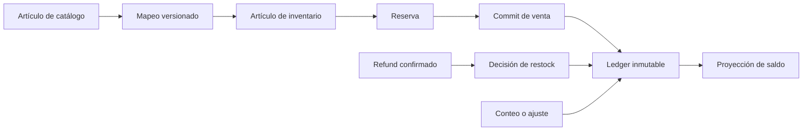

# UmiPOS — Autoridad de inventario

## 1. Propósito

Este documento define el inventario que implementa Gate 3E. UMI API autoriza cada cambio. PostgreSQL conserva los hechos de existencias.

La referencia funcional es el contrato `2.3.0`. Su hash es `9d6a01b2cb9ac00bf3bfd54c51c4dc689084fa20fa2479b1b1f79bdd1d949454`.

La migración canónica es `docs/migration/build-v3/36_pos_inventory.sql`.

Gate 3E no incluye compras, proveedores, almacenes avanzados, pronósticos ni valuación contable.

## 2. Principios de autoridad

- El merchant define el límite comercial.
- La location define el límite operativo.
- La ubicación de inventario define la fuente física.
- El servidor convierte las unidades.
- El ledger conserva cada efecto como un hecho nuevo.
- La proyección de saldo se puede reconstruir desde el ledger.
- Flutter muestra información y envía comandos tipados.
- El cliente nunca calcula la existencia oficial.

## 3. Cantidades y unidades

Cada cantidad usa un entero, una escala y una unidad. El sistema no usa números de punto flotante como autoridad.

Las unidades admitidas son:

- unidad;
- gramo;
- kilogramo;
- mililitro;
- litro;
- porción;
- paquete;
- caja.

Una conversión declara el numerador, el denominador, la escala de destino y el redondeo. El servidor rechaza una conversión ausente o inexacta.

El artículo conserva su unidad base cuando ya tiene historial. Un cambio posterior requiere una migración exacta.

## 4. Artículos de inventario

Un artículo puede representar un producto físico, una variante, un ingrediente, un empaque o un componente.

Cada artículo contiene:

- una identidad pública;
- el merchant;
- la unidad base y la escala;
- la política de seguimiento;
- la política de existencia negativa;
- el requisito de reserva;
- el umbral de existencia baja;
- una versión optimista.

Un servicio o un artículo digital no crea existencias físicas por defecto. Un artículo archivado conserva el historial y bloquea operaciones normales.

## 5. Ubicaciones de inventario

Una ubicación pertenece a una location del merchant. Puede representar el almacén principal, la cocina, el bar o una zona de cuarentena.

El servidor selecciona la fuente de surtido con la política vigente. El POS no selecciona otra ubicación de forma libre.

Los saldos nunca se agrupan entre locations. RLS aplica el merchant y la location en cada consulta y cambio.

## 6. Mapeo del catálogo

El mapeo vincula un producto o una variante con:

- un artículo directo;
- una receta;
- una composición de bundle;
- una declaración explícita de producto sin seguimiento.

El sistema no infiere el mapeo por nombre, SKU o código de barras. La variante puede sustituir el mapeo general solo con una regla explícita.

Los tipos de catálogo se tratan así:

| Tipo      | Comportamiento                              |
| --------- | ------------------------------------------- |
| Physical  | Usa un mapeo directo o una receta.          |
| Service   | No consume existencias por defecto.         |
| Bundle    | Consume sus componentes versionados.        |
| Kit       | Usa la composición explícita disponible.    |
| Composite | Consume una receta versionada.              |
| Digital   | No consume existencias físicas por defecto. |
| Gift Card | Permanece fuera del inventario físico.      |
| Custom    | Requiere una configuración explícita.       |

## 7. Recetas, variantes y modificadores

Una receta contiene un rendimiento y componentes exactos. La receta usada por una venta permanece inmutable.

Una variante puede tener un mapeo propio. Un modificador consume o sustituye un componente solo cuando existe una regla versionada.

El sistema no usa el texto traducido de una opción para decidir un consumo. Una regla contradictoria bloquea el checkout.

Los bundles reservan y consumen todos los componentes obligatorios en una sola transacción. El sistema evita el consumo doble entre una receta y un bundle.

## 8. Política de seguimiento

La política del servidor define:

- si existe seguimiento;
- si la reserva es obligatoria;
- la ubicación de surtido;
- el umbral de aprobación para ajustes;
- el umbral de aprobación para merma;
- la tolerancia del conteo;
- el conteo ciego;
- la política de existencia negativa;
- el límite offline;
- la versión, el vencimiento y la huella.

El piloto usa valores conservadores. Bloquea la existencia negativa. Las operaciones sensibles requieren aprobación independiente.

## 9. Ledger de existencias

`merchant.stock_ledger_entry` es la autoridad inmutable. Cada efecto tiene una secuencia por artículo y ubicación.

El ledger registra:

- saldo inicial;
- creación, liberación y vencimiento de reservas;
- consumo de venta;
- restock, no-restock e inspección;
- ajustes;
- merma y daño;
- cuarentena;
- correcciones de conteo.

El trigger de inmutabilidad bloquea `UPDATE` y `DELETE`. La identidad del comando y la huella evitan un efecto duplicado.

## 10. Proyección de saldo

La proyección separa:

- existencia física;
- reservado;
- disponible;
- comprometido;
- dañado;
- cuarentena;
- merma;
- tránsito como foundation.

La fórmula base es:

`disponible = existencia física - reservado - dañado - cuarentena`

La proyección conserva la secuencia calculada. La función de reconstrucción detecta una diferencia y reproduce el mismo saldo.

## 11. Saldo inicial

El saldo inicial usa un comando controlado, un seed de desarrollo o una migración aprobada. El ledger conserva la fuente y la razón.

El seed del piloto crea hechos de saldo inicial. La ejecución repetida no crea hechos adicionales.

Gate 3E no importa las tablas de inventario de NEXO.

## 12. Reservas

Una reserva pertenece a una venta, una versión de venta y una ubicación. Las líneas conservan la versión del mapeo o de la receta.

El flujo es:

1. El servidor valida la venta y la sesión.
2. El servidor resuelve los consumos.
3. La transacción bloquea los saldos en orden estable.
4. La política valida la cantidad disponible.
5. El ledger crea los efectos de reserva.
6. La API devuelve el resultado autoritativo.

Una reserva no consume existencias. Un cambio del carrito libera la reserva anterior. Una reserva vencida no puede completar la venta.
La API libera los vencimientos antes de consultar inventario o crear otra reserva.

## 13. Commit de venta

El checkout llama `merchant.commit_sale_inventory` dentro de la transacción financiera.

La misma transacción crea:

- la venta comprometida;
- los hechos del tender;
- el efecto de caja cuando aplica;
- el recibo;
- el evento de orden;
- los hechos de consumo;
- el resultado idempotente.

Un fallo revierte toda la transacción. Un producto sin seguimiento no crea un hecho de inventario.

## 14. Disponibilidad

La API calcula la disponibilidad por merchant, location y ubicación de inventario.

Los estados son:

- disponible;
- existencias bajas;
- no disponible;
- pedido pendiente permitido;
- desconocido;
- bloqueado por política.

Un producto compuesto usa el componente obligatorio limitante. La consulta usa un lote acotado y evita una consulta por producto.

Flutter muestra el estado. El checkout vuelve a validar la existencia antes del commit.

## 15. Conflictos de checkout

La API devuelve códigos estables para una reserva vencida, una existencia insuficiente o un mapeo obsoleto.

El POS conserva el carrito. El sistema nunca elimina una línea, reduce una cantidad ni sustituye un ingrediente sin una acción explícita.

La política puede exigir una aprobación para una excepción. El piloto bloquea la existencia negativa.

## 16. Refund y decisión de restock

Gate 3D crea una decisión inmutable. Gate 3E consume esa decisión después del commit del refund.

Los resultados son:

| Decisión                    | Efecto                                                        |
| --------------------------- | ------------------------------------------------------------- |
| Restock                     | Crea un hecho compensatorio y aumenta la existencia elegible. |
| DoNotRestock                | Registra el resultado y no aumenta la existencia.             |
| InspectionRequired          | Aumenta la existencia física en cuarentena.                   |
| NotApplicable               | Registra la decisión sin un efecto físico.                    |
| UnknownUntilInventoryReview | Conserva una revisión pendiente.                              |

El restock no puede superar la cantidad reembolsada ni el consumo original. La operación usa el mapeo histórico.

Una receta no devuelve ingredientes preparados de forma automática. El valor predeterminado exige una revisión por componente.

El commit del refund conserva el `restock intent` sin cambiar existencias. Una operación posterior requiere `inventory.restock.resolve` y una aprobación independiente. Esta operación usa el consumo original. El resultado se guarda como un hecho separado. El sistema no modifica el `restock intent` original.

## 17. Ajustes, merma, daño y cuarentena

Un ajuste crea un hecho nuevo. Nunca modifica una entrada anterior.

La merma reduce la existencia elegible y aumenta el estado de merma. La merma no crea un refund financiero.

El daño mueve una cantidad al estado dañado o a cuarentena. La cuarentena queda fuera de la disponibilidad.

Una liberación de cuarentena valida el saldo de origen. La política puede exigir una aprobación independiente.

## 18. Conteo y reconciliación

El conteo pertenece a una ubicación y a una secuencia fija por artículo. El modo ciego oculta la cantidad esperada antes del envío.

El servidor calcula:

`varianza = cantidad contada - cantidad esperada`

El operador selecciona un motivo para cada diferencia. Una aprobación de manager usa un PIN, una huella, una vigencia corta y un solo uso.

La reconciliación crea entradas `count_correction`. No sobrescribe el saldo esperado ni el conteo observado.

## 19. Permisos y aprobaciones

Los permisos canónicos están en `config/umipos-permission-inventory.json`. Los grants están en `config/umipos-pilot-role-grants.json`.

Los permisos separan lectura, ajustes, merma, daño, cuarentena, conteos, restock, política y aprobación.

El nombre del rol no concede autoridad. La API también valida el merchant, la location, el dispositivo, la credencial, la sesión y el entitlement POS.

La matriz `config/umipos-pilot-approval-boundaries.json` bloquea la autoaprobación sensible por defecto.
Cuando una operación también produciría existencia negativa, la aprobación específica de excepción sustituye la aprobación de umbral. El comando conserva una sola frontera más restrictiva.

## 20. Offline y recuperación

Las operaciones directas de inventario son online-only. El POS no crea un ledger oficial local.

Una venta cash offline conserva el comando provisional existente. El replay vuelve a validar la política, el mapeo, la receta y las existencias.

Un conflicto permanece en Recovery Center. La pérdida de respuesta consulta el comando original antes de un reintento.
El resumen devuelve el conteo activo de la sesión. Flutter lo restaura después de un reinicio.

## 21. Seguridad y auditoría

Cada cambio valida el permiso efectivo y el alcance del objeto. RLS y `FORCE ROW LEVEL SECURITY` protegen las tablas operativas.

La auditoría conserva referencias seguras, cantidades escaladas, comandos, actores y resultados. No conserva PIN, tokens ni credenciales.

Los límites de lote protegen recetas, reservas, conteos e historial. El orden de bloqueo es ubicación, artículo y referencia estable.
El historial usa un cursor estable con la fecha y el identificador del último hecho. Flutter carga una página adicional por solicitud.

El software no prueba la custodia física. Un conteo requiere control físico y conducta operativa correcta.

## 22. Procedimiento de prueba del piloto

1. Ejecuta el seed del piloto.
2. Enrola un dispositivo de desarrollo.
3. Inicia sesión con un perfil autorizado.
4. Consulta la disponibilidad del catálogo.
5. Completa una venta con seguimiento.
6. Verifica el ledger y el saldo.
7. Registra un refund con cada decisión de restock.
8. Registra un ajuste, una merma y un daño.
9. Inicia un conteo ciego.
10. Envía el conteo y selecciona los motivos.
11. Obtén una aprobación independiente.
12. Reconcilia el conteo.
13. Repite un comando y verifica que no existe un efecto adicional.

Consulta los comandos reales en `docs/development/RUNNING_UMIPOS.md`.

## 23. Límites futuros

Gate 3E no implementa:

- órdenes de compra;
- proveedores;
- recepción avanzada;
- transferencias de almacén;
- pronósticos;
- valuación contable;
- FIFO;
- lotes de producción;
- fechas de caducidad operativas;
- reportes finales.

Estas funciones requieren un Gate posterior y una autorización explícita.
