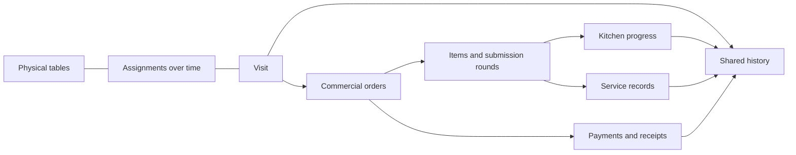

**POS table map and order traceability — research, 2026-09-13.**

**Recommendation — Umi inference.** Add a Tables tab beside Kitchen. Make each table open a visit with linked orders and a shared history. The business purpose is clear ownership of service, visible delays, and evidence for corrections. Treat revenue gains and time savings as pilot hypotheses.

**Editor decision — selected by the user, 2026-09-13.** Use Konva with React Konva for the dashboard editor. Keep the published layout in Umi's shared contract. Render that layout with native Flutter widgets in the POS. The library selection is complete; implementation and validation remain.

**Documented market workflows.** Sources below describe product behavior. They establish useful design references; they do not establish Umi customer demand.

| Product             | Documented fact                                                                                                                                                                                                                                               | Implication for Umi                                                                  |
| ------------------- | ------------------------------------------------------------------------------------------------------------------------------------------------------------------------------------------------------------------------------------------------------------- | ------------------------------------------------------------------------------------ |
| Square              | A guest count makes a table occupied before staff add items. Floor plans support sections and table geometry. [Square floor plans](https://squareup.com/help/us/en/article/6427-building-your-floor-plan)                                                     | A visit must exist before the first order.                                           |
| Toast               | Staff can transfer a check to an occupied table and either merge it or retain separate checks. Permissions control transfers and server changes. [Toast table management](https://support.toasttab.com/en/article/New-POS-Managing-Tables)                    | Table assignment, check identity, and server assignment need separate actions.       |
| Lightspeed K-Series | Floor plans support table position, shape, capacity, guest counts, and temporary table removal from the POS. [Lightspeed floor plans](https://k-series-support.lightspeedhq.com/hc/en-us/articles/1260804656709-Creating-and-managing-floor-plans-and-tables) | Use stable table identities, simple geometry, capacity, and an availability control. |
| Odoo 19             | Preparation stages are configurable. Cards show tables, guest counts, item progress, elapsed time, and alerts. [Odoo preparation display](https://www.odoo.com/documentation/19.0/applications/sales/point_of_sale/extra/preparation.html)                    | Show partial readiness and elapsed time from the existing kitchen workflow.          |
| PoloTab             | Staff configure tables by area and identifier, then manage open checks for each table in the POS. [PoloTab tables](https://www.polotab.com/soporte/crear-mesas)                                                                                               | Area names and short table identifiers provide a useful initial structure.           |

**Separate service events — documented fact and Umi inference.** Toast distinguishes kitchen fulfillment, readiness for collection, and completion after payment and collection or delivery. That source concerns takeout and delivery. [Toast Orders Hub](https://support.toasttab.com/en/article/Orders-Hub-Status-Breakdown) For Umi dine-in service, record an explicit Served action after kitchen readiness. A paid order can still require preparation or delivery to the table. A fully served order can still have an unpaid balance. Record table clearance separately because payment does not prove that guests have left.

**Separate financial actions — documented fact.** Square distinguishes check splits by item or seat from payment splits by amount. Item discounts and some charges follow items; check-level adjustments need separate treatment. [Square check splits](https://squareup.com/help/us/en/article/8165-split-a-payment-and-check-with-square-for-restaurants) **Umi inference:** separate Move table, Combine checks, Split check, and Split payment in the model and interface. A table move must preserve order identity and kitchen progress. Combine checks only through an explicit financial action with clear results.

**Traceability — documented fact.** Toast provides check history with actor, time, device, and action. It includes item changes, server transfers, payments, and reopened checks. Its documentation states a two-week retention limit and possible missing updates. [Toast update history](https://support.toasttab.com/en/article/View-Update-History-Feature1) **Umi inference:** history must show what changed, who changed it, and why. Specify event coverage and retention before a pilot. Preserve the original order and item references through transfers, cancellations, and corrections. Show an unavailable event as unknown.

**MVP — Umi inference.** The target café workflow supports payment before or after food preparation. Confirm that requirement with the pilot merchant. A service order that exists before payment is a prerequisite for the full workflow. The software assessment below must establish this capability before implementation. A smaller pilot can attach paid orders to occupied tables, if that matches the merchant's service.

| Capability    | Initial scope                                                                                                      | Business purpose                                                     |
| ------------- | ------------------------------------------------------------------------------------------------------------------ | -------------------------------------------------------------------- |
| Map           | Areas; named tables; position, shape, and capacity; map and list views                                             | Staff identify a table quickly.                                      |
| Visit         | Seat guests, record guest count, assign a server, add orders, move to a free table, record departure and clearance | Occupancy follows the guests throughout service.                     |
| Table summary | Occupancy label, elapsed visit time, server, balance, and counts of ready and unserved items                       | Staff see which table needs action.                                  |
| Order detail  | Linked orders, item readiness, Served action, and checkout adapted for an existing open order                      | Staff complete the service from the table.                           |
| History       | Order creation, kitchen acceptance, readiness, service, payment, cancellation, and assignment changes              | Staff answer service questions and managers investigate corrections. |
| Controls      | Server permissions; manager controls for corrections and layout changes; visible connection state                  | Staff know which actions they can complete reliably.                 |

Allow the model to link several orders to a visit. Start the pilot with one open order per visit and several submission rounds within that order. Additional rounds need explicit kitchen updates that preserve prior item progress. Distinguish several tenders in one checkout from partial settlement across separate checkout sessions. The latter requires additional backend work. Treat check splits, paid-check merges, and transfers to occupied tables as separate releases with financial validation. Also defer reservations, seat-level item allocation, course pacing, and automatic seating recommendations until pilot evidence supports them.

**Operational ownership — Umi inference.** Assign a clear owner to each event. The host or server records seating and table changes. Kitchen staff record preparation progress. The server or runner records service. Cashiers record payments through checkout. Servers record departure; the employee who clears the table makes it available. Managers resolve corrections through recorded actions. A restaurant can combine these roles, but each recorded action still needs an actor.

**Business pilot — Umi inference.** Pilot one area across comparable busy shifts, after a baseline observation period. Train staff with a complete visit, an additional round, a table move, a cancellation, and a connection interruption. Estimate setup time, staff training, support, and maintenance costs from this pilot. Package the feature initially with dine-in service; test willingness to pay before a separate price decision.

| Measure                   | Definition                                                            | Use                                                   |
| ------------------------- | --------------------------------------------------------------------- | ----------------------------------------------------- |
| Time to first submission  | First submitted order time minus seated time                          | Find delays before the kitchen receives work.         |
| Time from ready to served | Served time minus ready time, per item or recorded batch              | Find delays between kitchen and table.                |
| Table occupancy duration  | Departure time minus seated time                                      | Understand visit duration by area and service period. |
| Clearance delay           | Available time minus departure time                                   | Find delays before reuse.                             |
| Unpaid departed visits    | Departed visits with a positive balance                               | Identify payment exceptions.                          |
| History completeness      | Visits with all applicable required events divided by eligible visits | Check whether the measures are reliable.              |
| Corrections               | Wrong-table deliveries and order corrections per 100 dine-in orders   | Test service quality alongside speed.                 |

Report medians and the 90th percentile for durations. Report missing timestamps separately. Compare similar service periods and guest counts. Validate results with staff observation because missed Served actions can distort the measures. Agree on success thresholds after the baseline; this research establishes no universal target or ROI.

**Assumptions to resolve during design — Umi inference.** Observe payment timing, server ownership, table reuse, group seating, and the frequency of separate checks. Confirm who can record service during busy periods. Confirm the required behavior during lost connectivity and the retention period for history. Those findings determine the financial scope and whether offline table changes belong in the first release.

**Current Umi implementation — source facts.** This audit inspected the working tree at commit `ff69e02` on 2026-09-13. It did not inspect production state.

| Area               | Evidence                                                                                                                                                                                                                              | Consequence                                                                                |
| ------------------ | ------------------------------------------------------------------------------------------------------------------------------------------------------------------------------------------------------------------------------------- | ------------------------------------------------------------------------------------------ |
| Navigation         | `_primaryNav` includes Order, Cash, Sales, Kitchen, and Settings. [Catalog surface](../../apps/umi-pos/lib/features/catalog/catalog_surface.dart)                                                                                     | Add Tables here. Check six destinations on the smallest supported display.                 |
| Kitchen view       | The POS board uses an eight-second timer and snapshot reads. [Board surface](../../apps/umi-pos/lib/features/kitchen/kitchen_board_surface.dart), [controller](../../apps/umi-pos/lib/features/kitchen/kitchen_board_controller.dart) | Reuse this presentation pattern. It does not provide POS commands for kitchen staff.       |
| Order creation     | Checkout `commit` calls `writeOrder` with `fulfillmentType: 'dine_in'`. [Checkout repository](../../apps/umi-api/src/modules/pos-checkout/pos-checkout.repository.ts)                                                                 | Table service needs submission before payment. Persist the selected fulfillment type.      |
| Saved sales        | `SaleSnapshot` supports suspended carts. Source order references come through the committed sale. [Contract](../../packages/contract/src/pos-sale.ts), [repository](../../apps/umi-api/src/modules/pos-sale/pos-sale.repository.ts)   | A suspended cart does not establish a submitted kitchen order.                             |
| Initial projection | `writeOrder` writes order facts and calls `projectKitchenOrder` in its caller's transaction. [Order writer](../../apps/umi-api/src/shared/orders/order-writer.ts)                                                                     | Keep commercial writes and preparation projections under the API owner.                    |
| Later rounds       | `projectKitchenOrder` returns immediately when a projection exists. [Kitchen projector](../../apps/umi-api/src/modules/kds/kitchen-projector.ts)                                                                                      | Repeated calls cannot project later additions. Add an amendment path.                      |
| Kitchen identity   | Contracts include source order IDs, item IDs, versions, events, and partial readiness. They lack table and visit fields. [Kitchen contract](../../packages/contract/src/pos-kitchen.ts)                                               | Reuse identities and add typed table context across clients.                               |
| History            | The schema defines order events and audit records. The dashboard exposes some order history. [Schema](../migration/build-v3/20_merchant.sql), [orders service](../../apps/umi-api/src/modules/orders/orders.service.ts)               | Combine existing facts with new seating, service, and assignment events.                   |
| Offline            | The native journal accepts `operational.ack` and `pos.checkout.cash`. [Journal](../../apps/umi-pos/lib/features/offline/offline_journal.dart)                                                                                         | Current offline support does not establish safe table assignment or open-order amendments. |

Targeted searches found no table-map or visit model in the inspected API, POS, contract, and build-v3 SQL paths. Source files establish implementation behavior; they do not establish deployed database state.

**Software design — Umi proposal.** Keep the feature in Flutter UmiPOS, the existing NestJS API, and PostgreSQL. Add a `table-service` module inside `apps/umi-api`. Keep order writes with the existing order owner. Put public models in `packages/contract` and generate the Dart consumer. No measured requirement justifies a separate service.

A visit identifies one party's stay. A table is a physical resource that many visits use over time. An order records items. Kitchen projections record preparation. Payments record settlement.

The following records are proposals, not existing tables.

| Record              | Main fields and rule                                                                                                    |
| ------------------- | ----------------------------------------------------------------------------------------------------------------------- |
| `dining_area`       | Merchant, location, name, display order, layout version.                                                                |
| `dining_table`      | Stable ID, area, label, capacity, shape, geometry, availability, version. Archive tables to preserve history.           |
| `dining_visit`      | Location, guest count, assigned staff, opened time, departed time, closed time, version. Customer identity is optional. |
| `dining_assignment` | Visit, table, assigned time, released time. Preserve each transfer as assignment history.                               |
| Order-to-visit link | Stable order and visit IDs with matching merchant and location. Start with one open order per visit.                    |
| Submission round    | Order, round ID, immutable line references, submitted time, actor, command ID. Send only new lines.                     |
| `dining_event`      | Visit, event ID, visit sequence, actor, device, server time, event type, reason, referenced entities.                   |

Use `dining_event` for seating, table changes, departure, clearance, and service. Reference existing order, kitchen, payment, and audit facts in the timeline. Avoid a second financial ledger. The current `order_event` accepts only status changes and order amendments. Retain that purpose. [Merchant schema](../migration/build-v3/20_merchant.sql)

**State rules — Umi proposal.** Compute table summaries from separate dimensions.

| Dimension      | States or measures                                | Authority                                          |
| -------------- | ------------------------------------------------- | -------------------------------------------------- |
| Physical table | Available, occupied, needs clearance, blocked     | Assignment, departure, and clearance actions       |
| Preparation    | Queued, preparing, partly ready, ready, exception | Existing kitchen facts                             |
| Service        | Unserved quantity, partly served, fully served    | Explicit service records by item or batch          |
| Payment        | Unpaid, partly paid, paid; refund exceptions      | Authoritative order amounts and allocated payments |

Only expose partial settlement after its command path exists. Derive readiness across all relevant stations. Give items without preparation a service path. Kitchen completion must not assert delivery to a table. Payment must not release the table. A departed visit with an unpaid balance remains an exception after staff clear and reuse the table.

**Open orders — the main dependency.** Create the visit when guests sit. Create the commercial order on the first Send action. Append a new round on later Send actions. Settle that existing order at checkout. Preserve its ID through payment, table moves, and kitchen changes.

An amendment must add kitchen lines without resetting previous preparation or service. Define how new work returns a finished kitchen aggregate to active work. Preserve round references so staff recognize new work. Record cancellations and replacements explicitly. The schema freezes most item fields and supports corrections through voids and new lines. [Item rules](../migration/build-v3/20_merchant.sql)

Adapt checkout to reference the submitted order instead of creating another order from the cart. Retain server totals, idempotency, payments, receipt snapshots, and approval rules. Validate tax, discount, and rounding allocations before separate checks or delayed partial settlement.

Resolve inventory timing before implementation. Checkout currently reserves inventory within its workflow. Open orders need a policy for reservations, preparation, cancellation, and prepared waste. Ensure payment never consumes stock twice. Define reporting dates for visits across shifts and business-day boundaries. Keep visit duration separate from payment attribution. [Checkout service](../../apps/umi-api/src/modules/pos-checkout/pos-checkout.service.ts)

**Concurrency — documented facts and tradeoff.** PostgreSQL row locks coordinate conflicting writes. Partial unique indexes enforce uniqueness for qualifying rows. Locks can cause deadlocks; consistent acquisition order and transaction retries address that risk. [PostgreSQL locks](https://www.postgresql.org/docs/current/explicit-locking.html), [partial indexes](https://www.postgresql.org/docs/current/indexes-partial.html)

For Umi, enforce one active assignment per table with a partial unique index where `released_at IS NULL`. Require an expected version and an idempotency key for each command. Bind keys to the operation, scope, and payload. Lock the visit and affected tables in a consistent order for moves. Commit changes and events together. Return current state on a conflict. Enforce merchant and location consistency through constraints and authorization.

**API and timeline — Umi proposal.** Add POS-authenticated routes under `/api/v1/pos/merchants/:merchantId/table-service`. These names are design candidates.

- `GET /board`: layout and visit summaries for the authorized location.
- `GET /visits/:visitId`: orders, items, balances, and assignments.
- `GET /visits/:visitId/events`: a paginated timeline with stable source references.
- `POST /commands`: typed seat, move, assign-server, serve, depart, and clear commands.
- Submission and settlement commands: use the existing order and checkout owners.

Each timeline entry needs an event type, affected quantity, actor, device, server time, reason, and source references. Keep unknown historical actors unknown. Record device time separately if offline events become supported. Use stable display tie-breakers; timestamps alone do not prove cross-system causality. Serialize visit events under the visit's write lock.

A useful trace reads: seated; round sent; preparation started; drinks ready; drinks served; table moved; dessert sent; paid; departed; cleared. The visit ID connects each action. Refunds reference the original payment and order. Corrections retain the original fact and add a new event.

Enforce permissions in the API. Scope reads and commands by merchant, location, operator session, and assigned responsibility where required. Distinguish view, seat, serve, move, assign-server, layout-edit, and financial correction permissions. Preserve existing approval controls. Expose sensitive financial history only to authorized roles.

**Synchronization — documented facts and tradeoff.** Socket.IO preserves message order but defaults to at-most-once delivery. Recovery can fail and still requires state synchronization. [Delivery guarantees](https://socket.io/docs/v4/delivery-guarantees/), [recovery](https://socket.io/docs/v4/connection-state-recovery/)

Start with a snapshot on entry, after commands, and through bounded foreground polling. Show the last successful refresh. Retain the last known map after an error. Use one board request per location rather than one request per table. Measure refresh delay and request volume during the pilot.

Then add authorized location notifications through the existing realtime module. Use each notification to request current state. Refetch on reconnect and retain polling for recovery. Add durable replay only if measured requirements justify it. Audit transaction ordering before using a database sequence as a replay cursor.

The current realtime bus operates within one process. Multiple API replicas require shared notification distribution. A standard Redis adapter does not itself provide connection-state recovery. These are separate decisions. [Current bus](../../apps/umi-api/src/modules/realtime/dashboard-realtime.events.ts), [adapter support](https://socket.io/docs/v4/connection-state-recovery/)

**Offline boundary — Umi proposal.** The first pilot can show a cached map with a stale indicator. Require connectivity for shared table changes and open-order submission. Local pending work remains visibly unsent until the API accepts it. Keep existing offline cash operations within their supported scope.

This reduces conflict complexity but limits service during outages. Validate the tradeoff with the pilot merchant. If full offline table service is essential, design explicit device ownership or local coordination first. Test reassignment, delayed sends, duplicate kitchen work, and payment conflicts. General cash replay does not solve these cases.

**Flutter interface — Umi proposal.** Place Mesas / Tables beside Cocina / Kitchen. Show an area selector and a map/list switch. Each table shows its label, guest count, server, elapsed time, and an attention indicator. Selection opens Orders and History views in a detail panel. Preserve the cart when staff change tabs.

Use accessible table widgets in a positioned layout. Flutter `InteractiveViewer` supplies pan and zoom where useful. Separate layout-edit gestures from service actions. Provide labels and icons alongside colors, plus keyboard access on Linux. [Flutter InteractiveViewer](https://api.flutter.dev/flutter/widgets/InteractiveViewer-class.html)

Use simple manager-controlled geometry first, through the dashboard editor described below. Preserve table IDs when labels or positions change. Show the current destination on kitchen tickets and retain the previous destination in history. Extend contracts and test older consumers because current schemas use strict validation.

**Delivery sequence — Umi inference.** The largest effort lies in open orders, amendments, and settlement. The map is a smaller interface task. Calendar estimates need agreement on financial and offline scope.

| Stage                 | Deliverable                                                                                                    | Exit condition                                                                      |
| --------------------- | -------------------------------------------------------------------------------------------------------------- | ----------------------------------------------------------------------------------- |
| 1. Service foundation | Visits, table records, submission before payment, later rounds, kitchen amendments, settlement, service events | Complete a visit without duplicate orders, preparation, payments, or stock effects. |
| 2. Operational pilot  | Tables tab, simple editor, map/list views, history, permissions, stale state, moves to free tables             | Staff complete the main workflows on two devices during representative shifts.      |
| 3. Expansion          | Table groups, several checks, item splits, partial settlement, faster notifications, optional offline service  | Each addition has merchant demand and passes financial or concurrency checks.       |

A narrower pay-first map can precede Stage 1 for a merchant with counter payment. Describe that scope explicitly. It cannot validate service with payment at the end.

**Required implementation checks — proposed, not executed.** Validate these cases before the pilot:

1. Seat guests before an order exists.
2. Submit an unpaid order and add a round after some items are ready or served.
3. Settle the existing order without duplicate kitchen work or stock deductions.
4. Move a visit during preparation; retain history and update the destination.
5. Have two devices claim the same table; accept one assignment.
6. Retry after a lost response; preserve one business effect.
7. Cancel after preparation starts; retain the reason and kitchen consequence.
8. Pay before readiness; retain occupancy and pending service.
9. Record unpaid departure; retain the exception after clearance and reuse.
10. Reconnect and recover current state without silent overwrites.
11. Reject cross-location access and unauthorized changes.
12. Change staff shifts, rename tables, and cross the business-day boundary without broken history.

**Decision basis and limits.** Vendor documents establish workflows. Current source code establishes implementation gaps. The model, delivery sequence, and offline boundary are Umi-specific recommendations. Operator observations must validate workflow fit. Measurements must validate synchronization choices. This research changed documentation only. It ran no application tests and made no production changes.

**Follow-up: editor placement and GUI tools — 2026-09-13.** Put permanent table creation and floor-plan design in the dashboard. Keep seating, service, table availability, and visit transfers in the POS. The API owns both sets of records. This refines the earlier editor proposal.

| Action                                                | Recommended surface                      | Reason                                                          |
| ----------------------------------------------------- | ---------------------------------------- | --------------------------------------------------------------- |
| Create areas and permanent tables                     | Dashboard                                | Managers configure the location and review its capacity.        |
| Set shapes, furniture positions, labels, and capacity | Dashboard                                | A larger work area and property controls support precise edits. |
| Preview and publish a layout                          | Dashboard                                | Managers review changes before staff receive them.              |
| Seat guests, open orders, serve, and clear            | POS                                      | Staff perform these actions during service.                     |
| Move a visit or temporarily block a table             | POS                                      | These actions concern current service.                          |
| Join tables for a party                               | POS, later release                       | Keep physical table IDs and separate check decisions.           |
| Add a temporary table during service                  | Later manager-only POS action, if needed | Merchant evidence should justify this additional creation path. |

This division has a documented precedent. Square creates and designs floor plans in its dashboard and supports table combinations during POS service. [Square floor plans](https://squareup.com/help/us/en/article/6427-building-your-floor-plan) Umi should first offer one full editor that also works in a tablet browser. A merchant who regularly changes furniture during service may justify additional POS editing later. A visit transfer changes guest assignment; a furniture move changes layout geometry. Give those actions distinct names.

**Selected editor stack.** Use `konva` and `react-konva` for the dashboard canvas. The user selected Konva after the [alternatives research](2026-09-13-floor-plan-editor-alternatives.md). Umi currently uses React 18.3.1. Choose the compatible `react-konva` 18 release and verify its peer dependencies during implementation. The official documentation requires matching React and binding major versions. [Dashboard dependencies](../../apps/umi-dashboard/package.json), [React Konva](https://konvajs.org/docs/react/index.html)

Konva supplies shapes, event handling, and a Transformer for resize and rotation. Its React examples handle both clicks and taps. Umi must implement snapping, alignment rules, property forms, and publication controls. Undo and redo can use application state history. These are integration tasks, not a complete editor supplied by the library. [Transformer](https://konvajs.org/docs/react/Transformer.html), [undo and redo](https://konvajs.org/docs/react/Undo-Redo.html)

| Option         | Assessment for Umi                                                                                                                                                                               |
| -------------- | ------------------------------------------------------------------------------------------------------------------------------------------------------------------------------------------------ |
| React Konva    | Selected for the custom editor with drag, resize, rotate, and structured table properties.                                                                                                       |
| React with SVG | A reasonable simpler alternative if the scope stays at basic placement. Umi would implement selection and transform controls.                                                                    |
| Fabric.js      | Provides an object model, interaction, and serialization. Viable, but the existing React stack favors React Konva's declarative bindings. [Fabric documentation](https://www.fabricjs.com/docs/) |

The recommendation is based on integration fit and the requested controls. It is not a measured performance comparison. Prototype touch behavior and representative layouts before selecting exact package versions. Konva uses the MIT license. [Konva license](https://github.com/konvajs/konva/blob/master/LICENSE)

**Editor interaction — Umi proposal.** Use a shape palette on the left, the floor plan in the center, and properties on the right. Use a drawer for properties on tablets. Put the area selector, undo, redo, zoom, preview, and publish controls above the canvas.

- Offer round, square, and rectangular tables with capacity presets.
- Offer walls, counters, doors, and labels as decorative elements.
- Support drag, resize, rotation, duplication, and keyboard movement.
- Add grid snapping, alignment, and even spacing for selected tables.
- Allow staff to create several numbered tables through a row or grid preset.
- Show table name, capacity, area, dimensions, and rotation in ordinary form controls.
- Keep status colors under the service system's control.
- Offer an optional locked background image in a later release if merchants need it.

The first version needs enough geometry for recognition. Add irregular shapes and architectural tools only when merchant layouts require them. Decorative elements must remain distinct from tables that can receive orders. Represent chairs as capacity indicators initially; individual seat ordering is separate scope.

Provide an accessible table list and form controls alongside the canvas. Each operation needs an alternative to precise dragging. Check keyboard use, touch targets, zoom, and readable table labels. Keep operational state out of the editable layout document.

**Shared layout format — Umi proposal.** Store a versioned Umi document with area dimensions and element records. Each table element references its stable `tableId`. Store element kind, shape, `x`, `y`, `width`, `height`, rotation, and display order. Define coordinate origin and rotation semantics in the contract. Use fixed logical coordinates and scale the viewport uniformly on each device. Keep pan and zoom as view preferences.

Persist Umi application state rather than raw Konva node serialization. Konva's guidance recommends application state for complex applications. This also lets Flutter render the same geometry independently. [Serialization guidance](https://konvajs.org/docs/data_and_serialization/Best_Practices.html)

The Flutter POS can use `Stack` and positioned table widgets, with `InteractiveViewer` for pan and zoom. Paint decorative walls separately. Preserve accessible actions on the table widgets. The web editor and Flutter view share data and rendering rules through the contract. Konva itself runs only in the web editor. [Flutter InteractiveViewer](https://api.flutter.dev/flutter/widgets/InteractiveViewer-class.html)

**Draft and publication rules — Umi proposal.** Autosave the draft. Keep the published layout active until a manager selects Publish. Validate table references, unique labels within the chosen scope, geometry, and expected version through the API. Publish atomically, then notify or refresh POS clients. Preserve table IDs and service assignments across layout changes.

Reject publication that removes an occupied table until the visit is transferred or closed. Preserve archived table references in historical events. Record the publisher and layout version. Detect concurrent draft changes and retain recoverable revisions. A layout publication must never recreate an order or change a payment.

**Implementation order — Umi proposal.** Define the shared layout contract first. Build the dashboard editor next. Build the Flutter renderer against the same sample layouts. Verify geometry parity, draft isolation, occupied-table rules, and publication conflicts. Add manager tools in the POS only after the pilot establishes their need.
